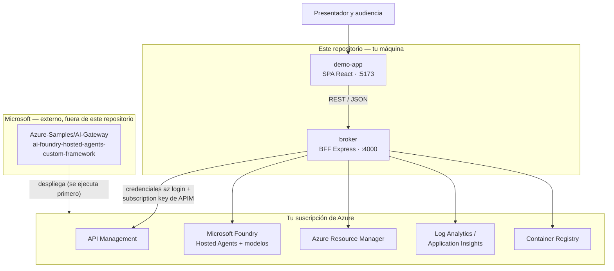

<div align="center">


### [🇬🇧 English](README.md) &nbsp;|&nbsp; 🇪🇸 Español

[](https://react.dev/)
[](https://www.typescriptlang.org/)
[](https://vitejs.dev/)
[](https://react.fluentui.dev/)
[](https://nodejs.org/)
[](https://github.com/Azure-Samples/AI-Gateway/tree/main/labs/ai-foundry-hosted-agents-custom-framework)
[](LICENSE)

</div>

---

> **Aviso importante.** Este es un **proyecto complementario independiente** construido sobre el laboratorio oficial de Microsoft [**«AI Foundry Hosted Agents with Custom Frameworks»**](https://github.com/Azure-Samples/AI-Gateway/tree/main/labs/ai-foundry-hosted-agents-custom-framework), parte de [`Azure-Samples/AI-Gateway`](https://github.com/Azure-Samples/AI-Gateway).
>
> **No reemplaza, no sustituye ni forma parte de Azure AI Foundry, Azure API Management, el Portal de Azure ni ninguna herramienta oficial de Microsoft.** Es una capa de presentación que lee un despliegue creado por el laboratorio oficial. No es un producto, no es una plataforma y no es una solución SaaS. Sin afiliación ni respaldo de Microsoft.

## Contenido

[Qué es](#qué-es) · [Qué problema resuelve](#qué-problema-resuelve) · [Qué desarrollamos](#qué-desarrollamos) · [Qué NO desarrollamos](#qué-no-desarrollamos) · [Arquitectura](#arquitectura) · [Flujo de la petición](#flujo-de-la-petición) · [Requisito previo: desplegar el laboratorio oficial](#requisito-previo-desplegar-el-laboratorio-oficial) · [Puesta en marcha](#puesta-en-marcha) · [Cómo destruir el entorno](#cómo-destruir-el-entorno) · [Las cuatro secciones](#las-cuatro-secciones) · [El copiloto integrado](#el-copiloto-integrado) · [Modos de demostración](#modos-de-demostración) · [Costos](#costos) · [Capturas](#capturas) · [Estructura del repositorio](#estructura-del-repositorio) · [Documentación](#documentación) · [Seguridad](#seguridad) · [Créditos](#créditos) · [Licencia](#licencia)

## Qué es

Una **demo complementaria** — una consola visual — para un laboratorio oficial de Azure concreto: **Foundry Hosted Agents ejecutando frameworks personalizados, gobernados por Azure API Management**.

La componen dos piezas que escribimos nosotros y que se publican juntas en este repositorio:

- **`demo-app/`** — la consola frontend que ve la audiencia.
- **`broker/`** — el backend-for-frontend que habla con Azure en nombre de la consola.

Ambas pueden ejecutarse **en la máquina del presentador**, y ambas pueden **desplegarse en Azure como un único App Service** mediante la automatización del laboratorio de este repositorio — Express sirve la consola y las rutas `/api` desde un mismo origen, así que en ninguno de los dos modos llega una credencial al navegador. Juntas convierten un despliegue que ya tienes en algo que puedes recorrer con una sala en unos diez minutos.

## Qué problema resuelve

El laboratorio oficial es un notebook de Jupyter. Es excelente en lo suyo — reproducir un despliegue celda por celda — y poco adecuado para otra tarea distinta: explicar ese despliegue, en vivo, a personas que no van a leer código.

La alternativa es el Portal de Azure, que muestra los recursos pero dispersa el *relato* entre el XML de políticas de API Management, dos cuentas de Foundry, un registro de contenedores y consultas de Log Analytics. Nadie sigue una arquitectura así en una reunión.

Esta demo existe para que una audiencia técnica o no técnica pueda **ver la arquitectura y el flujo** — gobernanza, identidad, enrutamiento, telemetría — sin recorrer el notebook y sin navegar toda la superficie de Azure AI Foundry.

Se utiliza en presentaciones técnicas, conversaciones de preventa, workshops, sesiones con clientes e internas, y explicaciones de arquitectura. Es una forma de **explicar** una solución — la aplicación en sí no es el producto que se vende.

## Qué desarrollamos

| Componente | Responsabilidad |
|---|---|
| **`demo-app/`** — React 19 · TypeScript · Vite · Tailwind v4 · Fluent UI v9 · Zustand | La consola visual. Cuatro secciones navegables más un copiloto integrado. **No** guarda credenciales de Azure y **no** incluye SDK de Azure — solo llama al broker por HTTP. |
| **`broker/`** — Node.js · Express · TypeScript · `DefaultAzureCredential` | Un backend-for-frontend local escrito específicamente para esta demo. Se autentica contra Azure con la sesión `az login` del presentador, guarda la subscription key de APIM del lado del servidor, llama a Azure (ARM, API Management, Foundry, Log Analytics, Container Registry) y expone una pequeña API REST interna al frontend. |

**Por qué existe el broker.** Un navegador no puede hacer este trabajo. Tendría que guardar una subscription key de APIM y un token de Entra en JavaScript que cualquiera puede abrir con las DevTools, y además CORS bloquearía la mayoría de estos endpoints. Poner cada credencial y cada llamada a Azure en un proceso servidor local hace que la exposición de credenciales sea *estructuralmente* imposible, no solo desaconsejada. El broker **no** forma parte del laboratorio oficial — es nuestro, existe únicamente para servir a esta consola, y por eso ambos se publican en el mismo repositorio.

## Qué NO desarrollamos

Todo lo que la demo *muestra* pertenece a Microsoft y al laboratorio oficial:

- **El laboratorio** — [`ai-foundry-hosted-agents-custom-framework`](https://github.com/Azure-Samples/AI-Gateway/tree/main/labs/ai-foundry-hosted-agents-custom-framework) — su notebook, su `main.bicep`, su XML de políticas de APIM y sus agentes de ejemplo son de Microsoft, publicados bajo licencia MIT en [`Azure-Samples/AI-Gateway`](https://github.com/Azure-Samples/AI-Gateway). **Este repositorio no contiene ninguna copia del laboratorio y no lo modifica.**
- **Microsoft Foundry** y los **Foundry Hosted Agents** son servicios de plataforma de Microsoft.
- **Azure API Management**, **Log Analytics**, **Application Insights** y **Azure Container Registry** son servicios de Azure.
- La arquitectura que se demuestra es la del laboratorio, no la nuestra.

Nosotros añadimos una forma de verla. Esa es toda la contribución.

## Arquitectura



El laboratorio oficial es un **requisito previo**, no una dependencia que este repositorio incorpore: lo despliegas desde el repositorio de Microsoft, y esta demo lee después lo que él creó.

## Flujo de la petición

Cuando el presentador hace una pregunta al agente:

```text
Usuario (navegador)
  ↓  demo-app — sin credenciales, sin SDK de Azure
Broker (localhost:4000) — sesión az login + subscription key de APIM
  ↓  HTTPS, subscription key
Azure API Management — salto norte–sur, aplicación de políticas
  ↓
Foundry Hosted Agent — tu contenedor, protocolo Responses
  ↓  identidad administrada, salto este–oeste de vuelta por API Management
Despliegue del modelo (gpt-5-mini)
```

La llamada saliente del propio agente al modelo ocurre íntegramente dentro de Azure; el broker hace el primer salto y lee la respuesta terminada. Ambos saltos son visibles en la sección Observabilidad de la consola, correlacionados a partir de datos reales de Log Analytics y Application Insights.

## Requisito previo: desplegar el laboratorio oficial

**Esta demo no funciona por sí sola.** Lee un despliegue en vivo, así que ese despliegue tiene que existir antes. **No necesitas clonar nada más** — el laboratorio está incorporado a este repositorio en `vendor/ai-gateway/`, así que ambas rutas funcionan solo con este clon.

**Automatizada (recomendada).** Un comando despliega el laboratorio, registra los dos Hosted Agents y publica esta demo en un App Service, terminando con una URL pública:

```powershell
cd labs/ai-foundry-hosted-agents-custom-framework-automation/scripts
./deploy.ps1                 # añade -ValidateOnly primero para una prueba en seco
```

Consulta el [README](labs/ai-foundry-hosted-agents-custom-framework-automation/README.md) de esa carpeta para parámetros, comportamiento en redespliegues y costos.

**Manual, siguiendo el notebook de Microsoft.** La ruta original, sin cambios:

1. **Abre el laboratorio incorporado** — `vendor/ai-gateway/labs/ai-foundry-hosted-agents-custom-framework/`, o la [copia original](https://github.com/Azure-Samples/AI-Gateway/tree/main/labs/ai-foundry-hosted-agents-custom-framework).
2. **Ejecuta su despliegue** — abre `ai-foundry-hosted-agents-custom-framework.ipynb` y ejecútalo de arriba a abajo. Despliega la infraestructura con Bicep (API Management, dos cuentas de Microsoft Foundry, Azure Container Registry, Log Analytics, Application Insights), construye y publica la imagen del agente del framework elegido (`strands` o `pydantic`), lo registra como Foundry Hosted Agent y lo prueba directamente y a través de API Management.
3. **Verifica que los Hosted Agents funcionan** — las propias celdas de prueba del notebook son la comprobación. No continúes hasta que pasen.
4. **Configura el broker de esta demo** — [Paso 2](#paso-2--arrancar-el-broker), usando las salidas de ese despliegue.
6. **Ejecuta la demo** — [Paso 3](#paso-3--arrancar-la-consola).

El README del propio laboratorio es la **única** fuente autorizada sobre cómo desplegarlo, incluida la resolución de problemas. Este repositorio ni lo copia ni lo modifica.

**Para desplegar el laboratorio necesitas:** [Python 3.12+](https://www.python.org/), [VS Code](https://code.visualstudio.com/) con la [extensión Jupyter](https://marketplace.visualstudio.com/items?itemName=ms-toolsai.jupyter), [uv](https://docs.astral.sh/uv/), una suscripción de Azure con rol Contributor + RBAC Administrator (u Owner), y la [CLI de Azure](https://learn.microsoft.com/cli/azure/install-azure-cli) con sesión iniciada (`az login`).

**Para ejecutar esta demo encima necesitas:** [Node.js 20+](https://nodejs.org/) y npm.

## Puesta en marcha

### Paso 0 — Clonar

```bash
git clone https://github.com/AndresR08/hosted-agents-demo.git
cd hosted-agents-demo
```

Eso es todo lo que hay que descargar. El laboratorio oficial está incorporado en `vendor/ai-gateway/`, así que no hay un segundo repositorio que clonar.

### Paso 1 — Desplegar el laboratorio

Dos rutas. Ambas necesitan `az login` y una suscripción donde tengas **Owner**, o **Contributor + Role Based Access Control Administrator** — el Bicep del laboratorio crea asignaciones de rol.

**A. Automatizada (recomendada).** Un comando despliega la infraestructura, registra los dos Hosted Agents, construye esta demo y la publica en un App Service, terminando con una URL pública:

```powershell
cd labs/ai-foundry-hosted-agents-custom-framework-automation/scripts

./deploy.ps1 -ValidateOnly    # prueba en seco: verificaciones y validación ARM, sin crear recursos
./deploy.ps1                  # el despliegue real, ~25-35 min (APIM domina el tiempo)
```

Al terminar imprime la URL de la demo. No hay nada más que arrancar — los Pasos 2 y 3 son solo para ejecutar la consola localmente. Parámetros, comportamiento en redespliegues y banderas por etapa están en el [README de la automatización](labs/ai-foundry-hosted-agents-custom-framework-automation/README.md).

**B. Manual, siguiendo el notebook de Microsoft.** Abre `vendor/ai-gateway/labs/ai-foundry-hosted-agents-custom-framework/ai-foundry-hosted-agents-custom-framework.ipynb`, ejecútalo de arriba a abajo y continúa con el Paso 2. Ver [Requisito previo](#requisito-previo-desplegar-el-laboratorio-oficial).

### Paso 2 — Arrancar el broker *(solo ejecución local)*

Sáltatelo si usaste la ruta A — el App Service ya ejecuta ambas mitades.

El broker se autentica con tu sesión `az login` y nunca escribe en tu despliegue.

```bash
cd broker
npm install
cp .env.example .env
```

Rellena `.env` con las salidas del despliegue del Paso 1:

```bash
az deployment group show \
  --resource-group <tu-resource-group> \
  --name <nombre-del-despliegue> \
  --query properties.outputs
```

```bash
npm run dev          # escucha en http://localhost:4000
```

### Paso 3 — Arrancar la consola *(solo ejecución local)*

```bash
cd demo-app
npm install
cp .env.example .env.local
npm run dev          # http://localhost:5173 — requiere el broker del Paso 2
```

Abre `http://localhost:5173`.

## Cómo destruir el entorno

**Hazlo cuando dejes de usar el laboratorio.** El despliegue factura de forma continua se abra la demo o no, y API Management no se puede pausar — eliminar el grupo de recursos es la única manera de detener el cobro. Ver [Costos](#costos).

```powershell
cd labs/ai-foundry-hosted-agents-custom-framework-automation/scripts
./teardown.ps1 -ResourceGroupName lab-ai-foundry-hosted-agents-custom-framework
```

Pide confirmación antes de borrar. Un único grupo de recursos contiene todo — API Management, las dos cuentas de Foundry con sus agentes registrados, el Container Registry y sus imágenes, Log Analytics y el App Service — así que este solo comando elimina todo, sin nada pendiente que recordar.

De forma no interactiva (CI, tarea programada), pasa `-Force` para confirmar explícitamente:

```powershell
./teardown.ps1 -ResourceGroupName <tu-resource-group> -Force
```

También existe un gestor de costos local e interactivo, que muestra el gasto actual y ofrece el mismo borrado tras una doble confirmación: `labs/…-automation/scripts/local/Manage-LabCost.ps1`. Se ejecuta solo en tu máquina y nunca se despliega.

> **Borrar no purga de inmediato.** API Management y Foundry siguen siendo recuperables ~48 horas, y Log Analytics hasta 14 días, con sus nombres reservados. Volver a desplegar con el *mismo* nombre de grupo de recursos dentro de esa ventana puede fallar con un conflicto, o restaurar silenciosamente el recurso anterior. Espera a que pase, purga explícitamente, o usa otro nombre.

## Las cuatro secciones

| Sección | Responde |
|---|---|
| **Agentes** | ¿Qué agentes tengo desplegados y en qué estado están? |
| **Gateway** | ¿Cómo llegan los clientes al agente y qué aplica la política? |
| **Observabilidad** | ¿Qué evidencia genera la plataforma? |
| **Plataforma** | ¿Qué está desplegado y qué administra el equipo de operaciones? |

Cada componente que muestra datos lleva una insignia de procedencia que indica si lo que ves es en vivo, en vivo con retardo, o ilustrativo. Nada se presenta como medido cuando no lo es.

## El copiloto integrado

La consola incluye un asistente (`C` para abrir/cerrar) que responde preguntas sobre esta arquitectura. **No** es una quinta sección, y conviene describir cómo funciona realmente, porque es fácil confundirlo con algo que no es.

```text
pregunta
   ↓
findRelevantEntries()      broker/src/demoKnowledge.ts
   ↓
scoreEntry()               subcadena de keyword + solapamiento de palabras + términos de tema por entrada
   ↓
máximo 3 entradas          MAX_ENTRIES = 3
   ↓
buildAugmentedPrompt()     STYLE_DIRECTIVE + hechos coincidentes + la pregunta literal
   ↓
el agente real             APIM → Foundry Hosted Agent → modelo
```

- **`KNOWLEDGE_BASE`** es una lista de hechos sobre este despliegue **curada manualmente**, escrita a mano en `broker/src/demoKnowledge.ts`. Cada entrada tiene que ser cierta del entorno en ejecución.
- **`scoreEntry()`** puntúa cada entrada contra la pregunta normalizada por coincidencia de cadenas: subcadena exacta de la keyword, solapamiento parcial de palabras en keywords de varias palabras, y una lista de términos distintivos por entrada. Ganan las puntuaciones más altas.
- **Se inyectan como máximo tres entradas**, como contexto de referencia.
- **`buildAugmentedPrompt()`** ensambla `STYLE_DIRECTIVE` + los hechos coincidentes + la pregunta del usuario, pasada literalmente y claramente delimitada.
- **La respuesta la sigue escribiendo el modelo real.** El prompt aumentado viaja por la misma ruta en vivo que explica el resto de la consola — API Management, hosted agent, modelo. Lo único que se enriquece es el texto de la pregunta.
- **Cuando no hay coincidencias**, el fallback es la directiva de estilo y la pregunta a secas: el agente responde con su propia capacidad, que es lo que mantiene viva la conversación libre.

**No utiliza** embeddings, base de datos vectorial, Azure AI Search ni RAG en ningún sentido convencional. No hay índice de recuperación. Es aumento de prompt por puntuación de palabras clave sobre una lista de hechos escrita a mano.

Detalle completo, incluidas las reglas de honestidad que impone la directiva, en [`CONTEXTO_COPILOTO.md`](demo-app/docs/es/01-general/CONTEXTO_COPILOTO.md).

## Modos de demostración

- **Azure Live** (el predeterminado) — todos los paneles leen el despliegue real a través del broker. Es el modo para el que está construida la demo y en el que todo está verificado.
- **Simulación** — ⚠️ **no es una demo offline funcional.** La intención era reproducir una captura de ensayo grabada contra un despliegue en vivo, desde un JSON en `demo-app/captures/`. **Ese cargador de capturas no está construido.** Lo que existe hoy es un andamiaje estructuralmente válido que devuelve valores `PLACEHOLDER` evidentes para que los paneles tengan algo que renderizar y contra qué tipar. No sirve como red de seguridad para presentar sin conexión, y nada de su contenido debe mostrarse a un cliente. Ver `demo-app/src/services/simulation/simulationService.ts` y [`ESTADO_DEL_PROYECTO.md`](demo-app/docs/es/03-desarrollo/ESTADO_DEL_PROYECTO.md).

## Costos

**[Fact]** **Ejecutada localmente, la demo no añade ningún costo de hosting en Azure** — ambos componentes corren en la máquina del presentador. **Desplegada por la automatización del laboratorio, añade exactamente una línea de costo: un único plan de App Service (B1, Linux)**, que factura mientras exista, se abra la demo o no. Vive en el grupo de recursos del laboratorio, así que `teardown.ps1` lo elimina junto con todo lo demás.

El costo relevante es el del despliegue del **laboratorio oficial** (API Management, dos cuentas de Foundry, Container Registry, Log Analytics, Application Insights), más el **consumo marginal de tokens y peticiones** que la demo añade cada vez que el presentador invoca un agente o pregunta al copiloto — porque esas son llamadas reales a un modelo real.

### Cuánto cuesta dejarlo corriendo

**[Estimate]** **~$215/mes en `swedencentral`, precios de lista públicos, agosto 2026, dominado por APIM Basicv2 (92%) — verifica precios actuales para tu región.**

| Recurso | Peso | ¿Se puede pausar? |
|---|---|---|
| **API Management** (`Basicv2`) | ~$197/mes · **92%** | **No.** El tier Basic no tiene operación de detención ni pausa |
| Plan de App Service (`B1`, Linux) | ~$13/mes · 6% | Solo escalando a `F1` (Free). Detener el *sitio* no cambia nada — lo que factura es el plan |
| Container Registry (`Basic`) | ~$5/mes · 2% | No |
| Log Analytics + App Insights | ~$0 en reposo | Sin cuota fija; se paga ingesta y retención |
| `gpt-5-mini` (`GlobalStandard`) | **$0 en reposo** | Se paga por token. `capacity: 10` es un límite de tasa, no capacidad reservada |

**La consecuencia práctica:** apagar cosas no ahorra casi nada, porque el 92% no se puede apagar. **[Recommendation]** [Elimina el grupo de recursos](#cómo-destruir-el-entorno) cuando no estés usando el laboratorio — es la única acción con impacto financiero real.

Los precios cambian por región y con el tiempo, así que toma la cifra anterior como punto de partida y no como una cotización. [`DESPLIEGUE_Y_COSTOS.md`](demo-app/docs/es/01-general/DESPLIEGUE_Y_COSTOS.md) ofrece el inventario completo de recursos, el modelo de consumo y un procedimiento para obtener tus propias cifras. Cada afirmación allí está etiquetada como **[Fact]**, **[Estimate]** o **[Recommendation]**.

## Capturas


<p><sub>Diagrama de arquitectura del laboratorio oficial de Microsoft. Fuente: <a href="https://github.com/Azure-Samples/AI-Gateway/tree/main/labs/ai-foundry-hosted-agents-custom-framework">Azure-Samples/AI-Gateway</a> — reutilizado bajo su licencia MIT, ver <a href="ACKNOWLEDGEMENTS.md">ACKNOWLEDGEMENTS.md</a>.</sub></p>

<table>
<tr>
<td width="50%">

**Agentes** — registro de Foundry en vivo


</td>
<td width="50%">

**Gateway** — enrutamiento y prueba de credenciales


</td>
</tr>
<tr>
<td width="50%">

**Observabilidad** — evidencia real de Log Analytics


</td>
<td width="50%">

**Plataforma** — catálogo de controles en tres estados


</td>
</tr>
</table>

## Estructura del repositorio

```text
.
├── README.md / README.es.md      este archivo, en ambos idiomas
├── LICENSE · SECURITY.md · CONTRIBUTING.md · CODE_OF_CONDUCT.md
├── ACKNOWLEDGEMENTS.md · CHANGELOG.md
├── assets/                       banner, diagrama reutilizado del lab, capturas
│
├── vendor/ai-gateway/            el laboratorio oficial, incorporado desde Azure-Samples/AI-Gateway
│   ├── NOTICE.md                 procedencia: commit y fecha de upstream, qué incluye y por qué
│   ├── LICENSE.md                licencia MIT de upstream, sin modificar
│   ├── labs/…-custom-framework/  main.bicep, políticas, notebooks, código de los agentes
│   └── modules/                  los módulos Bicep compartidos que main.bicep necesita
│
├── labs/…-automation/            nuestro despliegue en PowerShell de ese laboratorio
│   └── scripts/                  deploy.ps1 · teardown.ps1 · sync-vendor.ps1
│
├── demo-app/                     la consola (SPA React)
│   ├── docs/                     documentación completa — en/ y es/
│   └── src/
│       ├── theme/                tokens de diseño, tema Fluent, proveedor claro/oscuro
│       ├── config/               acceso tipado a variables de entorno
│       ├── state/                store Zustand — sección activa, copiloto, modo, agente objetivo
│       ├── services/             contrato DemoDataService + implementaciones azure/ y simulation/
│       ├── components/           primitivas compartidas (PanelBody, ProvenanceBadge, …)
│       ├── layout/               AppShell, Header, SectionNav, StopFrame
│       ├── features/             una carpeta por sección, más copilot/
│       └── hooks/                useKeyboardShortcuts
│
└── broker/                       el BFF (Express)
    └── src/
        ├── config.ts             entorno + el único lugar que construye la URL de un hosted agent
        ├── demoKnowledge.ts      base de conocimiento curada del copiloto y constructor de prompts
        ├── azureAuth.ts          cableado de DefaultAzureCredential
        └── routes/               agents, ask, policy, observability, runs, controls, …
```

## Documentación

La documentación completa vive en [`demo-app/docs/`](demo-app/docs/README.md), en inglés y español, sincronizada tema a tema:

- **[`docs/es/01-general/`](demo-app/docs/es/01-general)** — [propósito](demo-app/docs/es/01-general/PROPOSITO_DEMO.md), [arquitectura](demo-app/docs/es/01-general/ARQUITECTURA_DEMO.md), [despliegue y costos](demo-app/docs/es/01-general/DESPLIEGUE_Y_COSTOS.md), [contexto del copiloto](demo-app/docs/es/01-general/CONTEXTO_COPILOTO.md).
- **[`docs/es/02-presentacion/`](demo-app/docs/es/02-presentacion)** — [guía de presentación](demo-app/docs/es/02-presentacion/GUIA_PRESENTACION.md), [flujo](demo-app/docs/es/02-presentacion/FLUJO_PRESENTACION.md), [preguntas frecuentes](demo-app/docs/es/02-presentacion/PREGUNTAS_FRECUENTES.md).
- **[`docs/es/03-desarrollo/`](demo-app/docs/es/03-desarrollo)** — [decisiones de diseño](demo-app/docs/es/03-desarrollo/DECISIONES_DE_DISENO.md), [reporte de integración con Azure](demo-app/docs/es/03-desarrollo/REPORTE_INTEGRACION_AZURE.md), [estado del proyecto](demo-app/docs/es/03-desarrollo/ESTADO_DEL_PROYECTO.md), [historial](demo-app/docs/es/03-desarrollo/HISTORIAL.md).
- **[`docs/es/04-referencias/`](demo-app/docs/es/04-referencias)** — enlaces al laboratorio oficial y a documentación externa.

Empieza por [`demo-app/docs/README.md`](demo-app/docs/README.md).

## Seguridad

La consola nunca guarda una credencial de Azure: sin SDK de Azure, sin subscription key, sin token de Entra en el navegador. Todo pasa por el broker vía `VITE_BROKER_BASE_URL`. El broker lee su configuración de un archivo `.env` ignorado por git y que nunca se commitea — `.env.example` solo trae marcadores de posición.

Para reportar una vulnerabilidad, ver [`SECURITY.md`](SECURITY.md). Los problemas del **laboratorio oficial** pertenecen a [`Azure-Samples/AI-Gateway`](https://github.com/Azure-Samples/AI-Gateway/issues), no aquí.

## Créditos

Atribución completa en [`ACKNOWLEDGEMENTS.md`](ACKNOWLEDGEMENTS.md). Versión corta: la arquitectura, las plantillas de infraestructura, las políticas de APIM y los agentes de ejemplo pertenecen al laboratorio oficial [`Azure-Samples/AI-Gateway`](https://github.com/Azure-Samples/AI-Gateway) de Microsoft. Este proyecto solo añade una forma de verlo.

Las contribuciones son bienvenidas — ver [`CONTRIBUTING.md`](CONTRIBUTING.md) y el [Código de Conducta](CODE_OF_CONDUCT.md). Los cambios se registran en [`CHANGELOG.md`](CHANGELOG.md).

## Licencia

El laboratorio oficial lo publica Microsoft Corporation bajo la [licencia MIT](https://github.com/Azure-Samples/AI-Gateway/blob/main/LICENSE.md). Este proyecto complementario se publica también bajo la [licencia MIT](LICENSE) — ver ese archivo para el texto completo y una nota sobre el único recurso reutilizado.

---

<p align="center"><sub>Una demo complementaria independiente. Sin afiliación ni respaldo de Microsoft. El laboratorio subyacente es un proyecto oficial de <a href="https://github.com/Azure-Samples/AI-Gateway">Azure-Samples/AI-Gateway</a>.</sub></p>
