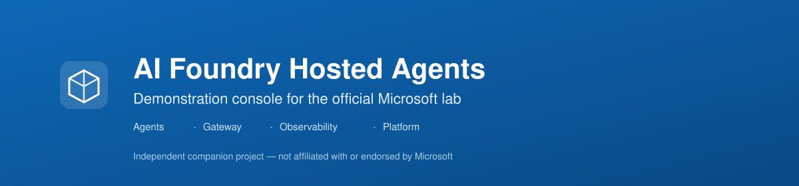
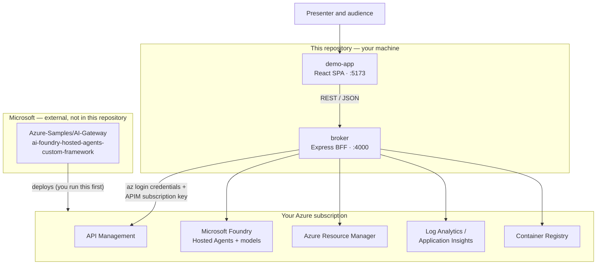
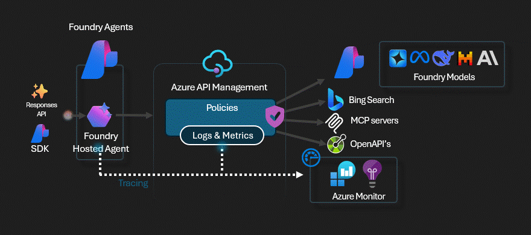
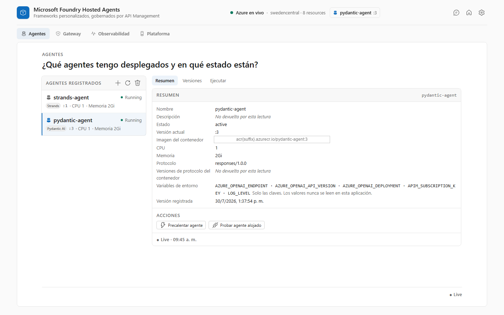
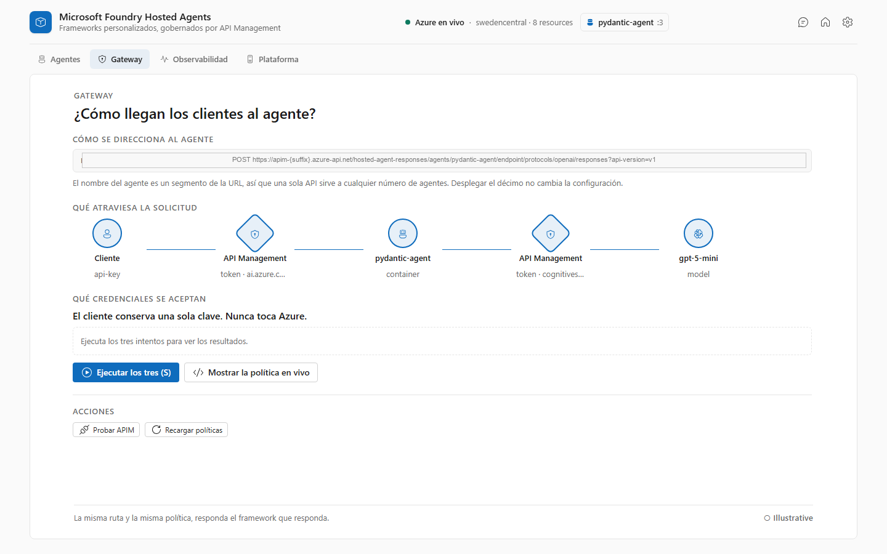
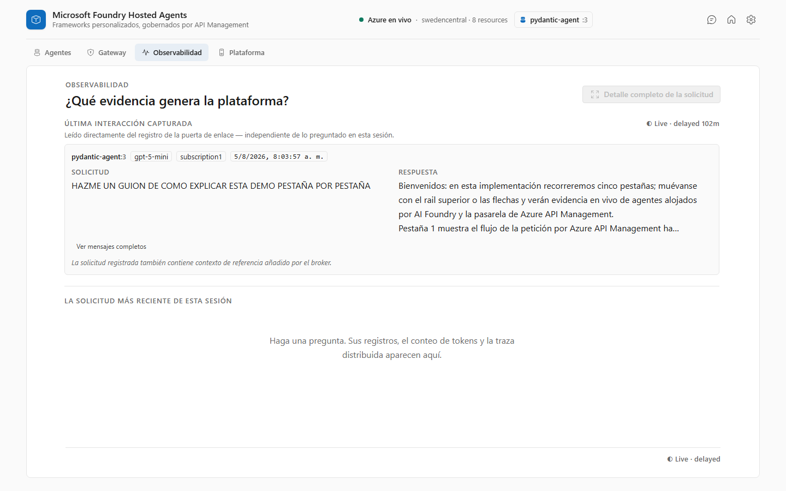
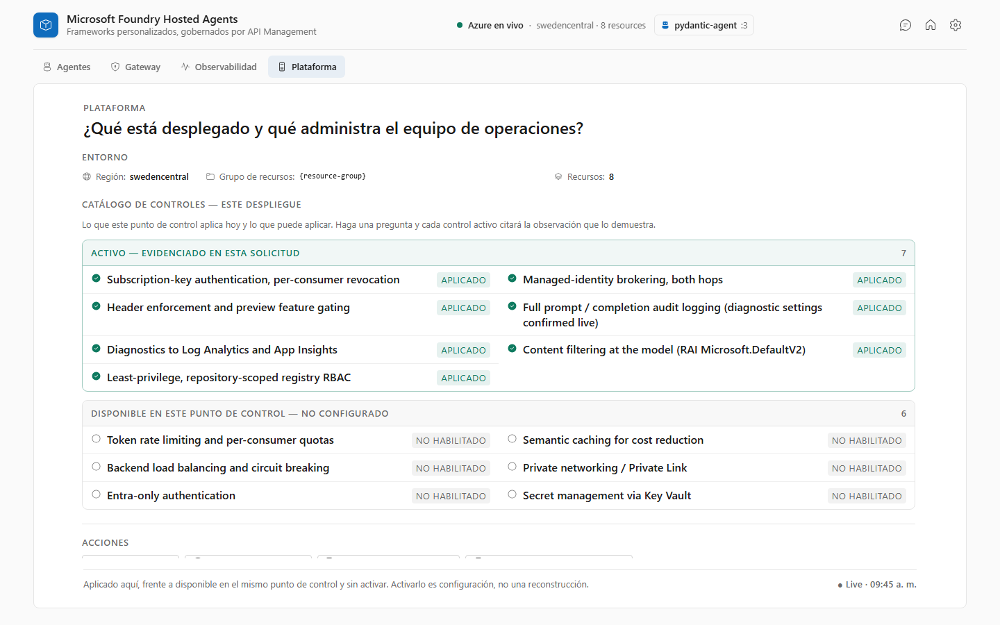

<div align="center">



### 🇬🇧 English &nbsp;|&nbsp; [🇪🇸 Español](README.es.md)

[](https://react.dev/)
[](https://www.typescriptlang.org/)
[](https://vitejs.dev/)
[](https://react.fluentui.dev/)
[](https://nodejs.org/)
[](https://github.com/Azure-Samples/AI-Gateway/tree/main/labs/ai-foundry-hosted-agents-custom-framework)
[](LICENSE)

</div>

---

> **Important notice.** This is an **independent companion demo** built on top of the official Microsoft sample [**"AI Foundry Hosted Agents with Custom Frameworks"**](https://github.com/Azure-Samples/AI-Gateway/tree/main/labs/ai-foundry-hosted-agents-custom-framework), part of [`Azure-Samples/AI-Gateway`](https://github.com/Azure-Samples/AI-Gateway).
>
> **It does not replace, substitute for, or form part of Azure AI Foundry, Azure API Management, the Azure Portal, or any official Microsoft tool.** It is a presentation layer that reads a deployment the official lab creates. It is not a product, not a platform, and not a SaaS offering. Not affiliated with or endorsed by Microsoft.

## Contents

[What this is](#what-this-is) · [What problem it solves](#what-problem-it-solves) · [What we built](#what-we-built) · [What we did not build](#what-we-did-not-build) · [Architecture](#architecture) · [Request flow](#request-flow) · [Prerequisite: deploy the official lab](#prerequisite-deploy-the-official-lab) · [Getting started](#getting-started) · [Tearing it down](#tearing-it-down) · [The four sections](#the-four-sections) · [The built-in copilot](#the-built-in-copilot) · [Demo modes](#demo-modes) · [Cost](#cost) · [Screenshots](#screenshots) · [Repository structure](#repository-structure) · [Documentation](#documentation) · [Security](#security) · [Credits](#credits) · [License](#license)

## What this is

A **companion demo** — a visual console — for one specific official Azure lab: **Foundry Hosted Agents running custom frameworks, governed by Azure API Management**.

It consists of two components we wrote ourselves, published together in this repository:

- **`demo-app/`** — the frontend console the audience sees.
- **`broker/`** — the backend-for-frontend that talks to Azure on the console's behalf.

Both can run **on the presenter's own machine**, and both can be **deployed to Azure as a single App Service** by this repository's lab automation — Express serves the console and the `/api` routes from one origin, so no credential ever reaches the browser in either mode. Together they turn a deployment you already have into something you can walk a room through in about ten minutes.

## What problem it solves

The official lab is a Jupyter notebook. It is excellent at what it does — reproducing a deployment cell by cell — and unsuited to a different job: explaining that deployment, live, to people who will not read code.

The alternative is the Azure Portal, which shows the resources but scatters the *story* across API Management policy XML, two Foundry accounts, a container registry, and Log Analytics queries. Nobody follows an architecture that way in a meeting.

This demo exists so that a technical or non-technical audience can **see the architecture and the flow** — governance, identity, routing, telemetry — without walking the notebook and without navigating Azure AI Foundry's full surface.

It is used for technical presentations, presales conversations, workshops, customer and internal sessions, and architecture explanations. It is a way of **explaining** a solution — the application itself is not the thing being sold.

## What we built

| Component | Responsibility |
|---|---|
| **`demo-app/`** — React 19 · TypeScript · Vite · Tailwind v4 · Fluent UI v9 · Zustand | The visual console. Four navigable sections plus a built-in copilot. It holds **no** Azure credentials and has **no** Azure SDK — it only calls the broker over HTTP. |
| **`broker/`** — Node.js · Express · TypeScript · `DefaultAzureCredential` | A local backend-for-frontend written specifically for this demo. It authenticates to Azure with the presenter's own `az login` session, holds the APIM subscription key server-side, calls Azure (ARM, API Management, Foundry, Log Analytics, Container Registry), and exposes a small internal REST API to the frontend. |

**Why the broker exists.** A browser cannot do this job. It would have to hold an APIM subscription key and an Entra token in JavaScript the audience can open DevTools on, and it would be blocked by CORS on most of these endpoints anyway. Putting every credential and every Azure call in a local server process makes credential exposure *structurally* impossible rather than merely discouraged. The broker is **not** part of the official lab — it is ours, it exists only to serve this console, and that is why the two ship in the same repository.

## What we did not build

Everything the demo *shows* belongs to Microsoft and to the official lab:

- **The lab itself** — [`ai-foundry-hosted-agents-custom-framework`](https://github.com/Azure-Samples/AI-Gateway/tree/main/labs/ai-foundry-hosted-agents-custom-framework) — its notebook, its `main.bicep`, its APIM policy XML, and its sample agents are Microsoft's, published under the MIT License in [`Azure-Samples/AI-Gateway`](https://github.com/Azure-Samples/AI-Gateway). **This repository contains no copy of the lab and does not modify it.**
- **Microsoft Foundry** and **Foundry Hosted Agents** are Microsoft platform services.
- **Azure API Management**, **Log Analytics**, **Application Insights**, and **Azure Container Registry** are Azure services.
- The architecture being demonstrated is the lab's architecture, not ours.

We added a way to see it. That is the whole contribution.

## Architecture



The official lab is a **prerequisite**, not a dependency this repository vendors: you deploy it from Microsoft's repository, and this demo then reads what it created.

## Request flow

When the presenter asks the agent a question:

```text
User (browser)
  ↓  demo-app — no credentials, no Azure SDK
Broker (localhost:4000) — holds az login session + APIM subscription key
  ↓  HTTPS, subscription key
Azure API Management — north–south hop, policy enforcement
  ↓
Microsoft Foundry Hosted Agent — your container, Responses protocol
  ↓  managed identity, east–west hop back through API Management
Model deployment (gpt-5-mini)
```

The agent's own outbound call to the model happens entirely inside Azure; the broker makes the first hop and reads back the finished response. Both hops are visible in the console's Observability section, correlated from real Log Analytics and Application Insights data.

## Prerequisite: deploy the official lab

**This demo does not work standalone.** It reads a live deployment, so that deployment has to exist first. **You do not need to clone anything else** — the lab is vendored into this repository under `vendor/ai-gateway/`, so either route below works from this clone alone.

**Automated (recommended).** One command deploys the lab, registers both hosted agents, and publishes this demo to an App Service, ending with a public URL:

```powershell
cd labs/ai-foundry-hosted-agents-custom-framework-automation/scripts
./deploy.ps1                 # add -ValidateOnly first for a dry run
```

See that folder's [README](labs/ai-foundry-hosted-agents-custom-framework-automation/README.md) for parameters, re-deploy behaviour, and cost.

**Manual, following Microsoft's notebook.** The original path, unchanged:

1. **Open the vendored lab** — `vendor/ai-gateway/labs/ai-foundry-hosted-agents-custom-framework/`, or the [upstream copy](https://github.com/Azure-Samples/AI-Gateway/tree/main/labs/ai-foundry-hosted-agents-custom-framework).
2. **Run its deployment** — open `ai-foundry-hosted-agents-custom-framework.ipynb` and run it top to bottom. It deploys the infrastructure with Bicep (API Management, two Microsoft Foundry accounts, Azure Container Registry, Log Analytics, Application Insights), builds and pushes the chosen framework's agent image (`strands` or `pydantic`), registers it as a Foundry Hosted Agent, and tests it directly and through API Management.
3. **Verify the hosted agents work** — the notebook's own test cells are the check. Do not continue until they pass.
4. **Configure this demo's broker** — [Step 2](#step-2--start-the-broker) below, using that deployment's outputs.
6. **Run the demo** — [Step 3](#step-3--start-the-console).

The lab's own README is the **only** authoritative source on deploying it, including troubleshooting. This repository neither copies nor modifies it.

**To deploy the lab you need:** [Python 3.12+](https://www.python.org/), [VS Code](https://code.visualstudio.com/) with the [Jupyter extension](https://marketplace.visualstudio.com/items?itemName=ms-toolsai.jupyter), [uv](https://docs.astral.sh/uv/), an Azure subscription with Contributor + RBAC Administrator (or Owner), and the [Azure CLI](https://learn.microsoft.com/cli/azure/install-azure-cli) signed in via `az login`.

**To run this demo on top of it you need:** [Node.js 20+](https://nodejs.org/) and npm.

## Getting started

### Step 0 — Clone

```bash
git clone https://github.com/AndresR08/hosted-agents-demo.git
cd hosted-agents-demo
```

That is everything you need to fetch. The official lab is vendored in `vendor/ai-gateway/`, so there is no second repository to clone.

### Step 1 — Deploy the lab

Two routes. Both need `az login` and a subscription where you hold **Owner**, or **Contributor + Role Based Access Control Administrator** — the lab's Bicep creates role assignments.

**A. Automated (recommended).** One command deploys the infrastructure, registers both hosted agents, builds this demo and publishes it to an App Service, ending with a public URL:

```powershell
cd labs/ai-foundry-hosted-agents-custom-framework-automation/scripts

./deploy.ps1 -ValidateOnly    # dry run first: checks and ARM validation, no resources
./deploy.ps1                  # the real thing, ~25-35 min (APIM dominates)
```

It prints the demo URL when it finishes. Nothing else to start — Steps 2 and 3 are only for running the console locally instead. Parameters, re-deploy behaviour and per-stage flags are in the [automation README](labs/ai-foundry-hosted-agents-custom-framework-automation/README.md).

**B. Manual, following Microsoft's notebook.** Open `vendor/ai-gateway/labs/ai-foundry-hosted-agents-custom-framework/ai-foundry-hosted-agents-custom-framework.ipynb` and run it top to bottom, then continue with Step 2 below. See [Prerequisite](#prerequisite-deploy-the-official-lab).

### Step 2 — Start the broker *(local run only)*

Skip this if you used route A — the App Service already runs both halves.

The broker authenticates with your `az login` session and never writes to your deployment.

```bash
cd broker
npm install
cp .env.example .env
```

Fill in `.env` from the Step 1 deployment's outputs:

```bash
az deployment group show \
  --resource-group <your-resource-group> \
  --name <your-deployment-name> \
  --query properties.outputs
```

```bash
npm run dev          # listens on http://localhost:4000
```

### Step 3 — Start the console *(local run only)*

```bash
cd demo-app
npm install
cp .env.example .env.local
npm run dev          # http://localhost:5173 — requires the broker from Step 2
```

Open `http://localhost:5173`.

## Tearing it down

**Do this when you stop using the lab.** The deployment bills continuously whether or not anyone opens the demo, and API Management cannot be paused — deleting the resource group is the only way to stop the charge. See [Cost](#cost).

```powershell
cd labs/ai-foundry-hosted-agents-custom-framework-automation/scripts
./teardown.ps1 -ResourceGroupName lab-ai-foundry-hosted-agents-custom-framework
```

It asks for confirmation before deleting. One resource group holds everything — API Management, both Foundry accounts and their registered agents, the container registry and its images, Log Analytics, and the App Service — so this single command removes all of it, with nothing left behind to remember.

Non-interactively (CI, a scheduled task), pass `-Force` to confirm explicitly:

```powershell
./teardown.ps1 -ResourceGroupName <your-resource-group> -Force
```

There is also a local, interactive cost manager that shows current spend and offers the same deletion behind a double confirmation — `labs/…-automation/scripts/local/Manage-LabCost.ps1`. It runs on your machine only and is never deployed.

> **Deleting does not purge immediately.** API Management and Foundry stay recoverable for ~48 hours and Log Analytics for up to 14 days, with their names reserved. Re-deploying under the *same* resource group name inside that window can fail with a conflict, or silently restore the old resource. Wait it out, purge explicitly, or use a different name.

## The four sections

| Section | Answers |
|---|---|
| **Agents** | What agents do I have deployed, and what state are they in? |
| **Gateway** | How do clients reach the agent, and what does the policy enforce? |
| **Observability** | What evidence does the platform generate? |
| **Platform** | What's deployed, and what does the operations team administer? |

Every data-bearing component carries a provenance badge stating whether what you are looking at is live, live-but-delayed, or illustrative. Nothing is presented as measured when it is not.

## The built-in copilot

The console has an assistant (`C` to open/close) that answers questions about this architecture. It is **not** a fifth section, and it is worth describing how it actually works, because it is easy to mistake for something it isn't.

```text
question
   ↓
findRelevantEntries()      broker/src/demoKnowledge.ts
   ↓
scoreEntry()               keyword substring + word overlap + per-entry topic terms
   ↓
top 3 entries max          MAX_ENTRIES = 3
   ↓
buildAugmentedPrompt()     STYLE_DIRECTIVE + matched facts + the verbatim question
   ↓
the real hosted agent      APIM → Foundry Hosted Agent → model
```

- **`KNOWLEDGE_BASE`** is a **manually curated** list of facts about this deployment, written by hand in `broker/src/demoKnowledge.ts`. Every entry has to be true of the running environment.
- **`scoreEntry()`** scores an entry against the normalised question by plain string matching: exact keyword substring, partial word overlap on multi-word keywords, and a per-entry list of distinctive topic terms. Highest scores win.
- **At most three entries** are injected, as reference context.
- **`buildAugmentedPrompt()`** assembles `STYLE_DIRECTIVE` + the matched facts + the user's question, passed through verbatim and clearly delimited.
- **The real model still writes the answer.** The augmented prompt goes over the same live path the rest of the console explains — API Management, hosted agent, model. Only the text of the question is enriched.
- **When nothing matches**, the fallback is the style directive and the question alone: the agent answers from its own capability, which is what keeps free-form conversation working.

**It does not use** embeddings, a vector database, Azure AI Search, or RAG in any conventional sense. There is no retrieval index. It is keyword-scored prompt augmentation over a hand-written fact list.

Full detail, including the honesty rules the directive enforces, in [`COPILOT_CONTEXT.md`](demo-app/docs/en/01-general/COPILOT_CONTEXT.md).

## Demo modes

- **Azure Live** (the default) — every panel reads the real deployment through the broker. This is the mode the demo is built for and the mode everything is verified in.
- **Simulation** — ⚠️ **not a working offline demo.** The intent was to replay a rehearsal capture recorded against a live deployment, from a JSON file in `demo-app/captures/`. **That capture loader is not built.** What ships today is a structurally valid scaffold that returns obvious `PLACEHOLDER` values so panels have something to render and type against. It is not a safety net for presenting without a connection, and nothing in it should be shown to a customer. See `demo-app/src/services/simulation/simulationService.ts` and [`PROJECT_STATUS.md`](demo-app/docs/en/03-development/PROJECT_STATUS.md).

## Cost

**[Fact]** **Run locally, the demo adds no Azure hosting cost** — both components run on the presenter's machine. **Deployed by the lab automation, it adds exactly one cost line: a single App Service plan (B1, Linux),** which bills for as long as it exists, whether or not anyone opens the demo. It lives in the lab's resource group, so `teardown.ps1` removes it along with everything else.

The cost that matters is the **official lab's** deployment (API Management, two Foundry accounts, Container Registry, Log Analytics, Application Insights), plus the **marginal token and request consumption** the demo adds each time the presenter invokes an agent or asks the copilot a question — because those are real calls to a real model.

### What it costs to leave running

**[Estimate]** **~$215/month in `swedencentral`, public list prices, August 2026, dominated by APIM Basicv2 (92%) — check current prices for your region.**

| Resource | Share | Can it be paused? |
|---|---|---|
| **API Management** (`Basicv2`) | ~$197/mo · **92%** | **No.** There is no stop or pause operation for the Basic tier |
| App Service plan (`B1`, Linux) | ~$13/mo · 6% | Only by scaling to `F1` (Free). Stopping the *site* changes nothing — the plan is what bills |
| Container Registry (`Basic`) | ~$5/mo · 2% | No |
| Log Analytics + App Insights | ~$0 idle | No fixed fee; you pay ingestion and retention |
| `gpt-5-mini` (`GlobalStandard`) | **$0 idle** | Pay-per-token. `capacity: 10` is a rate limit, not reserved throughput |

**The practical consequence:** turning things off saves almost nothing, because the 92% cannot be turned off. **[Recommendation]** [Delete the resource group](#tearing-it-down) when the lab is not in use — that is the only action with real financial impact.

Prices change by region and over time, so treat the figure above as a starting point and not a quote. [`DEPLOYMENT_AND_COSTS.md`](demo-app/docs/en/01-general/DEPLOYMENT_AND_COSTS.md) gives the full resource inventory, the consumption model, and a procedure for obtaining your own figures. Every claim there is tagged **[Fact]**, **[Estimate]**, or **[Recommendation]**.

## Screenshots


<p><sub>Architecture diagram from the official Microsoft lab. Source: <a href="https://github.com/Azure-Samples/AI-Gateway/tree/main/labs/ai-foundry-hosted-agents-custom-framework">Azure-Samples/AI-Gateway</a> — reused under its MIT License, see <a href="ACKNOWLEDGEMENTS.md">ACKNOWLEDGEMENTS.md</a>.</sub></p>

<table>
<tr>
<td width="50%">

**Agents** — live Foundry registry


</td>
<td width="50%">

**Gateway** — routing and credential test


</td>
</tr>
<tr>
<td width="50%">

**Observability** — real Log Analytics evidence


</td>
<td width="50%">

**Platform** — three-state controls catalogue


</td>
</tr>
</table>

## Repository structure

```text
.
├── README.md / README.es.md      this file, in both languages
├── LICENSE · SECURITY.md · CONTRIBUTING.md · CODE_OF_CONDUCT.md
├── ACKNOWLEDGEMENTS.md · CHANGELOG.md
├── assets/                       banner, reused lab diagram, screenshots
│
├── vendor/ai-gateway/            the official lab, vendored from Azure-Samples/AI-Gateway
│   ├── NOTICE.md                 provenance: upstream commit, date, what and why
│   ├── LICENSE.md                upstream's MIT License, unmodified
│   ├── labs/…-custom-framework/  main.bicep, policies, notebooks, agent sources
│   └── modules/                  the shared Bicep modules main.bicep reaches
│
├── labs/…-automation/            our PowerShell deployment of that lab
│   └── scripts/                  deploy.ps1 · teardown.ps1 · sync-vendor.ps1
│
├── demo-app/                     the console (React SPA)
│   ├── docs/                     full documentation — en/ and es/
│   └── src/
│       ├── theme/                design tokens, Fluent theme, light/dark provider
│       ├── config/               typed environment-variable access
│       ├── state/                Zustand store — active section, copilot, mode, target agent
│       ├── services/             DemoDataService contract + azure/ and simulation/ implementations
│       ├── components/           shared primitives (PanelBody, ProvenanceBadge, …)
│       ├── layout/               AppShell, Header, SectionNav, StopFrame
│       ├── features/             one folder per section, plus copilot/
│       └── hooks/                useKeyboardShortcuts
│
└── broker/                       the BFF (Express)
    └── src/
        ├── config.ts             environment + the one place that builds a hosted-agent URL
        ├── demoKnowledge.ts      the copilot's curated knowledge base and prompt builder
        ├── azureAuth.ts          DefaultAzureCredential wiring
        └── routes/               agents, ask, policy, observability, runs, controls, …
```

## Documentation

Full documentation lives in [`demo-app/docs/`](demo-app/docs/README.md), in English and Spanish, kept topic-for-topic in sync:

- **[`docs/en/01-general/`](demo-app/docs/en/01-general)** — [purpose](demo-app/docs/en/01-general/PURPOSE.md), [architecture](demo-app/docs/en/01-general/ARCHITECTURE.md), [deployment & costs](demo-app/docs/en/01-general/DEPLOYMENT_AND_COSTS.md), [copilot context](demo-app/docs/en/01-general/COPILOT_CONTEXT.md).
- **[`docs/en/02-presentation/`](demo-app/docs/en/02-presentation)** — [presentation guide](demo-app/docs/en/02-presentation/PRESENTATION_GUIDE.md), [flow](demo-app/docs/en/02-presentation/PRESENTATION_FLOW.md), [FAQ](demo-app/docs/en/02-presentation/FAQ.md).
- **[`docs/en/03-development/`](demo-app/docs/en/03-development)** — [design decisions](demo-app/docs/en/03-development/DESIGN_DECISIONS.md), [Azure integration report](demo-app/docs/en/03-development/AZURE_INTEGRATION_REPORT.md), [project status](demo-app/docs/en/03-development/PROJECT_STATUS.md), [history](demo-app/docs/en/03-development/HISTORY.md).
- **[`docs/en/04-references/`](demo-app/docs/en/04-references)** — links to the official lab and external documentation.

Start with [`demo-app/docs/README.md`](demo-app/docs/README.md).

## Security

The console never holds an Azure credential: no Azure SDK, no subscription key, no Entra token in the browser. Everything goes through the broker via `VITE_BROKER_BASE_URL`. The broker reads its configuration from a `.env` file that is git-ignored and never committed — `.env.example` ships placeholders only.

To report a vulnerability, see [`SECURITY.md`](SECURITY.md). Issues about the **official lab** belong in [`Azure-Samples/AI-Gateway`](https://github.com/Azure-Samples/AI-Gateway/issues), not here.

## Credits

Full attribution in [`ACKNOWLEDGEMENTS.md`](ACKNOWLEDGEMENTS.md). Short version: the architecture, infrastructure templates, APIM policies, and sample agents belong to Microsoft's official [`Azure-Samples/AI-Gateway`](https://github.com/Azure-Samples/AI-Gateway) lab. This project only adds a way to see it.

Contributions welcome — see [`CONTRIBUTING.md`](CONTRIBUTING.md) and the [Code of Conduct](CODE_OF_CONDUCT.md). Changes are recorded in [`CHANGELOG.md`](CHANGELOG.md).

## License

The official lab is published by Microsoft Corporation under the [MIT License](https://github.com/Azure-Samples/AI-Gateway/blob/main/LICENSE.md). This companion project is published under the [MIT License](LICENSE) as well — see that file for the full text and a note on the one reused asset.

---

<p align="center"><sub>An independent companion demo. Not affiliated with or endorsed by Microsoft. The underlying lab is an official <a href="https://github.com/Azure-Samples/AI-Gateway">Azure-Samples/AI-Gateway</a> project.</sub></p>
