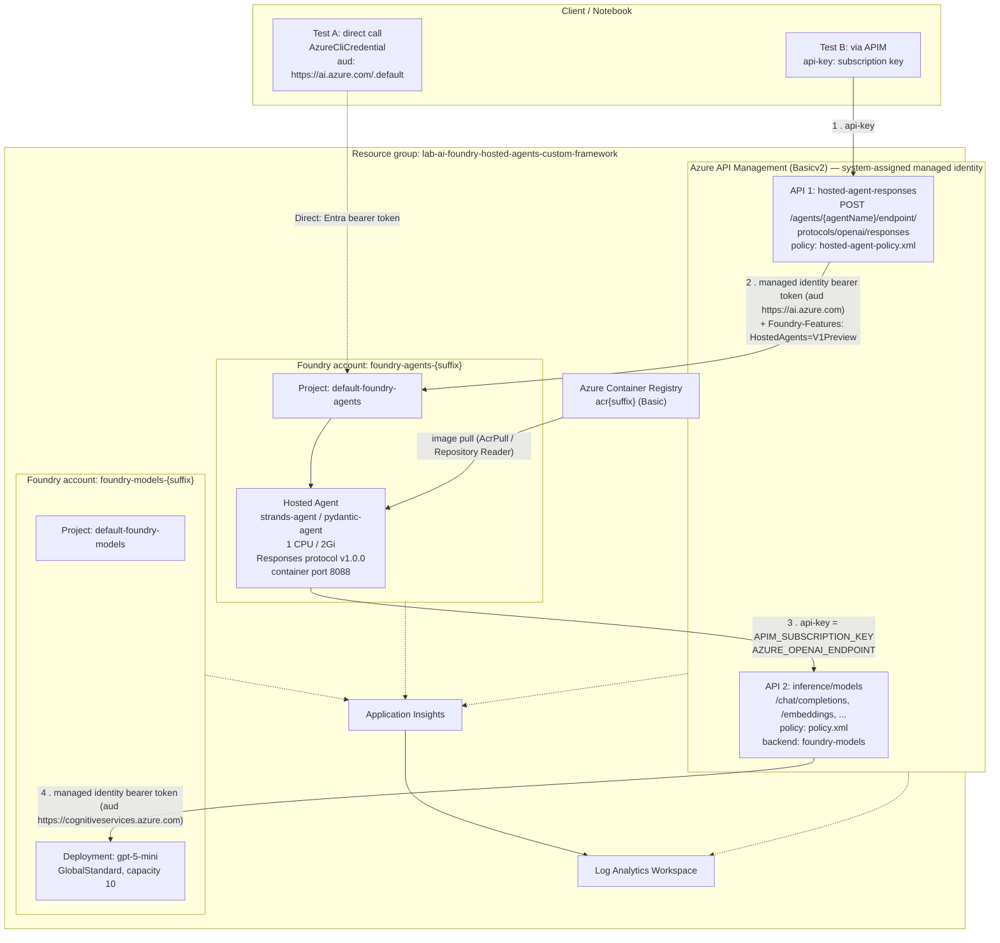

# Demo architecture

> This document describes the architecture of the **official Microsoft Azure lab** that this demo visualizes — not the architecture of the `demo-app`'s own frontend/backend code (broker + web interface), which is a separate topic and not the subject of this document.

**Lab path:** `labs/ai-foundry-hosted-agents-custom-framework`
**Scope:** This document describes only this lab. The shared Bicep modules under `modules/` are described only to the extent the lab consumes them.
**Analysis date:** 2026-07-31

---

## 1. Executive summary

This lab demonstrates how to run a **custom agent framework** (Pydantic AI or Strands) as a **Microsoft Foundry Hosted Agent**, packaged as a container image, and how to expose that agent through **Azure API Management (APIM)** so clients can authenticate with a simple subscription key instead of Entra ID credentials.

There are two distinct APIM API surfaces, and understanding the difference between them is the key to the whole architecture:

| # | APIM API | Direction | Purpose |
|---|----------|-----------|---------|
| 1 | **Hosted Agent Responses API** (`/hosted-agent-responses`) | **North–south, inbound** | External client → APIM → Foundry Hosted Agent (agent invocation) |
| 2 | **Inference API** (`/inference/models`) | **East–west, outbound** | Agent container → APIM → Foundry model deployment (`gpt-5-mini`) |

APIM therefore appears **twice in a single request journey**: once as the ingress gateway to the agent, and again as the outbound AI gateway the agent itself uses to reach the LLM. This is the "AI Gateway" pattern that provides a single control point for token metering, throttling, logging, and credential brokering on both sides of the agent.

The deployment is also intentionally split across **two separate Foundry (Azure AI Services) accounts**:

- `foundry-models-{suffix}` — hosts the `gpt-5-mini` model deployment (the inference plane).
- `foundry-agents-{suffix}` — hosts the containerized agent runtime (the agent plane).

This separation lets model capacity be scaled, secured, and governed independently of the agent-hosting surface, and keeps APIM's inference backend pointing at a resource that carries no agent workloads.

---

## 2. Component inventory

### 2.1 Lab files

| File | Role |
|------|------|
| `ai-foundry-hosted-agents-custom-framework.ipynb` | End-to-end orchestrator: deploy → build → register agent → test (direct + APIM) |
| `main.bicep` | Infrastructure-as-code entry point for the whole lab |
| `params.json` | Bicep parameters file — **generated/overwritten by the notebook at runtime** |
| `policy.xml` | APIM policy for the **inference** API (managed identity → Cognitive Services) |
| `hosted-agent-policy.xml` | APIM policy for the **hosted agent responses** API (managed identity → AI Foundry) |
| `clean-up-resources.ipynb` | Deletes the resource group |
| `src/frameworks/pydantic/` | Pydantic AI agent implementation + Dockerfile + requirements |
| `src/frameworks/strands/` | Strands agent implementation + Dockerfile + requirements |
| `src/frameworks/README.md` | Framework comparison, routing rules, troubleshooting |

### 2.2 Shared modules consumed

| Module | Implements |
|--------|-----------|
| `modules/operational-insights/v1/workspaces.bicep` | Log Analytics Workspace |
| `modules/monitor/v1/appinsights.bicep` | Application Insights (workspace-based) |
| `modules/apim/v3/apim.bicep` | APIM instance, loggers, diagnostics, subscriptions |
| `modules/apim/v3/inference-api.bicep` | APIM Inference API, backend, policy, LLM diagnostics |
| `modules/cognitive-services/v3/foundry.bicep` | AI Services accounts, Foundry projects, connections, RBAC |
| `modules/cognitive-services/v3/deployments.bicep` | Model deployments (`gpt-5-mini`) |

---

## 3. Architecture diagram



---

## 4. End-to-end request flow

### 4.1 Production journey (client → APIM → agent → APIM → model)

**Step 1 — Client → APIM (Hosted Agent API)**

```http
POST https://apim-{suffix}.azure-api.net/hosted-agent-responses/agents/{agentName}/endpoint/protocols/openai/responses?api-version=v1
api-key: {apim-subscription-key}
Content-Type: application/json

{ "input": "Hello! What can you help me with?", "stream": false }
```

The client presents **only** an APIM subscription key. It holds no Azure AD credential, no Foundry endpoint, and no model key.

**Step 2 — APIM inbound policy (`hosted-agent-policy.xml`)**

APIM performs a credential exchange:

1. `<authentication-managed-identity resource="https://ai.azure.com" .../>` — APIM's system-assigned managed identity acquires an Entra access token for the AI Foundry audience.
2. `Authorization: Bearer {token}` is set (overwriting any value sent by the client).
3. `Content-Type: application/json` is enforced.
4. `Foundry-Features: HostedAgents=V1Preview` is enforced — this opt-in header is required for the Hosted Agents preview surface.

The API's `serviceUrl` is the **agents** project endpoint (`foundryAgentProjectEndpoint`). APIM appends the matching operation's route, so `/agents/{agentName}/endpoint/protocols/openai/responses` is preserved verbatim against the Foundry project's base URL. Routing to a specific agent is done purely by URL path segment — there's no `agent_reference` in the body, which is why **a single APIM API serves an unlimited number of agents with no reconfiguration needed**.

**Step 3 — Foundry → agent container**

Foundry's hosted-agent control plane resolves `{agentName}`, routes to the running container instance, and talks to it using the **Responses protocol v1.0.0**. The container runs `azure.ai.agentserver.responses.ResponsesAgentServerHost`, which:

- deserializes the request into `CreateResponse` + `ResponseContext`
- calls the function registered with `@app.response_handler`
- exposes `context.get_input_text()`, `context.get_input_items()`, `context.get_history()` (multi-turn state via `conversation_id` / `previous_response_id`)
- provides an `asyncio.Event` cancellation signal for client disconnects
- serializes the returned `TextResponse` as either a full response or `response.output_text.delta` SSE events

**Step 4 — Agent → APIM (Inference API)**

The agent does **not** call the model directly. It builds an `AsyncOpenAI` client pointing at:

```
base_url = AZURE_OPENAI_ENDPOINT            # https://apim-{suffix}.azure-api.net/inference/models
default_query = { "api-version": AZURE_OPENAI_API_VERSION }
default_headers = { "api-key": APIM_SUBSCRIPTION_KEY }
```

so the effective call is `POST https://apim-{suffix}.azure-api.net/inference/models/chat/completions?api-version=2024-05-01-preview`.

`main.py` normalizes the endpoint defensively: it strips any query string and trims a trailing `/chat/completions`, so both the base URL and a full chat-completions URL work.

**Step 5 — APIM inbound policy (`policy.xml`)**

A second credential exchange, with a different audience:

1. `<authentication-managed-identity resource="https://cognitiveservices.azure.com" .../>`
2. `Authorization: Bearer {token}`
3. `<set-backend-service backend-id="foundry-models" />` — the `{backend-id}` placeholder is substituted at deployment time by `inference-api.bicep`. With a single AI service in the array it resolves to that service's name; with more than one, it would resolve to `inference-backend-pool` (load-balanced).

**Step 6 — Foundry models → `gpt-5-mini`**

The backend URL is `{foundry-models endpoint}/models`, and the `Cognitive Services User` role assignment on the account authorizes APIM's managed identity.

**Step 7 — Response return journey**

Tokens flow back: model → APIM → agent container → Foundry → APIM → client. Both agents implement true incremental streaming:
- **Strands:** `agent.stream_async()`, yielding `event["data"]` deltas; wires the cancellation signal to `agent.cancel()`.
- **Pydantic AI:** `agent.run_stream()` + `run.stream_text()`, converting *cumulative* text into incremental deltas via prefix-diffing against the previous chunk.

### 4.2 Direct journey (baseline / troubleshooting)

```
Notebook → AzureCliCredential (aud https://ai.azure.com/.default)
        → https://foundry-agents-{suffix}.services.ai.azure.com/api/projects/default-foundry-agents
        → /agents/{agentName}/endpoint/protocols/openai/responses?api-version=v1
```

Implemented via `AIProjectClient(..., allow_preview=True).get_openai_client(agent_name=...)`, followed by `openai_client.responses.create(input=query)`. APIM is bypassed entirely. **From step 4 onward, the journey doesn't change** — the agent still calls the model through APIM, because that's baked into its environment variables. This makes the direct test the correct isolation test: if it fails, the problem is in the agent or in Foundry; if it succeeds and the via-APIM test fails, the problem is in APIM's policy/configuration.

---

## 5. Azure resource inventory

Naming convention: `resourceSuffix = uniqueString(subscription().id, resourceGroup().id)`.
Resource group: `lab-ai-foundry-hosted-agents-custom-framework`, location `swedencentral`.

> The resource group name is a notebook variable, not a fixed value. **The currently
> deployed instance is `{resource-group}`** with suffix
> `{suffix}`. Also note that the 21 rows below are a manual inventory that includes
> sub-resources; a top-level ARM resource listing against this group returns
> **8**. Both numbers are correct — they count different things.

| # | Resource type | Name | Key configuration |
|---|---------------|------|-------------------|
| 1 | `Microsoft.OperationalInsights/workspaces` | `workspace-{suffix}` | PerGB2018, 30-day retention, system-assigned managed identity |
| 2 | `Microsoft.Insights/components` | `insights-{suffix}` | Workspace-based, `CustomMetricsOptedInType: WithDimensions` |
| 3 | `Microsoft.ApiManagement/service` | `apim-{suffix}` | **Basicv2**, capacity 1, **system-assigned managed identity**, releaseChannel `Default` |
| 4 | `Microsoft.ApiManagement/service/loggers` | `azuremonitor` | Azure Monitor logger, unbuffered |
| 5 | `Microsoft.ApiManagement/service/loggers` | `appinsights-logger` | App Insights logger, unbuffered |
| 6 | `Microsoft.ApiManagement/service/subscriptions` | `hosted-agents-subscription` | scope `/apis`, active, tracing allowed |
| 7 | `Microsoft.ApiManagement/service/apis` | `inference-api` | path `inference/models`, OpenAPI `AIFoundryAzureAI.json` |
| 8 | `Microsoft.ApiManagement/service/backends` | `foundry-models` | url `{endpoint}/models`, **managedIdentity** credential |
| 9 | `Microsoft.ApiManagement/service/apis` | `hosted-agent-responses-api` | path `hosted-agent-responses`, serviceUrl = agents project endpoint |
| 10 | `.../apis/operations` | `create-response` | `POST /agents/{agentName}/endpoint/protocols/openai/responses` |
| 11 | `Microsoft.CognitiveServices/accounts` | `foundry-models-{suffix}` | kind `AIServices`, S0, `allowProjectManagement: true`, system-assigned managed identity |
| 12 | `Microsoft.CognitiveServices/accounts` | `foundry-agents-{suffix}` | kind `AIServices`, S0, `allowProjectManagement: true`, system-assigned managed identity |
| 13 | `.../accounts/projects` | `default-foundry-models` | system-assigned managed identity |
| 14 | `.../accounts/projects` | `default-foundry-agents` | system-assigned managed identity — **hosts the agent** |
| 15 | `.../accounts/deployments` | `gpt-5-mini` | OpenAI, version `2025-08-07`, GlobalStandard, capacity 10, RAI `Microsoft.DefaultV2` |
| 16 | `.../accounts/connections` | `{account}-appInsights-connection` | category `AppInsights`, authType `ApiKey` (×2, one per account) |
| 17 | `Microsoft.ContainerRegistry/registries` | `acr{suffix}` | SKU **Basic**, `adminUserEnabled: true`, anonymous pull disabled, public network enabled |
| 18 | `Microsoft.Insights/diagnosticSettings` | per resource | APIM (AllLogs + AllMetrics, dedicated tables); each Foundry account (AllMetrics) |
| 19 | `.../apis/diagnostics` | `azuremonitor` | 100% sampling, verbose, **LLM request/response message logging up to 256 KB** |
| 20 | `.../apis/diagnostics` | `applicationinsights` | W3C correlation, verbose, 8 KB bodies, rate-limit headers captured |
| 21 | `Microsoft.Authorization/roleAssignments` | 11+ assignments | See section 7 |
| — | **Foundry Hosted Agent** (data plane) | `strands-agent` / `pydantic-agent` | Not an ARM resource — created via SDK; 1 CPU / 2Gi |

---

## 6. How APIM interacts with Azure AI Foundry

APIM sits in front of Foundry in **two independent roles**, each with its own API, policy, and token audience.

### 6.1 Role A — Ingress gateway to the Hosted Agent

| Aspect | Value |
|--------|-------|
| APIM API | `hosted-agent-responses-api` |
| Path | `hosted-agent-responses` |
| Backend | `serviceUrl` = `https://foundry-agents-{suffix}.services.ai.azure.com/api/projects/default-foundry-agents` |
| Routing | Explicit operation with `{agentName}` template parameter |
| Client authentication | APIM subscription key (`api-key`, header or query) |
| Backend authentication | APIM system-assigned managed identity, audience `https://ai.azure.com` |
| Extra headers | `Content-Type: application/json`, `Foundry-Features: HostedAgents=V1Preview` |
| Conditional | Deployed only when `enableHostedAgentResponsesApi = true` |

Note that this API uses a direct `serviceUrl` instead of an APIM `backend` entity — there's no `set-backend-service` in `hosted-agent-policy.xml`, and no load balancing or circuit breaker on this path.

### 6.2 Role B — Outbound AI gateway for model calls

| Aspect | Value |
|--------|-------|
| APIM API | `inference-api` |
| Path | `inference/models` (`inferenceAPIType = 'AzureAI'` ⇒ `/models` suffix) |
| OpenAPI contract | `AIFoundryAzureAI.json` — AI Model Inference `2025-05-15-preview` |
| Backend | APIM `foundry-models` backend entity → `{foundry-models endpoint}/models` |
| Client authentication | APIM subscription key (`api-key`); `bearer: enabled` is also configured on the API |
| Backend authentication | APIM system-assigned managed identity, audience `https://cognitiveservices.azure.com` |
| Backend credential | The backend entity *also* carries a `managedIdentity` credential for the same audience |

### 6.3 The value APIM adds here

1. **Credential brokering** — no Foundry key or Entra credential ever reaches the client, and no model key ever reaches the agent container. Managed identity tokens are issued per request, inside the policy, and never persisted.
2. **Uniform authentication model** — a single subscription key works for both the agent invocation surface and the model inference surface.
3. **Multi-agent routing with no reconfiguration** — since the agent is selected by URL path segment, deploying a tenth agent requires no APIM change at all.
4. **Centralized LLM observability** — the `largeLanguageModel` diagnostic block captures full prompt and completion messages (up to 256 KB each) into Log Analytics, plus token/rate-limit headers into App Insights.
5. **Extension point** — token-limit, semantic-cache, and content-safety policies plug into these same two policy documents without touching the agent's code.

---

## 7. Foundry Hosted Agents — how they work

### 7.1 Concept

A Hosted Agent is **a container you provide, which Foundry runs on your behalf**, exposed through a standardized HTTP contract. You keep full control of the agent's framework and internal logic; Foundry provides hosting lifecycle, scaling, identity, routing, observability, and governance.

### 7.2 Registration

Registration is a **data-plane operation via SDK, not an ARM resource** (`azure-ai-projects==2.3.0`):

```
AIProjectClient(endpoint=foundryAgentProjectEndpoint,
                credential=AzureCliCredential(),
                allow_preview=True)
    .agents.create_version(
        agent_name = "pydantic-agent",
        definition = HostedAgentDefinition(
            protocol_versions        = [ProtocolVersionRecord(RESPONSES, "1.0.0")],
            cpu                      = "1",
            memory                   = "2Gi",
            container_configuration  = ContainerConfiguration(image=image_uri),
            environment_variables    = { ... }))
```

Key properties:
- `allow_preview=True` is mandatory — Hosted Agents is a preview surface (mirroring the `Foundry-Features: HostedAgents=V1Preview` header on the APIM path).
- `create_version` is **immutable and versioned**: Foundry automatically assigns `:1`, `:2`, … Re-running the cell publishes a new version rather than mutating the existing one. The notebook mirrors this on the image side with an incrementing `build_version` tag.
- Resource allocation and environment variables are part of the *agent definition*, not the container image — the same image can be promoted across environments with different configurations.

### 7.3 Runtime contract — Responses protocol v1.0.0

The container must serve the OpenAI Responses protocol on the path Foundry probes. The `azure-ai-agentserver-responses` SDK (`1.0.0b8`) implements the entire server side:

| Aspect | Provided by the SDK |
|---------|---------------------|
| HTTP server, routing, port binding | `ResponsesAgentServerHost` (`app.run()`) |
| Request model | `CreateResponse` |
| Turn context | `ResponseContext` — `response_id`, `get_input_text()`, `get_input_items()`, `get_history()` |
| Multi-turn state | `conversation_id` / `previous_response_id` chaining, exposed via `get_history()` |
| Streaming | `TextResponse(context, request, text=<async generator>)` → SSE `response.output_text.delta` |
| Cancellation | `asyncio.Event` passed to the handler |
| Multimodal input | `MessageContentInputImageContent` + `data_url` helpers |

Its entire integration surface is one decorated function:

```python
@app.response_handler
async def handler(request, context, cancellation_signal) -> TextResponse: ...
```

Everything inside that function is framework-specific — which is precisely what makes Strands and Pydantic AI interchangeable in this lab.

### 7.4 Framework implementation comparison

| | **Strands** (`strands-agents[openai]==1.45.0`) | **Pydantic AI** (`pydantic-ai[openai]`) |
|---|---|---|
| Agent construction | `Agent(...)` per request, model cached in `_MODEL` | Full agent cached in `_AGENT` (deferred singleton) |
| History handling | Converted to native Strands `Messages`, preloaded into the agent | Flattened into a plain-text prompt (`"role: text"` lines) |
| Context management | `SlidingWindowConversationManager(window_size=20)` | None (relies on the flattened prompt) |
| Tools | `get_weather`, `show_internal_environment_variables` (debug) | Only `get_weather`, via `@_AGENT.tool_plain` |
| Image input | Supported — inline `data:` URLs decoded to raw bytes | Not implemented |
| Streaming | `agent.stream_async()` → `event["data"]` | `run_stream()` → prefix-diff deltas |
| Cancellation | Wired to `agent.cancel()` via a watcher task | Cooperative — breaks the yield loop |
| Extra environment variable | `STRANDS_LOG_LEVEL` | — |

### 7.5 Why the platform matters

The justification put forward by the lab, grounded in what the template actually provisions: built-in observability (App Insights connection auto-wired to both Foundry accounts), agent identity and RBAC (project-level system-assigned managed identities with scoped ACR roles), platform guardrails and governance, discoverability through the Foundry control plane, and native evaluation and red-teaming integration.

---

## 8. Where Azure Container Registry fits

ACR is the **artifact plane** — the handoff point between build time and run time.

```
src/frameworks/{framework}/   →   az acr build   →   acr{suffix}.azurecr.io/{image}:{tag}   →   Foundry pulls   →   running agent
```

### 8.1 Build

```
az acr build --registry acr{suffix} --image pydantic-agent:2 src/frameworks/pydantic
```

`az acr build` runs the Docker build **inside ACR Tasks**, not locally. Consequences that matter architecturally:

- **No local Docker daemon required** — a stated relaxation of prerequisites for this lab.
- **The correct target platform is guaranteed** — the image is always built as Linux/amd64, matching Foundry's hosting substrate. This eliminates the classic arm64-Mac → amd64-host failure.
- Build and push are a single atomic operation; the resulting URI is `{registry}.azurecr.io/{image}:{tag}`.

The Dockerfile is deliberately minimal — `python:3.12-slim`, copies the source into `/app/user_agent`, conditional `pip install` of the framework-specific requirements file, `EXPOSE 8088`, `CMD ["python", "main.py"]`.

### 8.2 Pull

When the agent starts (and on every horizontal scale-out), Foundry's hosted-agent infrastructure authenticates against ACR **with managed identity** and pulls the image referenced in `ContainerConfiguration(image=image_uri)`. There are no registry credentials in the agent definition.

### 8.3 ACR configuration and RBAC design

The registry is SKU `Basic`, with public network enabled, anonymous pull disabled, `adminUserEnabled: true`.

The role model is notable: it uses **ABAC-enabled, repository-scoped** ACR roles for granular control, combined with the classic `AcrPull` for compatibility:

| Principal | Role | Purpose |
|-----------|------|---------|
| `foundry-agents` account MI | **Container Registry Repository Reader** (`b93aa761-…`) | Repository-scoped read |
| `foundry-agents` account MI | **AcrPull** (`7f951dda-…`) | Image pull |
| `default-foundry-agents` project MI | **AcrPull** | Project-level image pull |
| `foundry-models` account MI | **AcrPull** | Pull (defensive; the models account doesn't run containers here) |
| `default-foundry-models` project MI | **AcrPull** | Pull (defensive) |
| Deploying user (`deployer().objectId`) | **Container Registry Repository Writer** (`2a1e307c-…`) | Push via `az acr build` |
| Deploying user | **Container Registry Repository Catalog Lister** (`bfdb9389-…`) | Enumerate repositories |

Granting pull permissions to both the *account* MI and the *project* MI is deliberate, belt-and-suspenders: which identity actually performs the pull depends on how the hosted-agent runtime is bound, and covering both avoids a class of `ImagePullBackOff` failure.

---

## 9. Authentication and authorization

### 9.1 Identities

| Identity | Type | Use |
|----------|------|----------|
| APIM service | System-assigned managed identity | Token acquisition for both Foundry audiences |
| `foundry-models-{suffix}` | System-assigned managed identity | ACR pull |
| `foundry-agents-{suffix}` | System-assigned managed identity | ACR pull, agent runtime identity |
| Project `default-foundry-models` | System-assigned managed identity | ACR pull |
| Project `default-foundry-agents` | System-assigned managed identity | ACR pull, hosted-agent identity |
| Log Analytics workspace | System-assigned managed identity | Platform |
| Deploying user (`deployer()`) | Entra user | Deployment, ACR push, agent registration |
| Signed-in user (`az ad signed-in-user show`) | Entra user | Granted the Foundry User role at deployment time |

### 9.2 Hop-by-hop authentication

| Hop | Mechanism | Credential | Audience / Key |
|-----|-----------|-----------|----------------|
| Client → APIM (agent) | API key | APIM subscription key | `api-key` header/query |
| Client → Foundry (direct) | OAuth 2.0 bearer | `AzureCliCredential` | `https://ai.azure.com/.default` |
| APIM → Foundry agents | OAuth 2.0 bearer | APIM system-assigned managed identity | `https://ai.azure.com` |
| Foundry → ACR | OAuth 2.0 bearer | Foundry account/project MI | ACR (AcrPull) |
| Agent → APIM (inference) | API key | `APIM_SUBSCRIPTION_KEY` environment variable | `api-key` header |
| APIM → Foundry models | OAuth 2.0 bearer | APIM system-assigned managed identity | `https://cognitiveservices.azure.com` |
| Notebook → ARM/ACR | Azure CLI | `az login` | ARM |

### 9.3 Role assignments

| Role | Role definition ID | Principal | Scope |
|------|--------------------|-----------|-------|
| **Azure AI User** ("Foundry User") | `53ca6127-db72-4b80-b1b0-d745d6d5456d` | Each ID in `foundryUserObjectIds` | Both Foundry accounts |
| **Cognitive Services User** | `a97b65f3-24c7-4388-baec-2e87135dc908` | APIM MI | Both Foundry accounts |
| **Azure AI Project Manager** | `eadc314b-1a2d-4efa-be10-5d325db5065e` | Deploying user | Both Foundry accounts |
| **AcrPull** | `7f951dda-4ed3-4680-a7ca-43fe172d538d` | 4 Foundry MIs (2 accounts + 2 projects) | ACR |
| **Container Registry Repository Reader** | `b93aa761-3e63-49ed-ac28-beffa264f7ac` | `foundry-agents` account MI | ACR |
| **Container Registry Repository Writer** | `2a1e307c-b015-4ebd-883e-5b7698a07328` | Deploying user | ACR |
| **Container Registry Repository Catalog Lister** | `bfdb9389-c9a5-478a-bb2f-ba9ca092c3c7` | Deploying user | ACR |

The deployment requires **Contributor + RBAC Administrator**, or **Owner**, because the template creates role assignments.

### 9.4 Authentication observations

These are lab-specific design characteristics, called out so they don't carry over to production without review:

1. **`disableLocalAuth: false`** on both Foundry accounts — API key authentication remains available on the Foundry endpoints alongside Entra. In production this should be set to `true`.
2. **`adminUserEnabled: true`** on ACR — the admin account is a static shared credential and no flow in this lab needs it (the build uses Entra RBAC, the pull uses managed identity).
3. **APIM subscription key injected as a plaintext environment variable** in the agent definition. It's visible in the agent definition, and the Strands agent includes a `show_internal_environment_variables` tool that will return it to any caller who asks for it. That tool is a debugging aid and should be removed before any use outside the lab. A production design would have the agent call the model with its own managed identity, or read the key from Key Vault.
4. **The subscription key is a deployment output** (`apimSubscriptions[].key`, via `listSecrets()`), so it ends up recorded in deployment history. The Bicep explicitly suppresses the linter warning (`#disable-next-line outputs-should-not-contain-secrets`).
5. **`publicNetworkAccess: 'Enabled'`** on the Foundry accounts and on ACR — there's no Private Link or VNet integration in this lab.
6. **Full prompt/completion logging at 100% sampling** (up to 256 KB per message) in Log Analytics — check this against your own data-handling requirements before enabling it in production.

---

## 10. Exposed endpoints

### 10.1 APIM — Hosted Agent Responses API (public, north–south)

```
Base: https://apim-{suffix}.azure-api.net/hosted-agent-responses
```

| Operation | Method | URL template |
|-----------|--------|--------------|
| `create-response` | POST | `/agents/{agentName}/endpoint/protocols/openai/responses` |

- Protocol: HTTPS only
- Query: `api-version=v1` (required)
- Authentication: `api-key` header or query (requires subscription)
- Body: `{ "input": "<text>", "stream": <bool> }`
- Template parameter: `agentName` (string, required)

### 10.2 APIM — Inference API (consumed by the agent, east–west)

```
Base: https://apim-{suffix}.azure-api.net/inference/models
```

Operations from the `AIFoundryAzureAI.json` contract (AI Model Inference 2025-05-15-preview):

| Path | Used by this lab |
|------|------------------|
| `POST /chat/completions` | **Yes** — the agent's model calls |
| `POST /embeddings` | Exposed, unused |
| `POST /images/embeddings` | Exposed, unused |
| `POST /images/generations` | Exposed, unused |
| `GET  /info` | Exposed, unused |

Authentication: `api-key` header/query; `bearer: enabled` is also configured on the API.

### 10.3 Foundry data-plane endpoints (direct)

| Endpoint | Purpose |
|----------|---------|
| `https://foundry-agents-{suffix}.services.ai.azure.com/api/projects/default-foundry-agents` | Agents project — SDK operations and direct invocation |
| `…/agents/{agentName}/endpoint/protocols/openai/responses?api-version=v1` | Direct agent invocation |
| `https://foundry-models-{suffix}.cognitiveservices.azure.com/` | Models account endpoint |
| `https://foundry-models-{suffix}.services.ai.azure.com/api/projects/default-foundry-models` | Models project endpoint |
| `{models endpoint}/models` | APIM backend target |

### 10.4 Container Registry

| Endpoint | Purpose |
|----------|---------|
| `acr{suffix}.azurecr.io` | Login server |
| `acr{suffix}.azurecr.io/strands-agent:{n}` | Strands image |
| `acr{suffix}.azurecr.io/pydantic-agent:{n}` | Pydantic AI image |

### 10.5 Inside the container

| Port | Notes |
|------|-------|
| `8088` | `EXPOSE`d by both Dockerfiles; bound by `ResponsesAgentServerHost`. Not directly reachable — Foundry fronts it. |

---

## 11. Environment variables

### 11.1 Injected into the hosted agent (agent definition, notebook cell 13)

| Variable | Value | Purpose |
|----------|-------|---------|
| `AZURE_OPENAI_ENDPOINT` | `{apimGatewayUrl}/inference/models` | APIM inference base URL for model calls |
| `AZURE_OPENAI_API_VERSION` | `2024-05-01-preview` | Sent as the `api-version` query parameter |
| `AZURE_OPENAI_DEPLOYMENT` | `gpt-5-mini` | Model name in the chat-completions payload |
| `APIM_SUBSCRIPTION_KEY` | APIM subscription key | Sent as the `api-key` header |
| `LOG_LEVEL` | `INFO` | Root level for `logging.basicConfig` |
| `OTEL_SDK_DISABLED` | `'true'` — **commented out (disabled)** | Would disable OpenTelemetry export |

### 11.2 Read by the agent code but not injected

| Variable | Read by | Behavior |
|----------|---------|------|
| `AZURE_OPENAI_API_KEY` | both | First choice in the API-key fallback chain |
| `OPENAI_API_KEY` | both | Second choice |
| `STRANDS_LOG_LEVEL` | Strands only | Strands SDK logger level; defaults to `INFO` |

The resolution order for the model credential is `AZURE_OPENAI_API_KEY` → `OPENAI_API_KEY` → `APIM_SUBSCRIPTION_KEY`; if all are absent, the container raises `RuntimeError` on the first request. Both agents also call `load_dotenv()`, so a mounted `.env` is respected for local development.

Code defaults: `AZURE_OPENAI_DEPLOYMENT` → `gpt-5-mini`, `AZURE_OPENAI_API_VERSION` → `2024-05-01-preview`, `LOG_LEVEL` → `INFO`, `STRANDS_LOG_LEVEL` → `INFO`. `AZURE_OPENAI_ENDPOINT` is the only hard requirement (`os.environ[...]`).

### 11.3 `example.env` (local development template)

```
AZURE_OPENAI_ENDPOINT=https://XXXXXXXXX.azure-api.net/inference/models
AZURE_OPENAI_DEPLOYMENT=gpt-5-mini
AZURE_OPENAI_API_VERSION=2024-05-01-preview
LOG_LEVEL=INFO
STRANDS_LOG_LEVEL=INFO
APIM_SUBSCRIPTION_KEY=XXXXXXXXX
```

Identical in both framework folders (the Pydantic copy carries the unused `STRANDS_LOG_LEVEL` line).

### 11.4 Notebook variables (not process environment variables)

`deployment_name`, `resource_group_name`, `resource_group_location`, `aiservices_config`, `models_config`, `apim_sku`, `apim_subscriptions_config`, `inference_api_path`, `inference_api_type`, `hosted_agent_responses_api_path`, `foundry_project_name`, `foundry_agent_ai_service_index`, `frameworks`, `build_version`, `framework`, `agent_name`, `agent_image_tag`, `framework_src`, `model_deployment_name`, `image_uri`, `current_user`, `tenant_id`, `subscription_id`, `foundry_user_object_ids`, `api_key`, `inference_endpoint`.

---

## 12. Deployment outputs

The **12** outputs of `main.bicep` (verified against the template on 2026-08-01 — this section
previously said 13 while listing 12; there are twelve `output` declarations):

| # | Output | Type | Value | Consumed by the notebook |
|---|--------|------|-------|----------------------|
| 1 | `logAnalyticsWorkspaceId` | string | LAW `customerId` (GUID) | No |
| 2 | `apimServiceId` | string | APIM ARM resource ID | No |
| 3 | `apimResourceGatewayURL` | string | `https://apim-{suffix}.azure-api.net` | **Yes** |
| 4 | `apimSubscriptions` | array | `[{name, displayName, key}]` — **contains a secret** | **Yes** |
| 5 | `aiGatewayUrl` | string | `{gatewayUrl}/inference` | No |
| 6 | `foundryProjectEndpoint` | string | Models project endpoint | No |
| 7 | `foundryAiServicesEndpoint` | string | Models account endpoint | No |
| 8 | `foundryAgentProjectEndpoint` | string | **Agents** project endpoint | **Yes** |
| 9 | `foundryAgentAiServicesEndpoint` | string | Agents account endpoint | No |
| 10 | `containerRegistryName` | string | `acr{suffix}` | **Yes** |
| 11 | `containerRegistryLoginServer` | string | `acr{suffix}.azurecr.io` | No |
| 12 | `hostedAgentResponsesApimPath` | string | `{gatewayUrl}/hosted-agent-responses/responses` or `''` | No |

The notebook reads four of these (#3, #4, #8, #10) via `utils.get_deployment_output`, then derives `inference_endpoint = {apimResourceGatewayURL}/inference/models` — the value injected as `AZURE_OPENAI_ENDPOINT`.

**Discrepancy worth noting:** output #12 emits `…/hosted-agent-responses/responses`, which isn't a path the APIM API actually exposes. The only defined operation is `/agents/{agentName}/endpoint/protocols/openai/responses`. The output appears to be a holdover from an earlier design with `agent_reference` in the body, which the README and the frameworks documentation explicitly state was abandoned. It's harmless because nothing consumes it, but it could mislead anyone who took it at face value.

---

## 13. Deployment sequence

| Step | Action | Tool |
|------|--------|-------------|
| 0 | Initialize notebook variables; select framework | Python |
| 1 | `az account show`, `az ad signed-in-user show` → capture object ID | Azure CLI |
| 2 | Create resource group; write `params.json`; `az deployment group create` | Bicep |
| 3 | `az deployment group show` → read outputs; derive `inference_endpoint` | Azure CLI |
| 4 | `az acr build` → build and push the image (`build_version` auto-increments) | ACR Tasks |
| 5 | `pip install azure-ai-projects==2.3.0 azure-identity` | pip |
| 6 | `project.agents.create_version(...)` → register the hosted agent | Foundry SDK |
| 7 | Direct test via `AIProjectClient.get_openai_client()` | Foundry SDK |
| 8 | Test via APIM with `requests.post` using `api-key` | requests |
| 9 | Cleanup — delete the resource group | `clean-up-resources.ipynb` |

Bicep dependency order: LAW → App Insights → APIM → Foundry (needs `apimPrincipalId`) → Inference API + ACR + role assignments → Hosted Agent Responses API (needs the agents project endpoint).

Note that `params.json` is **regenerated in notebook cell 6 on every run**; editing it by hand has no effect. Change the variables in cell 2, or `main.bicep` directly.

---

## 14. Design observations

### Strengths

1. **Dual-gateway pattern** — a single control point for both agent ingress and model egress; token metering, throttling, and logging apply to both without changing any agent code.
2. **Zero secrets on the north–south path** — clients hold only a subscription key; every Azure credential is a managed identity issued per request.
3. **Path-based multi-agent routing** — one APIM API serves N agents. Deploying a new agent requires no infrastructure change at all.
4. **Framework-agnostic hosting** — the only coupling to the runtime is `@app.response_handler`; the README documents the (genuinely small) steps to add CrewAI, AutoGen, or anything else.
5. **Correct control-plane/data-plane split** — infrastructure in Bicep, agent versions via SDK, reflecting that agent versions are immutable data-plane artifacts.
6. **Model/agent plane separation** — independent scaling, quota, and governance for inference capacity versus agent hosting.
7. **Build portability** — `az acr build` removes the local-Docker prerequisite and guarantees the correct target platform.
8. **Solid isolation test** — the direct test deliberately holds the agent→model hop constant while removing the client→agent hop, so a failure localizes cleanly.

### Considerations before production use

1. **Authentication hardening** — set `disableLocalAuth: true` on the Foundry accounts; set `adminUserEnabled: false` on ACR.
2. **Secrets handling** — replace the plaintext `APIM_SUBSCRIPTION_KEY` environment variable with the agent's own managed identity or a Key Vault reference; remove the `show_internal_environment_variables` tool.
3. **Network isolation** — no Private Link/VNet; everything has public networking enabled.
4. **No gateway-level rate limiting** — neither policy includes `llm-token-limit`, `rate-limit-by-key`, or `azure-openai-token-limit`. The gateway is well-positioned to add them, but doesn't yet.
5. **SKU ceilings** — APIM `Basicv2` (capacity 1) has no availability zones or multi-region gateway; ACR `Basic` has the lowest throughput and storage limits.
6. **Single region** — everything is in `swedencentral`; no failover.
7. **Prompt/completion logging** — 100% sampling with full message capture; check against your data residency and privacy requirements.
8. **Documentation drift** — several documents reference `src/responses/agents/frameworks/…` while the actual path (and the one the notebook uses) is `src/frameworks/…`. This affects the lab root `README.md` and `src/frameworks/README.md`.
9. **Stale output** — `hostedAgentResponsesApimPath` (section 12) doesn't correspond to a real path.
10. **`build_version` resets** — initialized to `1` in cell 2 and incremented in cell 10, so a full "Run All" always produces the `:2` tag, overwriting the previous `:2`. Fine for a lab; not a durable versioning scheme.
11. **Hard-coded project name suffixes** — `main.bicep` references `'${foundryProjectName}-foundry-models'` and `'-foundry-agents'` as literals, so renaming entries in `aiServicesConfig` breaks the template even though the array is otherwise parameterized.
12. **History flattening in Pydantic** — collapsing conversation history into a single text prompt loses the role structure and tool-call fidelity that the Strands implementation preserves. Reasonable for a sample; worth revisiting for multi-turn, tool-using workloads.

---

## Appendix A — Bicep parameters

| Parameter | Type | Default | Lab value |
|-----------|------|---------|-----------|
| `aiServicesConfig` | array | `[]` | `[{foundry-models, swedencentral}, {foundry-agents, swedencentral}]` |
| `modelsConfig` | array | `[]` | `[{gpt-5-mini, OpenAI, 2025-08-07, GlobalStandard, 10, foundry-models}]` |
| `apimSku` | string | `Basicv2` | `Basicv2` |
| `apimSubscriptionsConfig` | array | `[]` | `[{hosted-agents-subscription, Hosted Agents Subscription}]` |
| `inferenceAPIPath` | string | `inference` | `inference` |
| `inferenceAPIType` | string | `AzureAI` | `AzureAI` |
| `foundryProjectName` | string | `default` | `default` |
| `foundryAgentAiServiceIndex` | int | `1` | `1` |
| `foundryUserObjectIds` | array | `[]` | `[<signed-in user's object ID>]` |
| `enableHostedAgentResponsesApi` | bool | `false` | `true` |
| `hostedAgentResponsesApiPath` | string | `hosted-agent-responses` | `hosted-agent-responses` |

## Appendix B — APIM policy comparison

| | `policy.xml` (inference) | `hosted-agent-policy.xml` (hosted agent) |
|---|---|---|
| Applies to | `inference-api` | `hosted-agent-responses-api` |
| MI audience | `https://cognitiveservices.azure.com` | `https://ai.azure.com` |
| Token variable | `managed-id-access-token` | `managed-id-access-token` |
| `Authorization` header | Overwritten with bearer | Overwritten with bearer |
| `Content-Type` | Not set | Forced to `application/json` |
| `Foundry-Features` | Not set | Forced to `HostedAgents=V1Preview` |
| Backend selection | `set-backend-service backend-id="{backend-id}"` (substituted at deployment time) | None — uses the API's `serviceUrl` |
| Outbound / on-error | `<base/>` only | `<base/>` only |

## Appendix C — Python dependencies

**Shared:** `azure-ai-agentserver-responses==1.0.0b8`, `azure-ai-projects==2.3.0`, `python-dotenv`

**Strands:** `strands-agents[openai]==1.45.0`

**Pydantic AI:** `pydantic-ai[openai]>=0.0.40`, `openai>=1.50.0`, `azure-identity>=1.20.0`

---

## 15. Azure integration status

This section describes the actual state of the connection to Azure as of the demo's development (broker + frontend) — i.e., what's verified live against the lab described above, and what remains outstanding.

### 15.1 Integration architecture

```
┌─────────────┐      REST (JSON)      ┌──────────┐      REST / SDK-shaped calls      ┌───────┐
│   Browser   │  ──────────────────▶  │  Broker  │  ──────────────────────────────────▶ │ Azure │
│ (demo-app)  │  ◀──────────────────  │ (Node/TS)│  ◀────────────────────────────────── │       │
└─────────────┘                       └──────────┘                                    └───────┘
   localhost:5173                       localhost:4000                    APIM · Foundry · ARM · Log Analytics · ACR
```

The browser never talks to Azure directly. Nor does it talk to APIM, except indirectly — the broker is the only thing that holds the APIM subscription key, and the only thing that calls APIM. This directly satisfies two hard design constraints:

- **APIM remains the sole public entry point.** The broker's own outbound call to invoke a hosted agent goes through APIM (`/hosted-agent-responses/...`), the exact same path a real client would use — the broker has no alternate channel into Foundry that bypasses APIM. The one deliberate exception is the "direct to Foundry" test in the Access Control panel, which is *meant* to bypass APIM — that's the whole point of the test, and it's expected to fail with a 401.
- **No secret ever reaches the browser.** The APIM subscription key and all Azure credentials live only in the broker process (environment variables + `DefaultAzureCredential`). Every response the broker sends the browser is already shaped as public data (an answer, a status code, a policy document, a list of agent names) — never a key or a token.

This addresses an underlying technical constraint raised from the start of the design: neither APIM nor the Foundry endpoint emits CORS headers for an arbitrary browser origin, so a purely browser-based application was never going to work.

### 15.2 Broker responsibilities

`broker/` is an Express service (Node/TypeScript) with one route file per panel's data need:

| Route | Panel | What it does |
|---|---|---|
| `POST /api/ask` | ① AI Assistant | Invokes the hosted agent through APIM with the subscription key |
| `GET /api/journey/:askId` | ② Request Journey | Returns the (real, static) flow structure plus the real total latency of the corresponding `/ask` call |
| `GET /api/agents` | ④ Active Agents | Lists the agents actually registered in the Foundry project |
| `GET /api/agents/:name/provenance` | ④ Active Agents | Combines the agent's Foundry version metadata with its image digest from ACR |
| `POST /api/access-control-test` | ③ Access Control | Runs the real credential test in three variants (with key / without key / direct to Foundry) |
| `GET /api/policy/:apiName` | ③ Access Control | Fetches the live policy XML for either APIM API from ARM |
| `GET /api/audit-record` | ⑥ Audit Record | Queries `ApiManagementGatewayLlmLog` in Log Analytics for the most recent entry |
| `GET /api/controls` | ⑤ Controls | Live-checks diagnostics configuration and the model's RAI policy; the rest is a documented static audit |
| `GET /api/environment` | Header | Real region/resource group/resource count via ARM |

Why Node/TypeScript instead of Python (the rest of the lab's tooling): it's the same language and package manager as `demo-app/`, so anyone running this environment locally only needs one toolchain running two `npm run dev` processes, not two separate ecosystems. Nothing about the approach is Node-specific — the same nine endpoints could be reimplemented in Python against the SDK usage that already exists in the lab, if that's preferred down the line.

**Why Azure CLI is delegated to for ACR** (`broker/src/azCli.ts`): ACR data-plane authentication is its own OAuth2 token-exchange flow (ARM token → ACR refresh token → ACR access token). `az acr` already implements that flow correctly, and the machine running this broker is already signed in (`az login`) to run the lab's own notebook — delegating to the CLI is less code than reimplementing that exchange for "the smallest possible local backend." The real cost: `az acr manifest list-metadata` takes 15–20 seconds per cold call (CLI startup + token refresh), which is too slow for a live demo, so `routes/agents.ts` caches the result in memory for 5 minutes. Everything else in the broker talks to Azure via plain REST with a bearer token.

### 15.3 Authentication flow

The broker uses `DefaultAzureCredential` from `@azure/identity`, which tries credential sources in order and — on a developer or presenter machine that has already run `az login` for the notebook — resolves via `AzureCliCredential`. Nothing in the broker is hardcoded to that credential type; the same code works unmodified against a managed identity or a service principal if this were ever deployed to a server instead of run locally.

Three token audiences are requested, matching exactly the hop-by-hop authentication table in section 9.2 of this document:

| Audience | Use |
|---|---|
| `https://management.azure.com/.default` | ARM reads — policy XML, diagnostics configuration, RAI policy, resource listing |
| `https://ai.azure.com/.default` | Reading the Foundry agent list/version |
| `https://api.loganalytics.io/.default` | Querying `ApiManagementGatewayLlmLog` |

Tokens are cached in memory per audience (`broker/src/azureAuth.ts`) and automatically refreshed within 60 seconds of expiry.

The APIM subscription key is a separate, non-AAD-based credential — it's read once from `broker/.env` (excluded from git) and attached as the `api-key` header on the two calls that need it (`/api/ask`, and the "with key" leg of `/api/access-control-test`). It is never logged, never returned in a broker response, and never reaches the browser.

### 15.4 APIM journey

Exactly the journey described in section 4.1 of this document, now genuinely exercised on every live "Ask" query:

```
Browser  → POST /api/ask (broker, localhost)
Broker   → POST {apimGatewayUrl}/hosted-agent-responses/agents/{agent}/endpoint/protocols/openai/responses?api-version=v1
              header: api-key: {subscription key}
          ↓  (inside Azure, invisible to the broker)
          APIM validates the subscription key → managed identity token (aud ai.azure.com) → Foundry hosted agent
          → the agent container calls APIM's /inference/models with its own api-key → managed identity token
            (aud cognitiveservices.azure.com) → gpt-5-mini → the response flows back
Broker   ← 200 { output: [...], agent_reference: { name, version } }
Browser  ← { answerText, agentName, agentVersion, latencyMs, httpStatus }
```

Verified live at this milestone: a real question, asked through exactly this path, returned a real response from `pydantic-agent:3` in ~2 seconds (a cold agent took ~13s — see the section 15.7 note on cold start).

### 15.5 Azure resources used

All against the lab's own deployed resource group (`{resource-group}`, `swedencentral`) — no new resources, no infrastructure changes:

| Resource | Use |
|---|---|
| `apim-{suffix}` | Both the hosted-agent invocation and the three-variant credential test |
| `foundry-agents-{suffix}` / `default-foundry-agents` | Reading the agent registry, the direct-to-Foundry rejection test |
| `acr{suffix}` | Image digest / push-time lookup for agent provenance |
| `workspace-{suffix}` (Log Analytics) | Querying `ApiManagementGatewayLlmLog` for the audit record |
| `foundry-models-{suffix}` | Reading the RAI policy for the Controls catalog |
| ARM (resource group scope) | Policy XML, diagnostics configuration, resource count |

### 15.6 Running locally

```bash
cd broker && npm install && cp .env.example .env   # fill in with your deployment's outputs
npm run dev                                          # http://localhost:4000

cd ../demo-app && npm install && cp .env.example .env.local
npm run dev                                          # http://localhost:5173
```

Requires `az login` on the machine running the broker, with at least Reader access to the resource group (Contributor if you also need to redeploy). The Foundry agent-list and ACR calls additionally need what the notebook's own `az ad signed-in-user` role assignment already grants (section 9.3 of this document) — if you can run the lab notebook, you can run this broker.

### 15.7 What's real, what's simulated, and why

Live mode (Settings → Demo Mode → Azure Live, the default) now calls real Azure through the broker for every panel. Simulation mode is unchanged from the previous milestone — the same local mock data, serving the same documented rehearsal fallback purpose.

| Priority | Panel | Live mode | Notes |
|---|---|---|---|
| 1 | **① AI Assistant** | **Real.** Every message is a genuine round trip through APIM → Foundry → APIM → gpt-5-mini. | Suggested-scenario buttons still send their scripted *question*, but always show the agent's real answer — canned response text only exists in Simulation mode. |
| 2 | **② Request Journey** | **Partially real.** Flow structure and total latency are real. | Per-hop timing (APIM hop 1 vs. hop 2 individually) **is not implemented** — it would require correlating Application Insights `requests`/`dependencies` by operation ID, and that data has a documented 1–3 minute ingestion delay. For a request that just happened, the data isn't in Log Analytics yet; returning an estimate would be exactly the kind of simulation this milestone was meant to stop doing. |
| 3 | **④ Active Agents** | **Real**, and incomplete by design. | Only `pydantic-agent` is registered in this deployment. `strands-agent` doesn't appear — it hasn't been built or registered (see section 15.8). The panel shows a single row instead of inventing a second one to match the two-framework script. |
| 4 | **③ Access Control** | **Real.** All three HTTPS attempts are genuine; the policy viewer fetches live policy XML from ARM. | Verified live: 200 / 401 / 401, exactly as scripted. |
| 5 | **⑥ Audit Record** | **Real**, honestly delayed. | Queries `ApiManagementGatewayLlmLog` directly. `ResponseMessages` was empty in the sample row captured during testing — the panel shows "(not captured at the gateway for this request)" instead of inventing a completion. Polled every 30 seconds. |
| 6 | **⑤ Controls** | **Mixed — live wherever the credential's permissions allow.** | Diagnostics configuration and the model's RAI policy are live ARM checks. The full RBAC assignment enumeration (`Microsoft.Authorization/roleAssignments/read`) returned an empty result under the presenter's own `az login` identity — that permission is often restricted separately from Contributor, even for the resource owner. The RBAC *design* is real and documented (section 9.3 of this document); it isn't re-verified live here. |

**Header / home page.** Region, resource group, and resource count are live via `GET /api/environment` in the header (dashboard). The three home-page info cards remain static placeholders, as specified for them in the previous milestone — only the header strip itself was updated in this milestone, since it's the always-visible chrome.

### 15.8 Outstanding work

- **Register `strands-agent`.** The notebook's `az acr build` + `agents.create_version` steps have only been run for the Pydantic framework in this deployment. Running them for Strands would make panel ④ Active Agents show two real rows instead of one, matching the presentation's two-framework moment, with genuinely live data instead of simulation mode.
- **Per-hop timing in Request Journey.** Would require correlating Application Insights `requests`/`dependencies` by operation ID, with the ingestion delay shown honestly (a "live-delayed" badge indicating the data's age) rather than blocking the feature. Not addressed at this milestone — see section 15.7.
- **Live RBAC verification.** Needs a credential with `Microsoft.Authorization/roleAssignments/read` at the resource-group scope, a permission the presenter's own session doesn't have here. Either that permission gets granted to the demo's identity, or this particular line stays as a documented-but-unverified fact (current behavior).
- **Localized broker responses.** `/api/controls` returns server-side-embedded English text (e.g., "RAI Microsoft.DefaultV2 confirmed live"); it currently doesn't respect the presenter's language setting. Every other panel's chrome is fully bilingual — this is the one place where server-derived strings bypass that system.
- **"Warm agent" control.** The "Warm agent" and "Refresh telemetry" options in the presenter menu remain disabled placeholders. Cold start is real and can take upward of ~10 seconds (observed during testing) — a broker endpoint that fires a throwaway request to pre-warm the agent before a live session would directly serve the pre-session checklist.
- **Replay capture recording.** Simulation mode still uses hand-written mock content, not a real recorded rehearsal capture from an actual session, as originally proposed. Real broker responses could be captured to a JSON file and replayed instead.

## See also

- [`DEPLOYMENT_AND_COSTS.md`](DEPLOYMENT_AND_COSTS.md) — what has to run for this architecture to work, what it costs to operate, hosting options, and when the copilot's design would need to change.
- [`COPILOT_CONTEXT.md`](COPILOT_CONTEXT.md) — the built-in assistant's behavior and honesty boundaries.
- [`PURPOSE.md`](PURPOSE.md) — why this project exists and what it deliberately is not.
