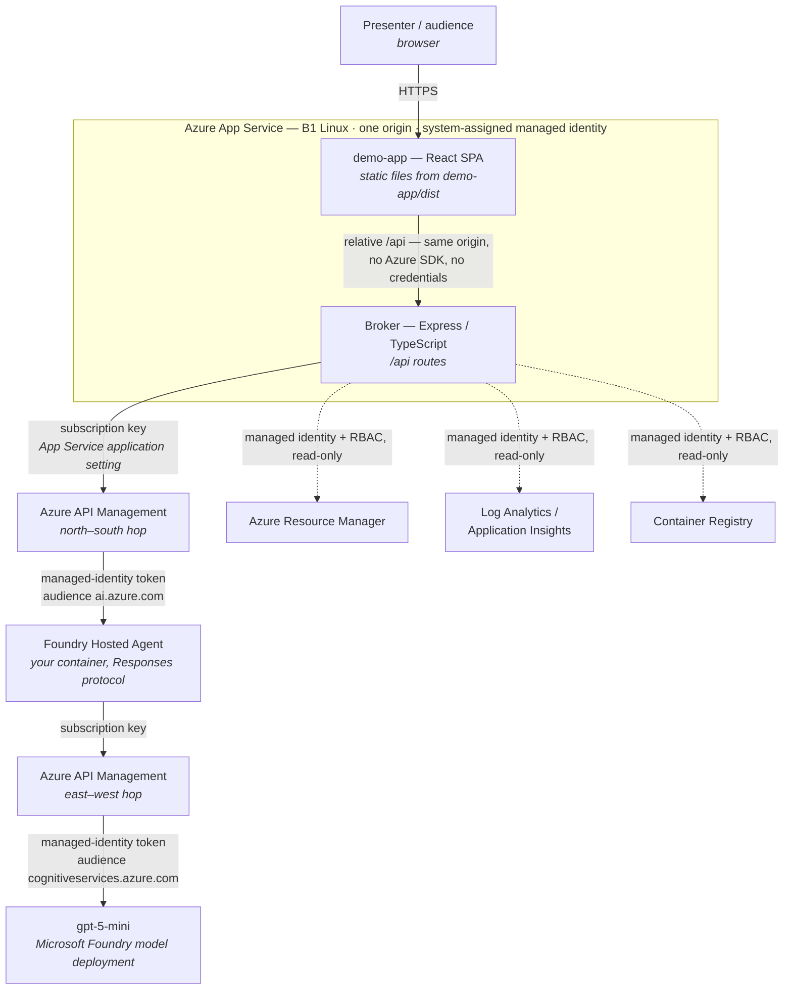
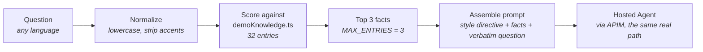

# Deployment & Cost Considerations

This document answers the question an architect asks immediately after reading [`ARCHITECTURE.md`](ARCHITECTURE.md): *what do I have to run, and what does it cost me?*

It is written to be verifiable, not persuasive. Where a number can be measured, it is measured and the measurement method is shown. Where a number depends on Azure list prices, **no figure is quoted** — see [Why no dollar amounts appear here](#why-no-dollar-amounts-appear-here) — and a procedure to obtain your own is given instead.

## How to read this document

Every claim is tagged:

| Tag | Meaning |
|---|---|
| **[Fact]** | Verified against this repository's code or a live deployment, or stated in official Azure documentation. Reproducible. |
| **[Estimate]** | Derived by calculation from a Fact, with the arithmetic shown. Depends on assumptions that are stated inline. |
| **[Recommendation]** | Professional judgment. Defensible, but another architect could reasonably choose differently. |

---

## 1. Deployment architecture

### 1.1 The most important cost fact first

**[Fact]** **The demo now adds one Azure hosting cost line: a single App Service (B1, Linux) that hosts both halves of it.** The lab automation (`labs/ai-foundry-hosted-agents-custom-framework-automation/scripts/deploy.ps1`) creates it, builds the console and the broker into it, and prints its public URL. That plan bills for as long as it exists, whether or not anyone opens the demo.

**[Fact]** One App Service, not two: Express serves the built console (`demo-app/dist`) **and** the `/api` routes from the **same origin**. The browser therefore receives no APIM subscription key and no Azure credential — it only ever calls a relative `/api/...` path on the site it was served from. The broker reaches Azure with the App Service's **system-assigned managed identity** plus RBAC role assignments, and reads the APIM subscription key from an App Service application setting. Nothing secret is baked into the browser bundle.

**[Fact]** Running from a laptop is still supported and unchanged — see [§6.1](#61-local-run--still-supported). It costs nothing, and it remains the right mode for a single presenter driving from their own machine.

Everything else the demo reads was already deployed by the official lab. Beyond its own App Service, the demo is a *reader* of that deployment, not an extension of it. The cost question is therefore in two parts: what the App Service costs, and what the lab costs plus the marginal consumption the demo adds on top.

That marginal consumption is quantified in [§3](#3-cost-model) and [§4](#4-consumption-scenarios).

### 1.2 The request path

Run locally instead and the shape is identical, with `localhost:5173` (Vite) and `localhost:4000` (broker) in place of the App Service box, and `DefaultAzureCredential` resolving the presenter's `az login` session instead of a managed identity. The broker's code is the same either way.

### 1.3 What each component does, and who pays for it

**[Fact]** — every row below is verifiable in this repository or in the lab's `main.bicep`.

| Component | Role in the demo | Deployed by | Runs where | Billing model |
|---|---|---|---|---|
| **App Service** (`B1`, Linux, Node 22 LTS) | Hosts both halves of the demo on one origin. Carries the system-assigned managed identity and the APIM subscription key as an application setting. | This repo's automation | Azure | **Fixed, per hour** — bills while the plan exists, regardless of demo usage |
| **demo-app** (React SPA) | The four sections and the copilot UI. Holds no credential and has no Azure SDK — structurally cannot call Azure. Served as static files by the broker. | This repo | Inside the App Service (or the presenter's machine) | **None of its own** — inside the App Service above |
| **Broker** (Express) | Holds the Azure credentials. Authenticates with `DefaultAzureCredential` — the App Service's managed identity when deployed, the presenter's `az login` session when local — calls Azure on the frontend's behalf, and injects copilot context. | This repo | Inside the App Service (or the presenter's machine) | **None of its own** — inside the App Service above |
| **API Management** (`Basicv2`, capacity 1) | The control point, twice per request: in front of the agent, and in front of the model the agent calls. Validates the subscription key, swaps it for a managed-identity token, enforces headers, writes full LLM logs. | Official lab | Azure | **Fixed, per hour** — runs 24/7 regardless of demo usage |
| **Foundry Hosted Agent** (`pydantic-agent`, `strands-agent` — 1 CPU / 2 GiB each) | Your container, run by Foundry behind the Responses protocol. Produces every answer the demo shows. | Official lab | Azure | Compute while registered/running — **see the caveat in §3.3** |
| **gpt-5-mini** (`GlobalStandard`, capacity 10) | The model each agent calls. | Official lab | Azure | **Per token**, consumption-based. No idle charge. |
| **Log Analytics** (`PerGB2018`, 30-day retention) | Destination for APIM gateway logs and full prompt/completion LLM logs. Backs the Observability section. | Official lab | Azure | **Per GB ingested** + retention |
| **Application Insights** (workspace-based) | Distributed traces (7–10 spans per request) from the Foundry runtime, the container, and APIM. | Official lab | Azure | **Per GB ingested**, into the same workspace |
| **Container Registry** (`Basic`) | Stores the agent images. The demo only *reads* manifests (digest, push time). | Official lab | Azure | **Fixed, per day** + storage/egress above quota |

**[Fact]** Of these nine components, **three are contributed by this project** (the App Service, demo-app and the broker), and **exactly one of them bills**: the App Service plan. The other six are the official lab's.

**[Fact]** Everything in the resource group — the App Service and plan included, because `deploy.ps1` creates them there — is removed by `scripts/teardown.ps1`, which deletes the resource group whole. There is no separate step to remember, and nothing survives it.

---

## 2. The copilot, from an infrastructure standpoint

### 2.1 What it does not use

**[Fact]** The copilot uses **none** of the following. There is no code path to any of them anywhere in this repository:

| Not used | Verify by |
|---|---|
| RAG (retrieval-augmented generation over an index) | No retrieval layer exists — see §2.2 for what replaces it |
| Azure AI Search | No SDK dependency, no endpoint, no index |
| Vector database (any) | No embeddings are ever computed or stored |
| Embeddings | No embedding model is deployed or called |
| Cosmos DB | Not deployed by the lab, not referenced |
| Blob Storage | Not deployed by the lab, not referenced — see [§8.3](#83-why-blob-storage-would-not-help-here) for why this is deliberate |
| Document indexing / chunking | The knowledge base is hand-authored prose, not derived from documents |

**[Fact]** The lab's `main.bicep` deploys no storage account, no search service, and no database. The demo required no addition to that infrastructure.

### 2.2 What it actually does

**[Fact]** All of this lives in a single compiled TypeScript file, `broker/src/demoKnowledge.ts`. Measured directly from that file:

| Measurement | Value |
|---|---|
| Knowledge-base entries | 32 |
| Total size of all facts | 20,457 characters (~20 KB) |
| Average fact | 639 characters |
| Largest fact | 1,120 characters |
| Style directive (persona + honesty boundaries) | 2,031 characters |
| Max facts injected per question | 3 (`MAX_ENTRIES`) |

Matching uses three signals, strongest first: exact keyword-phrase match, ≥60% of a multi-word keyword's tokens present, then a distinctive single term from a per-topic term map. If nothing matches, only the style directive is sent and the agent answers from its own general knowledge — it never refuses to answer.

**[Fact]** The user's question is always forwarded **verbatim** and clearly delimited. The knowledge base only decides what *reference context* accompanies it; it never rewrites the question and never returns a canned answer. Every copilot response is a genuine live model call through the full APIM → Foundry → model path.

### 2.3 Why this design, for this project

**[Recommendation]** — this is the reasoning, and it is worth stating plainly because "why didn't you use RAG?" is a fair question from any architect.

1. **The corpus is 20 KB.** That is smaller than one of the screenshots in this repository. A vector index over 20 KB of text is not an optimization; it is a distributed system standing in for a `for` loop over 32 items.
2. **Determinism is worth more than recall here.** In a customer demo, the failure mode that matters is the copilot confidently stating something untrue about the deployment. Hand-authored facts with an explicit honesty boundary make that failure mode reviewable in a pull request. Retrieval over auto-chunked documents does not.
3. **Every fact must be true of *this* deployment.** The knowledge base is compiled with the broker and version-controlled, so a claim cannot drift away from the environment it describes without someone changing a tracked file. That is a governance property, not a limitation.
4. **Zero added infrastructure, zero added latency.** Matching is in-process and completes in well under a millisecond, against a model call measured at 11–13 seconds end to end. Any retrieval service would add a network hop, a credential, a failure mode, and a cost line — to save nothing measurable.
5. **It has to survive a laptop.** The demo is presented in customer meetings, sometimes on hotel Wi-Fi. Fewer moving parts is a demo-safety requirement, not an aesthetic preference.

**[Recommendation]** This is a deliberate fit-for-purpose choice, **not** a claim that RAG is inferior in general. [§8](#8-future-scalability) states exactly when the trade-off flips.

---

## 3. Cost model

### 3.1 Fixed versus variable

**[Fact]** This is the structural point that determines everything else:

| Behavior | Components |
|---|---|
| **Fixed** — accrues 24/7 whether or not anyone opens the demo | API Management (`Basicv2`), **App Service plan (`B1`, Linux)**, Container Registry (`Basic`), Log Analytics/Application Insights retention, Foundry Hosted Agent compute *(see §3.3)* |
| **Variable** — accrues only when the demo is used | `gpt-5-mini` tokens, Log Analytics/Application Insights **ingestion** |
| **Free** — contributed by this project | demo-app and broker *(no charge of their own — they run inside the App Service plan above, or on a laptop)* |

**[Estimate]** At any realistic demo volume, the fixed components dominate total cost by a wide margin. The variable component is small enough that turning the demo off overnight saves essentially nothing — the meters that matter are APIM and the App Service plan, both running 24/7. The lever with real financial impact is **deleting the resource group when the lab is not in use** (`scripts/teardown.ps1`), not optimizing the demo's usage.

**[Estimate]** The App Service plan is a **small addition to an already-fixed base**: a B1 Linux plan is materially cheaper than the `Basicv2` API Management instance it sits beside. It changes the total, but it does not change which line dominates.

### 3.2 A) Without the copilot vs. B) With the copilot

A common assumption is that the non-copilot demo consumes no model tokens. **That is not correct**, and the honest breakdown matters:

**[Fact]** Actions in the demo that reach `gpt-5-mini` and consume tokens, *with the copilot never opened*:

| Action | Prompt sent | Token scale |
|---|---|---|
| Gateway → "Run the three credential tests" | `{"input":"ping"}` — **only the first of the three attempts** reaches the model; the other two are rejected at 401 before leaving APIM | Single-digit input tokens |
| Platform / Agents → "Warm up agent" | `"Reply with the single word: ready."` | ~10 input tokens |
| Agents → "Test hosted agent" | `"Reply with the single word: ok."` | ~10 input tokens |
| Agents → Run tab | Whatever the presenter types | Variable, typically small |

**[Fact]** Actions that consume **no** model tokens at all — the majority of the demo:

- The entire Agents registry view, version history, and provenance (Foundry data plane + ACR reads)
- The entire Gateway routing view and live policy XML (Azure Resource Manager reads)
- The entire Observability section (Log Analytics queries — reads, not writes)
- The entire Platform section: environment, controls catalogue, and the four maintenance actions except those listed above (ARM and Log Analytics reads)
- Gateway → "Test APIM" (deliberately sent without a key; expects 401, never reaches the model)

**[Estimate]** Measured prompt sizes for the copilot, computed from the real file contents (`chars ÷ 4`, the standard English approximation):

| Copilot case | Assembled prompt | Input tokens (est.) |
|---|---|---|
| No knowledge match (style directive only) | 2,123 chars | ~530 |
| Typical (3 average facts injected) | 4,161 chars | ~1,040 |
| Worst case (3 largest facts injected) | 5,319 chars | ~1,330 |

Output is bounded by the style directive's own instruction — *"at most three or four short sentences"* — which lands at roughly **100–150 output tokens** per answer. **[Estimate]**

**[Estimate]** **The marginal cost of the copilot is therefore ~1,040 input tokens per question versus ~10 for a probe — roughly two orders of magnitude more per interaction, but both are negligible in absolute terms.** What the copilot changes is not whether tokens are consumed, but that consumption becomes proportional to how much the audience asks.

### 3.3 An honest caveat on Hosted Agent billing

**[Fact]** Foundry Hosted Agents run a container the enterprise supplies, with a declared allocation of 1 CPU and 2 GiB per agent in this lab.

**[Estimate, low confidence]** Compute-based charging while an agent is registered and running is the expected model, consistent with how comparable Azure container-hosting surfaces bill. **However, Hosted Agents are a preview surface and I am not confident of the exact billing mechanics — whether charging is per registered agent, per running replica, per active session, or scale-to-zero when idle.** This materially affects the fixed-cost total, because two agents are registered in this lab.

**[Recommendation]** Do not take a position on this in front of a customer. Confirm it for your own subscription in **Cost Analysis** (Azure Portal → Cost Management → Cost analysis, grouped by resource) after the lab has been deployed for a few days. That is the only authoritative answer for your agreement and region, and it takes minutes.

### 3.4 The one people forget: telemetry ingestion

**[Fact]** API Management in this lab is configured with **full prompt and completion logging at 100% sampling**. Every model call writes the complete prompt *and* the complete response text into Log Analytics, plus a gateway log row, plus 7–10 Application Insights spans.

**[Estimate]** Per copilot question, total telemetry written ≈ **15–20 KB** (prompt ~4 KB + completion ~0.6 KB + gateway row ~1–2 KB + spans ~10 KB).

This is the component that grows fastest with usage and is the least visible on a bill, because it lands in a shared workspace rather than under an obviously AI-related line item. At demo volumes it is immaterial (see §4). At product volumes it is the first thing to reconsider — Azure Monitor supports a [daily ingestion cap](https://learn.microsoft.com/azure/azure-monitor/logs/daily-cap) for exactly this reason.

**[Recommendation]** 100% sampling with full message capture is the right choice *for this lab*, because the whole point of the Observability section is showing a real audit record to a compliance audience. It is **not** automatically the right choice in production, and it is a data-governance decision a customer should make consciously — which is worth naming out loud in a demo rather than letting them discover it later.

---

## 4. Consumption scenarios

**Assumptions [Estimate]:** one copilot question ≈ 1,040 input + 125 output tokens (§3.2) and ≈ 18 KB telemetry (§3.4). A 30-day month. Non-copilot actions are excluded because, per §3.2, they are two orders of magnitude smaller.

| Volume | Input tokens/month | Output tokens/month | Telemetry/month | What this actually represents |
|---|---|---|---|---|
| **50 questions/day** | ~1.6 M | ~190 K | ~27 MB | ~2 demos/day. Realistic steady state for one active presenter. |
| **200 questions/day** | ~6.2 M | ~750 K | ~108 MB | ~8 demos/day. A small team sharing one deployment. |
| **1,000 questions/day** | ~31 M | ~3.8 M | ~540 MB | ~40 demos/day. **See the note below.** |

### What scales, what doesn't

| Component | Behavior as volume grows | Comment |
|---|---|---|
| **`gpt-5-mini` tokens** | **Linear** | The only component that scales cleanly with questions asked. On a mini-class model, even the 1,000/day row is a modest monthly token volume. |
| **Log Analytics / App Insights ingestion** | **Linear** | Grows faster in *bytes* than tokens do, because full messages plus spans are stored. Still well under a typical workspace's free allowance at every row above. |
| **API Management (`Basicv2`)** | **Flat** | A fixed hourly charge. Identical at 0 and at 1,000 questions/day. Basicv2 capacity 1 will not be throughput-limited by any of these volumes. |
| **Container Registry (`Basic`)** | **Flat** | The demo only reads manifests. No image is pushed at demo time. |
| **Hosted Agent compute** | **Flat, probably** | Subject to the §3.3 caveat. Does not scale with question count in any billing model I would expect. |
| **App Service (`B1`)** | **Flat** | A fixed hourly charge for the plan. Identical at 0 and at 1,000 questions/day. One B1 instance is far more capacity than a handful of concurrent presenters need, since the slow part is an 11–13 second model call, not the broker. |
| **demo-app / broker** | **Flat at zero** | No charge of their own — both run inside the App Service plan above. |

**[Estimate]** **The likely single largest cost line is API Management running 24/7, at every volume in this table** — and it does not move at all with demo usage. The App Service plan is the second fixed line and behaves the same way.

**[Recommendation]** A note on the 1,000/day row: for a presales demonstration tool, ~40 demos per day is not a realistic profile. If you genuinely reach it, the demo has stopped being a demo and become an internal product — at which point the architecture questions in [§8](#8-future-scalability) become worth revisiting, and the hosting questions in [§5](#5-hosting-strategies) stop being optional.

---

## 5. Hosting strategies

**[Fact]** This comparison is **why App Service was chosen**, and it is kept here as the reasoning behind the decision rather than as an open question. The automation implements the first row. The full decision record, including the two options rejected and the code changes hosting required, is in [`labs/ai-foundry-hosted-agents-custom-framework-automation/docs/04-app-service-decision.md`](../../../../labs/ai-foundry-hosted-agents-custom-framework-automation/docs/04-app-service-decision.md).

**[Fact]** Whatever hosts this has to host two things: a **static React bundle** (`npm run build` output — plain files) and a **long-lived Node/Express process** that holds Azure credentials. The broker is the only part with real hosting requirements.

**[Fact]** One constraint drove the whole decision: locally the broker authenticates with `DefaultAzureCredential` against the presenter's `az login` session, and hosting it means that same call must resolve a **managed identity** instead, with the equivalent read roles granted to it. `DefaultAzureCredential` does that without a code change — what hosting actually required was the RBAC, which `deploy.ps1` now assigns.

| Option | Complexity | Expected cost | Maintenance | Best suited to |
|---|---|---|---|---|
| **Azure App Service** (Linux, B1/S1) | **Low.** Deploy from a Git repo or a zip. Managed identity is a toggle. No container work required. | Fixed monthly per plan. Frontend and broker can share one plan. | **Low.** Platform patches the OS and runtime. | A shared internal deployment for a small team. The default choice. |
| **Azure Container Apps** | **Medium.** Requires containerizing the broker. Scale-to-zero, revisions, and built-in ingress are genuinely useful. | Consumption-based; can approach zero when idle. | **Low–medium.** No cluster to operate, but you own the image. | Bursty or intermittent use, or if you want scale-to-zero between demos. |
| **Azure Container Instances** | **Low–medium.** A single container, no orchestrator. | Per-second while running. Cheapest *if* you stop it between demos — but nothing stops it for you. | **Medium.** No autoscale, no rolling deploys, no built-in TLS/ingress story. | Short-lived or ad-hoc use. Weak fit for an always-available shared tool. |
| **Azure Kubernetes Service** | **High.** A cluster, node pools, ingress, certificates, upgrades. | Node cost, effectively fixed, plus operational time. | **High.** You now operate a cluster. | **Not justified here.** See below. |
| **Static Web Apps + broker elsewhere** | **Medium.** Excellent for the SPA; the broker still needs a home, so this is a *complement*, not a complete answer. | Free tier covers a demo frontend. | **Low** for the frontend half. | Pairing with App Service or Container Apps for the broker. |

**[Recommendation]** **AKS is disproportionate for this workload, and saying so plainly is more useful than listing it as an option.** The demo is one static bundle and one stateless Node process with no horizontal-scale requirement, no service mesh, no multi-tenancy, and no inter-service networking. Adopting Kubernetes here means taking on cluster upgrades, node patching, and ingress management to run something App Service runs from a zip file. Choose AKS only if your organization *already* runs everything on an existing cluster and adding one more deployment is genuinely lower marginal effort than introducing a new hosting service — that is an organizational argument, not a technical one, and it is a legitimate reason.

---

## 6. Recommended deployment

**[Fact]** The deployed default is **Azure App Service (B1, Linux)**, created by `deploy.ps1`. Running locally remains fully supported. Both modes are described below.

### 6.1 Local run — still supported

**[Fact]** Nothing about the laptop path changed, and for a single presenter driving from their own machine it is still the right mode:

- It costs nothing.
- It matches how the tool is often used: one presenter, in a meeting, driving.
- The broker holding the presenter's own `az login` session means the demo shows *that person's* real permissions — including the RBAC read that legitimately fails for lack of permission, which is itself an honest thing to show a security audience.
- There is no shared deployment to keep patched, secured, or explained to a security review.

Start it with `npm run dev` in `broker/` and in `demo-app/`, exactly as before.

### 6.2 The deployed default: Azure App Service

**[Fact]** `deploy.ps1` provisions one **Azure App Service (B1, Linux, Node 22 LTS)** at the end of the lab deployment and prints its public URL. The reasons it is the right shape for this workload:

- The broker is a plain long-lived Node process. That is precisely App Service's core scenario — no containerization needed.
- **Managed identity is a configuration toggle**, which cleanly solves the one real hosting problem (§5) with no code restructuring: `DefaultAzureCredential` resolves it unchanged.
- Frontend and broker share a single plan **and a single origin**, keeping it to one billable resource, with no CORS configuration and no broker URL compiled into the browser bundle.
- Nothing about this workload needs what a heavier platform provides. There is no scale-out requirement: this serves a handful of concurrent presenters, and the slow part is an 11–13 second model call, not the broker.

**[Fact]** What the browser receives, and does not:

| The browser gets | The browser never gets |
|---|---|
| The static bundle and relative `/api/...` calls to the same origin | The APIM subscription key — it is an App Service application setting, read only server-side |
| Whatever each `/api` route chooses to return | Any Azure credential or token. The bundle contains no Azure SDK and no endpoint other than its own origin |

**[Fact]** Cost consequence, stated plainly: **the App Service bills for as long as it exists.** `scripts/teardown.ps1` deletes the resource group and takes the site and its plan with it.

### 6.3 When Container Apps is the better answer

**[Recommendation]** Prefer **Azure Container Apps** if any of these is true:

- **Usage is genuinely intermittent** and scale-to-zero matters — e.g. a partner-enablement environment used a few days a month. App Service bills the plan whether or not it is handling traffic.
- **Your organization already standardizes on containers** for internal tooling, so the image is the path of least resistance rather than added work.
- You want **revision-based rollout and traffic splitting** without operating a cluster.

The trade-off is honest: you gain elasticity and lose the "deploy a zip and forget it" simplicity. For an intermittently-used internal tool that is often the right trade; for a daily-use shared instance, App Service's simplicity usually wins.

---

## 7. Optional future improvement: a configurable copilot

**[Recommendation]** — analyzed as requested. **Not implemented, and not currently recommended.**

The idea: an `ENABLE_COPILOT=true|false` environment variable that turns the copilot off, so the demo can run without any model consumption.

### Advantages

- **A guaranteed-zero-token mode.** Useful where a customer's policy forbids sending any free-text prompt to a model during an evaluation, or in a sandbox with a hard spend cap.
- **A smaller attack surface for security review.** "The deployed instance cannot send arbitrary user text to a model" is a much easier sentence to get through a review board than explaining prompt-injection posture.
- **A cleaner failure story offline.** Today the fallback for a broken connection is Simulation mode; a copilot-free mode is a more precise instrument for "the network is fine, but we may not call the model."

### Disadvantages

- **It removes the most persuasive live proof.** The copilot is the clearest demonstration that the whole governed path actually works end to end — a real question traversing APIM → Foundry → model and returning stamped with the container and version that answered. Disabling it makes the demo more of a data viewer.
- **It creates a second supported configuration.** Every UI state that assumes the copilot exists needs a defined off-state, and both paths need testing. Two configurations is more than twice the surface of one, because the interactions between them also need thought.
- **It is a config flag for a decision that is currently a behavior.** A presenter can simply not open the copilot. A flag only adds value when the guarantee must be *enforced* rather than *chosen* — which is a real requirement in some organizations, but not the common case.

### Impact

| Dimension | Assessment |
|---|---|
| **Cost** | **[Estimate]** Near zero saving in practice. Per §3.1 and §4, the copilot's tokens are a rounding error against APIM running 24/7. This flag would be justified by *policy or governance*, never by cost. |
| **Maintenance** | **[Estimate]** Small but permanent: a second code path, a second UI state, and a second thing to verify before every release. |

**[Recommendation]** Implement this **only** when a real customer or internal policy requires an enforced no-model-call guarantee. Adding it speculatively buys a negligible cost saving in exchange for a permanent maintenance obligation. If it is implemented, scope it tightly: the flag should disable the copilot **surface** entirely rather than silently degrading it, so its state is never ambiguous to a presenter mid-meeting.

---

## 8. Future scalability

### 8.1 What would change if this grew significantly

**[Estimate]** The architecture holds up further than its current usage suggests, because the expensive parts are already fixed-cost and the routing model already scales. In rough order of what breaks first:

| Growth trigger | What actually changes |
|---|---|
| Multiple simultaneous presenters | **Already handled** — the App Service in §6.2 is shared and always available, and the broker is stateless. Scaling further is a plan-size change, not a redesign. |
| Correlation must survive restarts | **[Fact]** The ask store is in memory today — a broker restart resolves past asks to an honest 404. Durable correlation would need a real store; this is the first genuine persistence requirement the project would hit. |
| Sustained high question volume | Revisit APIM sampling and add an Azure Monitor daily cap (§3.4). Consider APIM rate-limiting policies — already available at the control point, just not switched on. |
| Many more agents | **[Fact]** No change. Routing is by agent name in the URL path, so one APIM API already serves any number of agents without reconfiguration. |
| The copilot must answer beyond this deployment | This is the one that genuinely changes the design — see §8.2. |

### 8.2 When RAG, AI Search, and embeddings would become the right call

**[Recommendation]** The current design is correct **for a 20 KB, hand-authored, deployment-specific corpus**. That is a statement about this corpus, not about retrieval. The trade-off flips when **any** of these becomes true:

| Adopt retrieval when… | Why the current approach breaks |
|---|---|
| The corpus exceeds roughly **100–200 KB**, or a few hundred entries | Keyword matching degrades and every fact stops fitting comfortably in a prompt. Hand-curating hundreds of entries also stops being realistic. |
| Content comes from **documents you do not author** — customer docs, product manuals, tickets | You can no longer guarantee each fact is true of the deployment, which is the property the current design exists to protect. Chunking and retrieval become the appropriate tools. |
| Content changes **faster than a release cycle** | Compiling facts into the broker means a redeploy per change. Fine monthly; wrong daily. |
| Users ask **paraphrased or conceptual** questions the keyword map cannot anticipate | This is exactly what embeddings solve. It is the strongest technical argument for the switch. |
| You need **citations back to source documents** | The current model injects prose facts with no document identity to cite. |

**[Recommendation]** At that point the natural target is **Azure AI Search** with integrated vectorization, since it handles chunking, embedding, and hybrid (keyword + vector) retrieval in one managed service rather than assembling three. Until then, adding it would mean operating an index over less text than this document contains.

### 8.3 Why Blob Storage would not help here

**[Recommendation]** — addressed directly, because it was raised as a candidate.

Moving the knowledge base to Blob Storage would be a **regression**, not an improvement:

1. **It solves a problem this project does not have.** The corpus is 20 KB and changes rarely. Blob is object storage for large or numerous artifacts; a few kilobytes of prose is not that.
2. **It adds a failure mode to the demo's critical path.** Every question would depend on a network call, a credential, and a service that can be slow or unavailable — in a tool whose primary design constraint is surviving a customer meeting on unreliable Wi-Fi. Today that path cannot fail, because the data is in the process.
3. **It removes the governance property that justifies the design.** The knowledge base's entire value is that *every claim must be true of the deployed environment*. Today that is enforced by code review: changing a fact means a tracked change to a versioned file. Move it to Blob and anyone with write access can change what the copilot asserts to a customer, with no review, no history, and no way to tell which version was live during a given demo. **For a knowledge base whose whole premise is verifiable honesty, that is the opposite of an upgrade.**
4. **It buys no measurable performance.** In-process matching is sub-millisecond against an 11–13 second model call.

**[Recommendation]** If the underlying goal is *"edit the copilot's facts without redeploying the broker,"* then **Azure App Configuration** is the right service — it is purpose-built for externalized configuration, with change history, labels, point-in-time snapshots, and feature flags, none of which Blob provides. That said, I would still push back on the goal itself: for this project the redeploy is not friction to eliminate, it is the review gate that keeps the copilot honest. Externalize the facts only if a non-engineer genuinely needs to edit them — and if that day comes, pair App Configuration with a documented review step so the guarantee is not lost with the convenience.

---

## Why no dollar amounts appear here

**[Fact]** This document deliberately quotes **no prices**. That is a correctness decision, not an omission:

- Azure list prices change, and this document is intended to stay useful over time. A stale figure in a technical reference is worse than no figure, because it will be repeated in front of a customer.
- Prices vary by **region**, and materially by **agreement** — Enterprise Agreement, CSP, MCA, and pay-as-you-go can differ substantially for the same resource.
- Several components here bill on **consumption**, so a single number would be meaningless without stating the volume assumptions it encodes.

**[Recommendation]** Produce your own figure in about ten minutes:

1. Open the [Azure Pricing Calculator](https://azure.microsoft.com/pricing/calculator/).
2. Add, in your target region: **API Management** (`Basicv2`, capacity 1), **App Service** (`B1`, Linux), **Container Registry** (`Basic`), **Azure Monitor / Log Analytics** (use the GB/month figures from §4), and your **model deployment** (use the token volumes from §4).
3. Apply your organization's agreement pricing.
4. For **Foundry Hosted Agents**, do not estimate — deploy the lab and read the actual charges in **Cost Management → Cost analysis**, grouped by resource, after a few days (§3.3).
5. Compare that against a real bill after one month. **[Recommendation]** Treat any calculator output as an estimate until a real invoice confirms it.

---

## Sources

Official Azure documentation used for the billing models and service characteristics described above. All links verified reachable at the time of writing.

- [Azure Pricing Calculator](https://azure.microsoft.com/pricing/calculator/)
- [API Management pricing](https://azure.microsoft.com/pricing/details/api-management/) · [v2 service tiers overview](https://learn.microsoft.com/azure/api-management/v2-service-tiers-overview)
- [Azure Monitor pricing](https://azure.microsoft.com/pricing/details/monitor/) · [Log Analytics cost calculations](https://learn.microsoft.com/azure/azure-monitor/logs/cost-logs) · [Daily ingestion cap](https://learn.microsoft.com/azure/azure-monitor/logs/daily-cap)
- [Container Registry pricing](https://azure.microsoft.com/pricing/details/container-registry/)
- [App Service pricing](https://azure.microsoft.com/pricing/details/app-service/linux/) · [Static Web Apps pricing](https://azure.microsoft.com/pricing/details/app-service/static/)
- [Container Apps pricing](https://azure.microsoft.com/pricing/details/container-apps/) · [Container Apps billing model](https://learn.microsoft.com/azure/container-apps/billing)
- [Container Instances pricing](https://azure.microsoft.com/pricing/details/container-instances/) · [Azure Kubernetes Service pricing](https://azure.microsoft.com/pricing/details/kubernetes-service/)
- [Azure AI Foundry documentation](https://learn.microsoft.com/azure/ai-foundry/) · [Foundry Agents overview](https://learn.microsoft.com/azure/ai-foundry/agents/overview)
- [Azure Well-Architected Framework — Cost Optimization](https://learn.microsoft.com/azure/well-architected/cost-optimization/)

Repository-internal measurements (§2.2, §3.2) were taken directly from `broker/src/demoKnowledge.ts`, `broker/src/routes/accessControl.ts`, and `broker/src/routes/maintenance.ts`. SKU facts are from the official lab's `main.bicep` as documented in [`ARCHITECTURE.md`](ARCHITECTURE.md) §2.

## See also

- [`ARCHITECTURE.md`](ARCHITECTURE.md) — the full technical architecture this document costs out.
- [`COPILOT_CONTEXT.md`](COPILOT_CONTEXT.md) — the copilot's behavior and honesty boundaries, from a product rather than infrastructure angle.
- [`PURPOSE.md`](PURPOSE.md) — why the project exists and what it deliberately is not.
