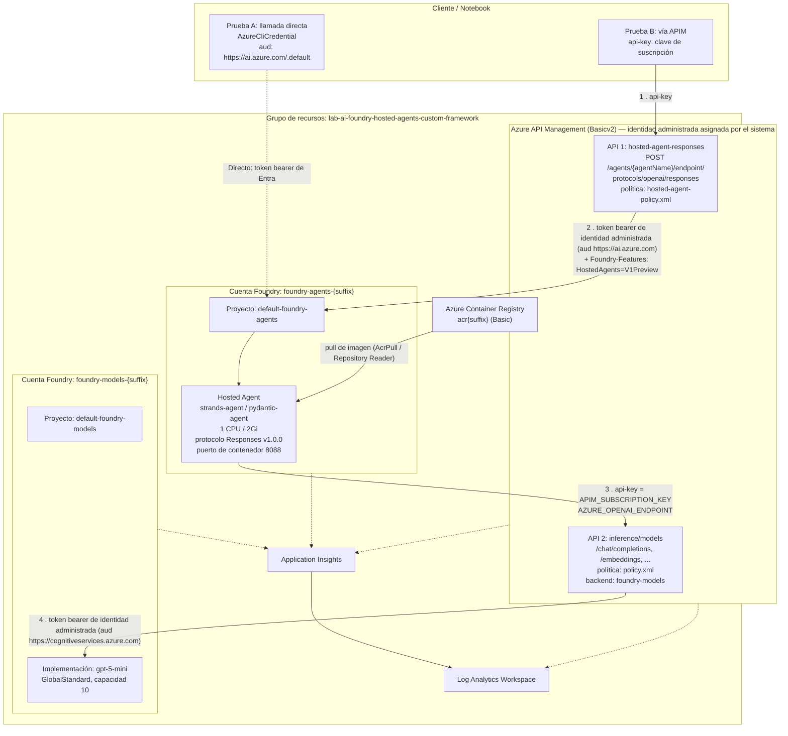

# Arquitectura de la demo

> Este documento describe la arquitectura del **laboratorio oficial de Microsoft Azure** que esta demo visualiza — no la arquitectura del código frontend/backend de la propia `demo-app` (broker + interfaz web), que es un tema distinto y no es el objeto de este documento.

**Ruta del laboratorio:** `labs/ai-foundry-hosted-agents-custom-framework`
**Alcance:** Este documento describe únicamente este laboratorio. Los módulos Bicep compartidos bajo `modules/` se describen en la medida en que el laboratorio los consume.
**Fecha de análisis:** 2026-07-31

---

## 1. Resumen ejecutivo

Este laboratorio demuestra cómo ejecutar un **framework de agentes personalizado** (Pydantic AI o Strands) como un **Microsoft Foundry Hosted Agent**, empaquetado como imagen de contenedor, y cómo exponer ese agente a través de **Azure API Management (APIM)** para que los clientes se autentiquen con una simple clave de suscripción en lugar de credenciales de Entra ID.

Existen dos superficies de API de APIM distintas, y entender la diferencia entre ellas es la clave de toda la arquitectura:

| # | API de APIM | Dirección | Propósito |
|---|----------|-----------|---------|
| 1 | **Hosted Agent Responses API** (`/hosted-agent-responses`) | **Norte–sur, entrante** | Cliente externo → APIM → Foundry Hosted Agent (invocación del agente) |
| 2 | **Inference API** (`/inference/models`) | **Este–oeste, saliente** | Contenedor del agente → APIM → implementación de modelo de Foundry (`gpt-5-mini`) |

Por lo tanto, APIM aparece **dos veces en un mismo recorrido de solicitud**: una vez como gateway de ingreso hacia el agente, y otra como gateway de IA de salida que el propio agente usa para llegar al LLM. Este es el patrón "AI Gateway" que otorga un único punto de control para medición de tokens, limitación de tasa (throttling), registro (logging) e intermediación de credenciales en ambos lados del agente.

La implementación también está dividida intencionalmente entre **dos cuentas Foundry (Azure AI Services) separadas**:

- `foundry-models-{suffix}` — aloja la implementación del modelo `gpt-5-mini` (el plano de inferencia).
- `foundry-agents-{suffix}` — aloja el runtime del agente en contenedor (el plano del agente).

Esta separación permite escalar, asegurar y gobernar la capacidad del modelo de forma independiente de la superficie de hospedaje del agente, y mantiene el backend de inferencia de APIM apuntando a un recurso que no contiene cargas de trabajo de agentes.

---

## 2. Inventario de componentes

### 2.1 Archivos del laboratorio

| Archivo | Rol |
|------|------|
| `ai-foundry-hosted-agents-custom-framework.ipynb` | Orquestador de extremo a extremo: implementar → compilar → registrar agente → probar (directo + APIM) |
| `main.bicep` | Punto de entrada de infraestructura como código para todo el laboratorio |
| `params.json` | Archivo de parámetros de Bicep — **generado/sobrescrito por el notebook en tiempo de ejecución** |
| `policy.xml` | Política de APIM para la API de **inferencia** (identidad administrada → Cognitive Services) |
| `hosted-agent-policy.xml` | Política de APIM para la API de **respuestas del agente hospedado** (identidad administrada → AI Foundry) |
| `clean-up-resources.ipynb` | Elimina el grupo de recursos |
| `src/frameworks/pydantic/` | Implementación del agente Pydantic AI + Dockerfile + requirements |
| `src/frameworks/strands/` | Implementación del agente Strands + Dockerfile + requirements |
| `src/frameworks/README.md` | Comparación de frameworks, reglas de enrutamiento, resolución de problemas |

### 2.2 Módulos compartidos consumidos

| Módulo | Implementa |
|--------|-----------|
| `modules/operational-insights/v1/workspaces.bicep` | Log Analytics Workspace |
| `modules/monitor/v1/appinsights.bicep` | Application Insights (basado en workspace) |
| `modules/apim/v3/apim.bicep` | Instancia de APIM, loggers, diagnósticos, suscripciones |
| `modules/apim/v3/inference-api.bicep` | Inference API de APIM, backend, política, diagnósticos de LLM |
| `modules/cognitive-services/v3/foundry.bicep` | Cuentas de AI Services, proyectos Foundry, conexiones, RBAC |
| `modules/cognitive-services/v3/deployments.bicep` | Implementaciones de modelo (`gpt-5-mini`) |

---

## 3. Diagrama de arquitectura



---

## 4. Flujo de solicitud de extremo a extremo

### 4.1 Recorrido de producción (cliente → APIM → agente → APIM → modelo)

**Paso 1 — Cliente → APIM (API del agente hospedado)**

```http
POST https://apim-{suffix}.azure-api.net/hosted-agent-responses/agents/{agentName}/endpoint/protocols/openai/responses?api-version=v1
api-key: {apim-subscription-key}
Content-Type: application/json

{ "input": "Hello! What can you help me with?", "stream": false }
```

El cliente presenta **únicamente** una clave de suscripción de APIM. No posee ninguna credencial de Azure AD, ningún endpoint de Foundry, ni ninguna clave de modelo.

**Paso 2 — Política de entrada de APIM (`hosted-agent-policy.xml`)**

APIM realiza un intercambio de credenciales:

1. `<authentication-managed-identity resource="https://ai.azure.com" .../>` — la identidad administrada asignada por el sistema de APIM adquiere un token de acceso de Entra para la audiencia de AI Foundry.
2. Se establece `Authorization: Bearer {token}` (sobrescribiendo cualquier valor enviado por el cliente).
3. Se fuerza `Content-Type: application/json`.
4. Se fuerza `Foundry-Features: HostedAgents=V1Preview` — este encabezado de habilitación (opt-in) es requerido para la superficie en vista previa (preview) de Hosted Agents.

El `serviceUrl` de la API es el endpoint del proyecto de **agentes** (`foundryAgentProjectEndpoint`). APIM añade la ruta de la operación coincidente, por lo que `/agents/{agentName}/endpoint/protocols/openai/responses` se preserva textualmente contra la URL base del proyecto de Foundry. El enrutamiento a un agente específico se realiza únicamente por segmento de ruta URL — no hay `agent_reference` en el cuerpo, razón por la cual **una sola API de APIM sirve a un número ilimitado de agentes sin necesidad de reconfiguración**.

**Paso 3 — Foundry → contenedor del agente**

El plano de control de agentes hospedados de Foundry resuelve `{agentName}`, enruta hacia la instancia de contenedor en ejecución, y le habla usando el **protocolo Responses v1.0.0**. El contenedor ejecuta `azure.ai.agentserver.responses.ResponsesAgentServerHost`, que:

- deserializa la solicitud en `CreateResponse` + `ResponseContext`
- llama a la función registrada con `@app.response_handler`
- expone `context.get_input_text()`, `context.get_input_items()`, `context.get_history()` (estado multi-turno mediante `conversation_id` / `previous_response_id`)
- proporciona una señal de cancelación `asyncio.Event` para desconexiones del cliente
- serializa el `TextResponse` devuelto como una respuesta completa o como eventos SSE `response.output_text.delta`

**Paso 4 — Agente → APIM (Inference API)**

El agente **no** llama directamente al modelo. Construye un cliente `AsyncOpenAI` apuntando a:

```
base_url = AZURE_OPENAI_ENDPOINT            # https://apim-{suffix}.azure-api.net/inference/models
default_query = { "api-version": AZURE_OPENAI_API_VERSION }
default_headers = { "api-key": APIM_SUBSCRIPTION_KEY }
```

de modo que la llamada efectiva es `POST https://apim-{suffix}.azure-api.net/inference/models/chat/completions?api-version=2024-05-01-preview`.

`main.py` normaliza el endpoint de forma defensiva: elimina cualquier cadena de consulta y recorta un `/chat/completions` final, de modo que tanto la URL base como una URL completa de chat-completions funcionan.

**Paso 5 — Política de entrada de APIM (`policy.xml`)**

Segundo intercambio de credenciales, con audiencia distinta:

1. `<authentication-managed-identity resource="https://cognitiveservices.azure.com" .../>`
2. `Authorization: Bearer {token}`
3. `<set-backend-service backend-id="foundry-models" />` — el marcador `{backend-id}` se sustituye en tiempo de implementación por `inference-api.bicep`. Con un único servicio de AI en el arreglo, se resuelve al nombre del servicio; con más de uno, se resolvería a `inference-backend-pool` (balanceado de carga).

**Paso 6 — Foundry models → `gpt-5-mini`**

La URL del backend es `{endpoint de foundry-models}/models`, y la asignación de rol `Cognitive Services User` en la cuenta autoriza a la identidad administrada de APIM.

**Paso 7 — Recorrido de retorno de la respuesta**

Los tokens fluyen de regreso: modelo → APIM → contenedor del agente → Foundry → APIM → cliente. Ambos agentes implementan streaming incremental verdadero:
- **Strands:** `agent.stream_async()`, produciendo deltas `event["data"]`; conecta la señal de cancelación del host con `agent.cancel()`.
- **Pydantic AI:** `agent.run_stream()` + `run.stream_text()`, convirtiendo texto *acumulativo* en deltas incrementales mediante comparación de prefijos (prefix-diffing) contra el fragmento anterior.

### 4.2 Recorrido directo (línea base / resolución de problemas)

```
Notebook → AzureCliCredential (aud https://ai.azure.com/.default)
        → https://foundry-agents-{suffix}.services.ai.azure.com/api/projects/default-foundry-agents
        → /agents/{agentName}/endpoint/protocols/openai/responses?api-version=v1
```

Implementado mediante `AIProjectClient(..., allow_preview=True).get_openai_client(agent_name=...)`, y luego `openai_client.responses.create(input=query)`. APIM se omite por completo. **A partir del paso 4, el recorrido no cambia** — el agente sigue llamando al modelo a través de APIM, porque eso está integrado en sus variables de entorno. Esto convierte a la prueba directa en la prueba de aislamiento correcta: si falla, el problema está en el agente o en Foundry; si tiene éxito y la prueba vía APIM falla, el problema está en la política/configuración de APIM.

---

## 5. Inventario de recursos de Azure

Convención de nombres: `resourceSuffix = uniqueString(subscription().id, resourceGroup().id)`.
Grupo de recursos: `lab-ai-foundry-hosted-agents-custom-framework`, ubicación `swedencentral`.

> El nombre del grupo de recursos es una variable del notebook, no un valor fijo. **La instancia
> actualmente implementada es `{resource-group}`** con sufijo
> `{suffix}`. Nótese también que las 21 filas a continuación son un inventario manual que
> incluye subrecursos; una lista de recursos ARM de nivel superior contra este grupo devuelve
> **8**. Ambos números son correctos — cuentan cosas distintas.

| # | Tipo de recurso | Nombre | Configuración clave |
|---|---------------|------|-------------------|
| 1 | `Microsoft.OperationalInsights/workspaces` | `workspace-{suffix}` | PerGB2018, retención de 30 días, identidad administrada asignada por el sistema |
| 2 | `Microsoft.Insights/components` | `insights-{suffix}` | Basado en workspace, `CustomMetricsOptedInType: WithDimensions` |
| 3 | `Microsoft.ApiManagement/service` | `apim-{suffix}` | **Basicv2**, capacidad 1, **identidad administrada asignada por el sistema**, releaseChannel `Default` |
| 4 | `Microsoft.ApiManagement/service/loggers` | `azuremonitor` | Logger de Azure Monitor, sin buffer |
| 5 | `Microsoft.ApiManagement/service/loggers` | `appinsights-logger` | Logger de App Insights, sin buffer |
| 6 | `Microsoft.ApiManagement/service/subscriptions` | `subscription1` | alcance `/apis`, activa, tracing permitido |
| 7 | `Microsoft.ApiManagement/service/apis` | `inference-api` | ruta `inference/models`, OpenAPI `AIFoundryAzureAI.json` |
| 8 | `Microsoft.ApiManagement/service/backends` | `foundry-models` | url `{endpoint}/models`, credencial **managedIdentity** |
| 9 | `Microsoft.ApiManagement/service/apis` | `hosted-agent-responses-api` | ruta `hosted-agent-responses`, serviceUrl = endpoint del proyecto de agentes |
| 10 | `.../apis/operations` | `create-response` | `POST /agents/{agentName}/endpoint/protocols/openai/responses` |
| 11 | `Microsoft.CognitiveServices/accounts` | `foundry-models-{suffix}` | kind `AIServices`, S0, `allowProjectManagement: true`, identidad administrada asignada por el sistema |
| 12 | `Microsoft.CognitiveServices/accounts` | `foundry-agents-{suffix}` | kind `AIServices`, S0, `allowProjectManagement: true`, identidad administrada asignada por el sistema |
| 13 | `.../accounts/projects` | `default-foundry-models` | identidad administrada asignada por el sistema |
| 14 | `.../accounts/projects` | `default-foundry-agents` | identidad administrada asignada por el sistema — **aloja el agente** |
| 15 | `.../accounts/deployments` | `gpt-5-mini` | OpenAI, versión `2025-08-07`, GlobalStandard, capacidad 10, RAI `Microsoft.DefaultV2` |
| 16 | `.../accounts/connections` | `{account}-appInsights-connection` | categoría `AppInsights`, authType `ApiKey` (×2, una por cuenta) |
| 17 | `Microsoft.ContainerRegistry/registries` | `acr{suffix}` | SKU **Basic**, `adminUserEnabled: true`, pull anónimo deshabilitado, red pública habilitada |
| 18 | `Microsoft.Insights/diagnosticSettings` | por recurso | APIM (AllLogs + AllMetrics, tablas dedicadas); cada cuenta Foundry (AllMetrics) |
| 19 | `.../apis/diagnostics` | `azuremonitor` | muestreo 100%, detallado (verbose), **registro de mensajes de solicitud/respuesta del LLM de hasta 256 KB** |
| 20 | `.../apis/diagnostics` | `applicationinsights` | correlación W3C, detallado (verbose), cuerpos de 8 KB, encabezados de límite de tasa capturados |
| 21 | `Microsoft.Authorization/roleAssignments` | 11+ asignaciones | Ver sección 7 |
| — | **Foundry Hosted Agent** (plano de datos) | `strands-agent` / `pydantic-agent` | No es un recurso ARM — se crea vía SDK; 1 CPU / 2Gi |

---

## 6. Cómo interactúa APIM con Azure AI Foundry

APIM se ubica frente a Foundry en **dos roles independientes**, cada uno con su propia API, política y audiencia de token.

### 6.1 Rol A — Gateway de ingreso hacia el Hosted Agent

| Aspecto | Valor |
|--------|-------|
| API de APIM | `hosted-agent-responses-api` |
| Ruta | `hosted-agent-responses` |
| Backend | `serviceUrl` = `https://foundry-agents-{suffix}.services.ai.azure.com/api/projects/default-foundry-agents` |
| Enrutamiento | Operación explícita con parámetro de plantilla `{agentName}` |
| Autenticación del cliente | Clave de suscripción de APIM (`api-key`, encabezado o consulta) |
| Autenticación del backend | Identidad administrada asignada por el sistema de APIM, audiencia `https://ai.azure.com` |
| Encabezados adicionales | `Content-Type: application/json`, `Foundry-Features: HostedAgents=V1Preview` |
| Condicional | Se implementa únicamente cuando `enableHostedAgentResponsesApi = true` |

Nótese que esta API usa un `serviceUrl` directo en lugar de una entidad `backend` de APIM — no hay `set-backend-service` en `hosted-agent-policy.xml`, y no hay balanceo de carga ni disyuntor de circuito (circuit breaker) en este recorrido.

### 6.2 Rol B — Gateway de IA de salida para llamadas al modelo

| Aspecto | Valor |
|--------|-------|
| API de APIM | `inference-api` |
| Ruta | `inference/models` (`inferenceAPIType = 'AzureAI'` ⇒ sufijo `/models`) |
| Contrato OpenAPI | `AIFoundryAzureAI.json` — AI Model Inference `2025-05-15-preview` |
| Backend | Entidad backend de APIM `foundry-models` → `{endpoint de foundry-models}/models` |
| Autenticación del cliente | Clave de suscripción de APIM (`api-key`); `bearer: enabled` también está configurado en la API |
| Autenticación del backend | Identidad administrada asignada por el sistema de APIM, audiencia `https://cognitiveservices.azure.com` |
| Credencial del backend | La entidad backend *también* lleva una credencial `managedIdentity` para la misma audiencia |

### 6.3 El valor que aporta APIM aquí

1. **Intermediación de credenciales (credential brokering)** — ninguna clave de Foundry ni credencial de Entra llega jamás al cliente, y ninguna clave de modelo llega jamás al contenedor del agente. Los tokens de identidad administrada se emiten por solicitud, dentro de la política, y nunca se persisten.
2. **Modelo de autenticación uniforme** — una única clave de suscripción funciona tanto para la superficie de invocación del agente como para la de inferencia del modelo.
3. **Enrutamiento multi-agente sin reconfiguración** — dado que el agente se selecciona por segmento de ruta URL, implementar un décimo agente no requiere ningún cambio en APIM.
4. **Observabilidad centralizada del LLM** — el bloque de diagnóstico `largeLanguageModel` captura mensajes completos de prompt y completion (hasta 256 KB cada uno) en Log Analytics, además de encabezados de tokens/límite de tasa en App Insights.
5. **Punto de extensión** — las políticas de límite de tokens, caché semántico y seguridad de contenido se integran en estos mismos dos documentos de política sin tocar el código del agente.

---

## 7. Foundry Hosted Agents — Cómo funcionan

### 7.1 Concepto

Un Hosted Agent es un **contenedor que usted provee, y que Foundry ejecuta en su nombre**, expuesto mediante un contrato HTTP estandarizado. Usted mantiene el control total del framework del agente y su lógica interna; Foundry proporciona el ciclo de vida del hospedaje, escalado, identidad, enrutamiento, observabilidad y gobernanza.

### 7.2 Registro

El registro es una **operación de plano de datos vía SDK, no un recurso ARM** (`azure-ai-projects==2.3.0`):

```
AIProjectClient(endpoint=foundryAgentProjectEndpoint,
                credential=AzureCliCredential(),
                allow_preview=True)
    .agents.create_version(
        agent_name = "pydantic-agent",
        definition = HostedAgentDefinition(
            protocol_versions        = [ProtocolVersionRecord(RESPONSES, "1.0.0")],
            cpu                      = "1",
            memory                   = "2Gi",
            container_configuration  = ContainerConfiguration(image=image_uri),
            environment_variables    = { ... }))
```

Propiedades clave:
- `allow_preview=True` es obligatorio — Hosted Agents es una superficie en vista previa (preview) (reflejando el encabezado `Foundry-Features: HostedAgents=V1Preview` en el recorrido de APIM).
- `create_version` es **inmutable y versionado**: Foundry asigna automáticamente `:1`, `:2`, … Volver a ejecutar la celda publica una nueva versión en lugar de mutar la existente. El notebook refleja esto en el lado de la imagen con una etiqueta `build_version` incremental.
- La asignación de recursos y las variables de entorno son parte de la *definición del agente*, no de la imagen de contenedor — la misma imagen puede promoverse entre entornos con configuraciones distintas.

### 7.3 Contrato de runtime — protocolo Responses v1.0.0

El contenedor debe servir el protocolo OpenAI Responses en la ruta que Foundry sondea (probes). El SDK `azure-ai-agentserver-responses` (`1.0.0b8`) implementa todo el lado servidor:

| Aspecto | Provisto por el SDK |
|---------|---------------------|
| Servidor HTTP, enrutamiento, binding de puerto | `ResponsesAgentServerHost` (`app.run()`) |
| Modelo de solicitud | `CreateResponse` |
| Contexto del turno | `ResponseContext` — `response_id`, `get_input_text()`, `get_input_items()`, `get_history()` |
| Estado multi-turno | Encadenamiento `conversation_id` / `previous_response_id`, expuesto mediante `get_history()` |
| Streaming | `TextResponse(context, request, text=<generador async>)` → SSE `response.output_text.delta` |
| Cancelación | `asyncio.Event` pasado al handler |
| Entrada multimodal | `MessageContentInputImageContent` + helpers `data_url` |

Toda su superficie de integración es una función decorada:

```python
@app.response_handler
async def handler(request, context, cancellation_signal) -> TextResponse: ...
```

Todo lo que hay dentro de esa función es específico del framework — esto es precisamente lo que hace que Strands y Pydantic AI sean intercambiables en este laboratorio.

### 7.4 Comparación de las implementaciones de framework

| | **Strands** (`strands-agents[openai]==1.45.0`) | **Pydantic AI** (`pydantic-ai[openai]`) |
|---|---|---|
| Construcción del agente | `Agent(...)` por solicitud, modelo cacheado en `_MODEL` | Agente completo cacheado en `_AGENT` (singleton diferido) |
| Manejo del historial | Convertido a `Messages` nativos de Strands, precargado en el agente | Aplanado a un prompt de texto plano (líneas `"role: text"`) |
| Gestión de contexto | `SlidingWindowConversationManager(window_size=20)` | Ninguna (depende del prompt aplanado) |
| Herramientas (tools) | `get_weather`, `show_internal_environment_variables` (depuración) | Solo `get_weather`, vía `@_AGENT.tool_plain` |
| Entrada de imagen | Soportada — URLs `data:` en línea decodificadas a bytes crudos | No implementada |
| Streaming | `agent.stream_async()` → `event["data"]` | `run_stream()` → deltas por comparación de prefijos |
| Cancelación | Conectada a `agent.cancel()` mediante una tarea observadora | Cooperativa — rompe el bucle de yield |
| Variable de entorno adicional | `STRANDS_LOG_LEVEL` | — |

### 7.5 Por qué importa la plataforma

La justificación planteada por el laboratorio, fundamentada en lo que la plantilla realmente provisiona: observabilidad integrada (conexión de App Insights conectada automáticamente a ambas cuentas Foundry), identidad de agente y RBAC (identidades administradas asignadas por el sistema a nivel de proyecto, con roles de ACR acotados), barreras de protección (guardrails) y gobernanza de la plataforma, capacidad de descubrimiento a través del plano de control de Foundry, e integración nativa de evaluación y red-teaming.

---

## 8. Dónde encaja Azure Container Registry

ACR es el **plano de artefactos** — el punto de traspaso entre el momento de compilación (build time) y el momento de ejecución (run time).

```
src/frameworks/{framework}/   →   az acr build   →   acr{suffix}.azurecr.io/{image}:{tag}   →   Foundry hace pull   →   agente en ejecución
```

### 8.1 Compilación

```
az acr build --registry acr{suffix} --image pydantic-agent:2 src/frameworks/pydantic
```

`az acr build` ejecuta la compilación de Docker **dentro de ACR Tasks**, no localmente. Consecuencias que importan arquitectónicamente:

- **No se requiere un daemon local de Docker** — una relajación de prerrequisitos declarada para este laboratorio.
- **Se garantiza la plataforma objetivo correcta** — la imagen siempre se compila como Linux/amd64, coincidiendo con el sustrato de hospedaje de Foundry. Esto elimina el clásico fallo de arm64-Mac → host amd64.
- Compilación y push son una única operación atómica; la URI resultante es `{registry}.azurecr.io/{image}:{tag}`.

El Dockerfile es deliberadamente mínimo — `python:3.12-slim`, copia el código fuente en `/app/user_agent`, `pip install` condicional del archivo de requirements específico del framework, `EXPOSE 8088`, `CMD ["python", "main.py"]`.

### 8.2 Pull

Al iniciar el agente (y en cada escalado horizontal), la infraestructura de hosted-agent de Foundry se autentica contra ACR **con identidad administrada** y hace pull de la imagen referenciada en `ContainerConfiguration(image=image_uri)`. No hay credenciales de registro en la definición del agente.

### 8.3 Configuración de ACR y diseño de RBAC

El registro es SKU `Basic`, con red pública habilitada, pull anónimo deshabilitado, `adminUserEnabled: true`.

El modelo de roles es destacable: usa los roles de ACR **habilitados para ABAC y acotados por repositorio** para control granular, y los combina con el clásico `AcrPull` por compatibilidad:

| Principal | Rol | Propósito |
|-----------|------|---------|
| MI de la cuenta `foundry-agents` | **Container Registry Repository Reader** (`b93aa761-…`) | Lectura acotada por repositorio |
| MI de la cuenta `foundry-agents` | **AcrPull** (`7f951dda-…`) | Pull de imagen |
| MI del proyecto `default-foundry-agents` | **AcrPull** | Pull de imagen a nivel de proyecto |
| MI de la cuenta `foundry-models` | **AcrPull** | Pull (defensivo; la cuenta de modelos no ejecuta contenedores aquí) |
| MI del proyecto `default-foundry-models` | **AcrPull** | Pull (defensivo) |
| Usuario que implementa (`deployer().objectId`) | **Container Registry Repository Writer** (`2a1e307c-…`) | Push vía `az acr build` |
| Usuario que implementa | **Container Registry Repository Catalog Lister** (`bfdb9389-…`) | Enumerar repositorios |

Otorgar permisos de pull tanto a la MI de la *cuenta* como a la MI del *proyecto* es deliberado, como medida de cinturón y tirantes (belt-and-braces): qué identidad realiza el pull depende de cómo esté vinculado el runtime del hosted-agent, y cubrir ambas evita una clase de fallo tipo `ImagePullBackOff`.

---

## 9. Autenticación y autorización

### 9.1 Identidades

| Identidad | Tipo | Uso |
|----------|------|----------|
| Servicio APIM | Identidad administrada asignada por el sistema | Adquisición de token para ambas audiencias de Foundry |
| `foundry-models-{suffix}` | Identidad administrada asignada por el sistema | Pull de ACR |
| `foundry-agents-{suffix}` | Identidad administrada asignada por el sistema | Pull de ACR, identidad de runtime del agente |
| Proyecto `default-foundry-models` | Identidad administrada asignada por el sistema | Pull de ACR |
| Proyecto `default-foundry-agents` | Identidad administrada asignada por el sistema | Pull de ACR, identidad del hosted-agent |
| Workspace de Log Analytics | Identidad administrada asignada por el sistema | Plataforma |
| Usuario que implementa (`deployer()`) | Usuario Entra | Implementación, push a ACR, registro del agente |
| Usuario con sesión iniciada (`az ad signed-in-user show`) | Usuario Entra | Se le otorga el rol Foundry User en tiempo de implementación |

### 9.2 Autenticación por salto (hop)

| Salto | Mecanismo | Credencial | Audiencia / Clave |
|-----|-----------|-----------|----------------|
| Cliente → APIM (agente) | Clave de API | Clave de suscripción de APIM | encabezado/consulta `api-key` |
| Cliente → Foundry (directo) | Bearer OAuth 2.0 | `AzureCliCredential` | `https://ai.azure.com/.default` |
| APIM → Foundry agents | Bearer OAuth 2.0 | Identidad administrada asignada por el sistema de APIM | `https://ai.azure.com` |
| Foundry → ACR | Bearer OAuth 2.0 | MI de cuenta/proyecto de Foundry | ACR (AcrPull) |
| Agente → APIM (inferencia) | Clave de API | variable de entorno `APIM_SUBSCRIPTION_KEY` | encabezado `api-key` |
| APIM → Foundry models | Bearer OAuth 2.0 | Identidad administrada asignada por el sistema de APIM | `https://cognitiveservices.azure.com` |
| Notebook → ARM/ACR | Azure CLI | `az login` | ARM |

### 9.3 Asignaciones de roles

| Rol | ID de definición de rol | Principal | Alcance |
|------|--------------------|-----------|-------|
| **Azure AI User** ("Foundry User") | `53ca6127-db72-4b80-b1b0-d745d6d5456d` | Cada ID en `foundryUserObjectIds` | Ambas cuentas Foundry |
| **Cognitive Services User** | `a97b65f3-24c7-4388-baec-2e87135dc908` | MI de APIM | Ambas cuentas Foundry |
| **Azure AI Project Manager** | `eadc314b-1a2d-4efa-be10-5d325db5065e` | Usuario que implementa | Ambas cuentas Foundry |
| **AcrPull** | `7f951dda-4ed3-4680-a7ca-43fe172d538d` | 4 MI de Foundry (2 cuentas + 2 proyectos) | ACR |
| **Container Registry Repository Reader** | `b93aa761-3e63-49ed-ac28-beffa264f7ac` | MI de la cuenta `foundry-agents` | ACR |
| **Container Registry Repository Writer** | `2a1e307c-b015-4ebd-883e-5b7698a07328` | Usuario que implementa | ACR |
| **Container Registry Repository Catalog Lister** | `bfdb9389-c9a5-478a-bb2f-ba9ca092c3c7` | Usuario que implementa | ACR |

La implementación requiere **Contributor + RBAC Administrator**, u **Owner**, porque la plantilla crea asignaciones de roles.

### 9.4 Observaciones sobre autenticación

Estas son características de diseño propias de un laboratorio, señaladas para que no se trasladen a producción sin revisión:

1. **`disableLocalAuth: false`** en ambas cuentas Foundry — la autenticación por clave de API sigue disponible en los endpoints de Foundry junto con Entra. En producción debería establecerse en `true`.
2. **`adminUserEnabled: true`** en ACR — la cuenta admin es una credencial estática compartida y ningún flujo de este laboratorio la necesita (la compilación usa RBAC de Entra, el pull usa identidad administrada).
3. **Clave de suscripción de APIM inyectada como variable de entorno en texto plano** en la definición del agente. Es visible en la definición del agente, y el agente Strands incluye una herramienta `show_internal_environment_variables` que la devolverá a cualquier llamador que la solicite. Esa herramienta es una ayuda de depuración y debería eliminarse antes de cualquier uso fuera del laboratorio. Un diseño de producción haría que el agente llamara al modelo con su propia identidad administrada, o leyera la clave desde Key Vault.
4. **La clave de suscripción es una salida (output) de la implementación** (`apimSubscriptions[].key`, vía `listSecrets()`), por lo que queda registrada en el historial de implementaciones. El Bicep suprime explícitamente la advertencia del linter (`#disable-next-line outputs-should-not-contain-secrets`).
5. **`publicNetworkAccess: 'Enabled'`** en las cuentas Foundry y en ACR — no hay Private Link ni integración de VNet en este laboratorio.
6. **Registro completo de prompt/completion con muestreo del 100%** (hasta 256 KB por mensaje) en Log Analytics — revisar contra los requisitos de manejo de datos propios antes de habilitar en producción.

---

## 10. Endpoints expuestos

### 10.1 APIM — Hosted Agent Responses API (pública, norte–sur)

```
Base: https://apim-{suffix}.azure-api.net/hosted-agent-responses
```

| Operación | Método | Plantilla de URL |
|-----------|--------|--------------|
| `create-response` | POST | `/agents/{agentName}/endpoint/protocols/openai/responses` |

- Protocolo: solo HTTPS
- Consulta: `api-version=v1` (obligatorio)
- Autenticación: encabezado o consulta `api-key` (requiere suscripción)
- Cuerpo: `{ "input": "<texto>", "stream": <bool> }`
- Parámetro de plantilla: `agentName` (string, obligatorio)

### 10.2 APIM — Inference API (consumida por el agente, este–oeste)

```
Base: https://apim-{suffix}.azure-api.net/inference/models
```

Operaciones del contrato `AIFoundryAzureAI.json` (AI Model Inference 2025-05-15-preview):

| Ruta | Usada por este laboratorio |
|------|------------------|
| `POST /chat/completions` | **Sí** — las llamadas al modelo del agente |
| `POST /embeddings` | Expuesta, sin uso |
| `POST /images/embeddings` | Expuesta, sin uso |
| `POST /images/generations` | Expuesta, sin uso |
| `GET  /info` | Expuesta, sin uso |

Autenticación: encabezado/consulta `api-key`; `bearer: enabled` también está configurado en la API.

### 10.3 Endpoints del plano de datos de Foundry (directo)

| Endpoint | Propósito |
|----------|---------|
| `https://foundry-agents-{suffix}.services.ai.azure.com/api/projects/default-foundry-agents` | Proyecto de agentes — operaciones de SDK e invocación directa |
| `…/agents/{agentName}/endpoint/protocols/openai/responses?api-version=v1` | Invocación directa del agente |
| `https://foundry-models-{suffix}.cognitiveservices.azure.com/` | Endpoint de la cuenta de modelos |
| `https://foundry-models-{suffix}.services.ai.azure.com/api/projects/default-foundry-models` | Endpoint del proyecto de modelos |
| `{endpoint de modelos}/models` | Destino del backend de APIM |

### 10.4 Container Registry

| Endpoint | Propósito |
|----------|---------|
| `acr{suffix}.azurecr.io` | Servidor de inicio de sesión (login server) |
| `acr{suffix}.azurecr.io/strands-agent:{n}` | Imagen de Strands |
| `acr{suffix}.azurecr.io/pydantic-agent:{n}` | Imagen de Pydantic AI |

### 10.5 Interno del contenedor

| Puerto | Notas |
|------|-------|
| `8088` | Expuesto (`EXPOSE`) por ambos Dockerfiles; vinculado por `ResponsesAgentServerHost`. No es alcanzable directamente — Foundry lo expone al frente. |

---

## 11. Variables de entorno

### 11.1 Inyectadas en el hosted agent (definición del agente, celda 13 del notebook)

| Variable | Valor | Propósito |
|----------|-------|---------|
| `AZURE_OPENAI_ENDPOINT` | `{apimGatewayUrl}/inference/models` | URL base de inferencia de APIM para llamadas al modelo |
| `AZURE_OPENAI_API_VERSION` | `2024-05-01-preview` | Enviado como el parámetro de consulta `api-version` |
| `AZURE_OPENAI_DEPLOYMENT` | `gpt-5-mini` | Nombre del modelo en el payload de chat-completions |
| `APIM_SUBSCRIPTION_KEY` | Clave de suscripción de APIM | Enviado como el encabezado `api-key` |
| `LOG_LEVEL` | `INFO` | Nivel raíz de `logging.basicConfig` |
| `OTEL_SDK_DISABLED` | `'true'` — **comentado (deshabilitado)** | Deshabilitaría la exportación de OpenTelemetry |

### 11.2 Leídas por el código del agente pero no inyectadas

| Variable | Leída por | Comportamiento |
|----------|---------|------|
| `AZURE_OPENAI_API_KEY` | ambos | Primera opción en la cadena de respaldo (fallback) de clave de API |
| `OPENAI_API_KEY` | ambos | Segunda opción |
| `STRANDS_LOG_LEVEL` | solo Strands | Nivel del logger del SDK de Strands; por defecto `INFO` |

El orden de resolución para la credencial del modelo es `AZURE_OPENAI_API_KEY` → `OPENAI_API_KEY` → `APIM_SUBSCRIPTION_KEY`; si todas están ausentes, el contenedor lanza `RuntimeError` en la primera solicitud. Ambos agentes también llaman a `load_dotenv()`, por lo que un `.env` montado se respeta para desarrollo local.

Valores por defecto en código: `AZURE_OPENAI_DEPLOYMENT` → `gpt-5-mini`, `AZURE_OPENAI_API_VERSION` → `2024-05-01-preview`, `LOG_LEVEL` → `INFO`, `STRANDS_LOG_LEVEL` → `INFO`. `AZURE_OPENAI_ENDPOINT` es el único requisito estricto (`os.environ[...]`).

### 11.3 `example.env` (plantilla de desarrollo local)

```
AZURE_OPENAI_ENDPOINT=https://XXXXXXXXX.azure-api.net/inference/models
AZURE_OPENAI_DEPLOYMENT=gpt-5-mini
AZURE_OPENAI_API_VERSION=2024-05-01-preview
LOG_LEVEL=INFO
STRANDS_LOG_LEVEL=INFO
APIM_SUBSCRIPTION_KEY=XXXXXXXXX
```

Idéntico en ambas carpetas de framework (la copia de Pydantic lleva la línea `STRANDS_LOG_LEVEL`, sin uso).

### 11.4 Variables del notebook (no son variables de entorno de proceso)

`deployment_name`, `resource_group_name`, `resource_group_location`, `aiservices_config`, `models_config`, `apim_sku`, `apim_subscriptions_config`, `inference_api_path`, `inference_api_type`, `hosted_agent_responses_api_path`, `foundry_project_name`, `foundry_agent_ai_service_index`, `frameworks`, `build_version`, `framework`, `agent_name`, `agent_image_tag`, `framework_src`, `model_deployment_name`, `image_uri`, `current_user`, `tenant_id`, `subscription_id`, `foundry_user_object_ids`, `api_key`, `inference_endpoint`.

---

## 12. Salidas de la implementación (deployment outputs)

Las **12** salidas de `main.bicep` (verificadas contra la plantilla el 2026-08-01 — esta sección
antes decía 13 mientras listaba 12; hay doce declaraciones `output`):

| # | Salida | Tipo | Valor | Consumida por el notebook |
|---|--------|------|-------|----------------------|
| 1 | `logAnalyticsWorkspaceId` | string | `customerId` del LAW (GUID) | No |
| 2 | `apimServiceId` | string | ID de recurso ARM de APIM | No |
| 3 | `apimResourceGatewayURL` | string | `https://apim-{suffix}.azure-api.net` | **Sí** |
| 4 | `apimSubscriptions` | array | `[{name, displayName, key}]` — **contiene un secreto** | **Sí** |
| 5 | `aiGatewayUrl` | string | `{gatewayUrl}/inference` | No |
| 6 | `foundryProjectEndpoint` | string | Endpoint del proyecto de modelos | No |
| 7 | `foundryAiServicesEndpoint` | string | Endpoint de la cuenta de modelos | No |
| 8 | `foundryAgentProjectEndpoint` | string | Endpoint del proyecto de **agentes** | **Sí** |
| 9 | `foundryAgentAiServicesEndpoint` | string | Endpoint de la cuenta de agentes | No |
| 10 | `containerRegistryName` | string | `acr{suffix}` | **Sí** |
| 11 | `containerRegistryLoginServer` | string | `acr{suffix}.azurecr.io` | No |
| 12 | `hostedAgentResponsesApimPath` | string | `{gatewayUrl}/hosted-agent-responses/responses` o `''` | No |

El notebook lee cuatro de estas (#3, #4, #8, #10) vía `utils.get_deployment_output`, y luego deriva `inference_endpoint = {apimResourceGatewayURL}/inference/models` — el valor inyectado como `AZURE_OPENAI_ENDPOINT`.

**Discrepancia digna de mención:** la salida #12 emite `…/hosted-agent-responses/responses`, que no es una ruta que la API de APIM realmente exponga. La única operación definida es `/agents/{agentName}/endpoint/protocols/openai/responses`. La salida parece ser un remanente de un diseño anterior con `agent_reference` en el cuerpo, que el README y la documentación de frameworks indican explícitamente que fue abandonado. Es inofensiva porque nada la consume, pero podría inducir a error a quien la tomara al pie de la letra.

---

## 13. Secuencia de implementación

| Paso | Acción | Herramienta |
|------|--------|-------------|
| 0 | Inicializar variables del notebook; seleccionar framework | Python |
| 1 | `az account show`, `az ad signed-in-user show` → capturar object ID | Azure CLI |
| 2 | Crear grupo de recursos; escribir `params.json`; `az deployment group create` | Bicep |
| 3 | `az deployment group show` → leer salidas; derivar `inference_endpoint` | Azure CLI |
| 4 | `az acr build` → compilar y publicar (push) la imagen (`build_version` se incrementa automáticamente) | ACR Tasks |
| 5 | `pip install azure-ai-projects==2.3.0 azure-identity` | pip |
| 6 | `project.agents.create_version(...)` → registrar el hosted agent | Foundry SDK |
| 7 | Prueba directa vía `AIProjectClient.get_openai_client()` | Foundry SDK |
| 8 | Prueba vía APIM con `requests.post` usando `api-key` | requests |
| 9 | Limpieza — eliminar el grupo de recursos | `clean-up-resources.ipynb` |

Orden de dependencias en Bicep: LAW → App Insights → APIM → Foundry (necesita `apimPrincipalId`) → Inference API + ACR + asignaciones de roles → Hosted Agent Responses API (necesita el endpoint del proyecto de agentes).

Nótese que `params.json` se **regenera en la celda 6 del notebook en cada ejecución**; editarlo a mano no tiene efecto. Cambie las variables en la celda 2, o `main.bicep` directamente.

---

## 14. Observaciones de diseño

### Fortalezas

1. **Patrón de doble gateway** — un único punto de control tanto para el ingreso del agente como para la salida del modelo; la medición de tokens, el throttling y el logging aplican a ambos sin cambios en el código del agente.
2. **Cero secretos en el recorrido norte–sur** — los clientes solo poseen una clave de suscripción; todas las credenciales de Azure son identidades administradas emitidas por solicitud.
3. **Enrutamiento multi-agente basado en ruta** — una sola API de APIM sirve a N agentes. Implementar un nuevo agente no requiere ningún cambio de infraestructura.
4. **Hospedaje agnóstico al framework** — el único acoplamiento con el runtime es `@app.response_handler`; el README documenta los pasos (genuinamente pequeños) para añadir CrewAI, AutoGen, o cualquier otro.
5. **División correcta entre plano de control y plano de datos** — infraestructura en Bicep, versiones de agente vía SDK, reflejando que las versiones de agente son artefactos inmutables del plano de datos.
6. **Separación de plano de modelo/agente** — escalado, cuota y gobernanza independientes para la capacidad de inferencia frente al hospedaje de agentes.
7. **Portabilidad de compilación** — `az acr build` elimina el prerrequisito de Docker local y garantiza la plataforma objetivo correcta.
8. **Prueba de aislamiento sólida** — la prueba directa mantiene deliberadamente constante el salto agente→modelo mientras elimina el salto cliente→agente, de modo que un fallo se localiza limpiamente.

### Consideraciones antes de un uso en producción

1. **Endurecimiento de autenticación** — establecer `disableLocalAuth: true` en las cuentas Foundry; establecer `adminUserEnabled: false` en ACR.
2. **Manejo de secretos** — reemplazar la variable de entorno en texto plano `APIM_SUBSCRIPTION_KEY` por identidad administrada del agente o una referencia a Key Vault; eliminar la herramienta `show_internal_environment_variables`.
3. **Aislamiento de red** — no hay Private Link/VNet; todo tiene la red pública habilitada.
4. **Sin limitación de tasa a nivel de gateway** — ninguna de las dos políticas incluye `llm-token-limit`, `rate-limit-by-key`, ni `azure-openai-token-limit`. El gateway está en posición de añadirlas, pero aún no lo hace.
5. **Techos de SKU** — APIM `Basicv2` (capacidad 1) no tiene zonas de disponibilidad ni gateway multi-región; ACR `Basic` tiene los límites más bajos de throughput y almacenamiento.
6. **Región única** — todo en `swedencentral`; sin conmutación por error (failover).
7. **Registro de prompt/completion** — muestreo del 100% con captura completa de mensajes; revisar contra los requisitos de residencia de datos y privacidad.
8. **Desviación de documentación (drift)** — varios documentos hacen referencia a `src/responses/agents/frameworks/…` mientras que la ruta real (y la referenciada por el notebook) es `src/frameworks/…`. Afecta al `README.md` (laboratorio oficial, externo) y a `src/frameworks/README.md`.
9. **Salida obsoleta** — `hostedAgentResponsesApimPath` (sección 12) no corresponde a una ruta real.
10. **Reinicios de `build_version`** — se inicializa en `1` en la celda 2 y se incrementa en la celda 10, por lo que un "Run All" completo siempre produce la etiqueta `:2`, sobrescribiendo el `:2` anterior. Adecuado para un laboratorio; no es un esquema de versionado duradero.
11. **Sufijos de nombre de proyecto codificados (hard-coded)** — `main.bicep` referencia `'${foundryProjectName}-foundry-models'` y `'-foundry-agents'` como literales, por lo que renombrar entradas en `aiServicesConfig` rompe la plantilla aunque el arreglo esté por lo demás parametrizado.
12. **Aplanado del historial en Pydantic** — colapsar el historial de conversación en un único prompt de texto pierde la estructura de roles y la fidelidad de llamadas a herramientas que la implementación de Strands preserva. Razonable para un ejemplo; a revisar para cargas de trabajo multi-turno que usan herramientas.

---

## Apéndice A — Parámetros de Bicep

| Parámetro | Tipo | Valor por defecto | Valor del laboratorio |
|-----------|------|---------|-----------|
| `aiServicesConfig` | array | `[]` | `[{foundry-models, swedencentral}, {foundry-agents, swedencentral}]` |
| `modelsConfig` | array | `[]` | `[{gpt-5-mini, OpenAI, 2025-08-07, GlobalStandard, 10, foundry-models}]` |
| `apimSku` | string | `Basicv2` | `Basicv2` |
| `apimSubscriptionsConfig` | array | `[]` | `[{subscription1, Subscription 1}]` |
| `inferenceAPIPath` | string | `inference` | `inference` |
| `inferenceAPIType` | string | `AzureAI` | `AzureAI` |
| `foundryProjectName` | string | `default` | `default` |
| `foundryAgentAiServiceIndex` | int | `1` | `1` |
| `foundryUserObjectIds` | array | `[]` | `[<object ID del usuario con sesión iniciada>]` |
| `enableHostedAgentResponsesApi` | bool | `false` | `true` |
| `hostedAgentResponsesApiPath` | string | `hosted-agent-responses` | `hosted-agent-responses` |

## Apéndice B — Comparación de políticas de APIM

| | `policy.xml` (inferencia) | `hosted-agent-policy.xml` (agente hospedado) |
|---|---|---|
| Se aplica a | `inference-api` | `hosted-agent-responses-api` |
| Audiencia de MI | `https://cognitiveservices.azure.com` | `https://ai.azure.com` |
| Variable de token | `managed-id-access-token` | `managed-id-access-token` |
| Encabezado `Authorization` | Sobrescrito con bearer | Sobrescrito con bearer |
| `Content-Type` | No establecido | Forzado a `application/json` |
| `Foundry-Features` | No establecido | Forzado a `HostedAgents=V1Preview` |
| Selección de backend | `set-backend-service backend-id="{backend-id}"` (sustituido en tiempo de implementación) | Ninguna — usa el `serviceUrl` de la API |
| Salida / en error | Solo `<base/>` | Solo `<base/>` |

## Apéndice C — Dependencias de Python

**Compartidas:** `azure-ai-agentserver-responses==1.0.0b8`, `azure-ai-projects==2.3.0`, `python-dotenv`

**Strands:** `strands-agents[openai]==1.45.0`

**Pydantic AI:** `pydantic-ai[openai]>=0.0.40`, `openai>=1.50.0`, `azure-identity>=1.20.0`

---

## 15. Estado de integración con Azure

Esta sección describe el estado real de conexión contra Azure durante el desarrollo de la demo (broker + frontend), es decir, qué está verificado en vivo contra el laboratorio descrito arriba y qué queda pendiente.

### 15.1 Arquitectura de la integración

```
┌─────────────┐      REST (JSON)      ┌──────────┐      REST / llamadas con forma de SDK      ┌───────┐
│  Navegador  │  ──────────────────▶  │  Broker  │  ──────────────────────────────────────────▶ │ Azure │
│ (demo-app)  │  ◀──────────────────  │ (Node/TS)│  ◀────────────────────────────────────────── │       │
└─────────────┘                       └──────────┘                                              └───────┘
   localhost:5173                       localhost:4000                    APIM · Foundry · ARM · Log Analytics · ACR
```

El navegador nunca habla directamente con Azure. Tampoco habla con APIM, salvo indirectamente — el broker es lo único que posee la clave de suscripción de APIM, y lo único que llama a APIM. Esto satisface directamente dos restricciones estrictas del diseño:

- **APIM sigue siendo el único punto de entrada público.** La llamada saliente del propio broker para invocar a un hosted agent pasa por APIM (`/hosted-agent-responses/...`), exactamente el mismo recorrido que usaría un cliente real — el broker no tiene un canal alternativo hacia Foundry que evite APIM. La única excepción deliberada es la prueba "directo a Foundry" del panel de Control de Acceso, que está *pensada* para omitir APIM — ese es justamente el propósito de la prueba, y se espera que falle con un 401.
- **Ningún secreto llega al navegador.** La clave de suscripción de APIM y todas las credenciales de Azure viven únicamente en el proceso del broker (variables de entorno + `DefaultAzureCredential`). Cada respuesta que el broker envía al navegador ya tiene forma de dato público (una respuesta, un código de estado, un documento de política, una lista de nombres de agentes) — nunca una clave o un token.

Esto responde a una limitación técnica de fondo planteada desde el inicio del diseño: ni APIM ni el endpoint de Foundry emiten encabezados CORS para un origen de navegador arbitrario, por lo que una aplicación puramente de navegador nunca iba a funcionar.

### 15.2 Responsabilidades del broker

`broker/` es un servicio Express (Node/TypeScript) con un archivo de ruta por cada necesidad de datos de panel:

| Ruta | Panel | Qué hace |
|---|---|---|
| `POST /api/ask` | ① AI Assistant | Invoca al hosted agent a través de APIM con la clave de suscripción |
| `GET /api/journey/:askId` | ② Request Journey | Devuelve la estructura de flujo (real, estática) más la latencia total real de la llamada `/ask` correspondiente |
| `GET /api/agents` | ④ Active Agents | Lista los agentes realmente registrados en el proyecto de Foundry |
| `GET /api/agents/:name/provenance` | ④ Active Agents | Combina los metadatos de versión del agente en Foundry con el digest de su imagen en ACR |
| `POST /api/access-control-test` | ③ Access Control | Ejecuta la prueba real de credenciales en tres variantes (con clave / sin clave / directo a Foundry) |
| `GET /api/policy/:apiName` | ③ Access Control | Obtiene el XML de política en vivo para cualquiera de las dos API de APIM desde ARM |
| `GET /api/audit-record` | ⑥ Audit Record | Consulta `ApiManagementGatewayLlmLog` en Log Analytics para obtener la entrada más reciente |
| `GET /api/controls` | ⑤ Controls | Verifica en vivo la configuración de diagnósticos y la política RAI del modelo; el resto es una auditoría estática documentada |
| `GET /api/environment` | Encabezado | Región/grupo de recursos/conteo de recursos real vía ARM |

Por qué Node/TypeScript en lugar de Python (el resto de las herramientas del laboratorio): es el mismo lenguaje y gestor de paquetes que `demo-app/`, de modo que quien ejecute este entorno localmente solo necesita una cadena de herramientas ejecutando dos procesos `npm run dev`, no dos ecosistemas distintos. Nada del enfoque es específico de Node — los mismos nueve endpoints podrían reimplementarse en Python contra el uso de SDK ya existente en el laboratorio, si eso se prefiere más adelante.

**Por qué se delega en Azure CLI para ACR** (`broker/src/azCli.ts`): la autenticación de plano de datos de ACR es su propio flujo de intercambio de tokens OAuth2 (token de ARM → token de refresco de ACR → token de acceso de ACR). `az acr` ya implementa correctamente ese flujo, y la máquina que ejecuta este broker ya tiene sesión iniciada (`az login`) para ejecutar el propio notebook del laboratorio — delegar en el CLI es menos código que reimplementar ese intercambio para "el backend local más pequeño posible". El costo real: `az acr manifest list-metadata` tarda entre 15 y 20 segundos por llamada en frío (arranque del CLI + refresco de token), lo cual es demasiado lento para una demo en vivo, por lo que `routes/agents.ts` cachea el resultado en memoria durante 5 minutos. Todo lo demás en el broker habla con Azure vía REST plano con un token bearer.

### 15.3 Flujo de autenticación

El broker usa `DefaultAzureCredential` de `@azure/identity`, que prueba fuentes de credenciales en orden y — en una máquina de desarrollador o presentador que ya ejecutó `az login` para el notebook — se resuelve mediante `AzureCliCredential`. Nada en el broker está fijado (hardcoded) a ese tipo de credencial; el mismo código funciona sin modificaciones contra una identidad administrada o un service principal si esto llegara a implementarse en un servidor en lugar de ejecutarse localmente.

Se solicitan tres audiencias de token, que coinciden exactamente con la tabla de autenticación por salto de la sección 9.2 de este documento:

| Audiencia | Uso |
|---|---|
| `https://management.azure.com/.default` | Lecturas de ARM — XML de política, configuración de diagnósticos, política RAI, lista de recursos |
| `https://ai.azure.com/.default` | Lectura de lista/versión de agentes de Foundry |
| `https://api.loganalytics.io/.default` | Consulta de `ApiManagementGatewayLlmLog` |

Los tokens se cachean en memoria por audiencia (`broker/src/azureAuth.ts`) y se refrescan automáticamente dentro de los 60 segundos previos a su expiración.

La clave de suscripción de APIM es una credencial separada, no basada en AAD — se lee una sola vez desde `broker/.env` (excluido de git) y se adjunta como el encabezado `api-key` en las dos llamadas que la necesitan (`/api/ask`, y el tramo "con clave" de `/api/access-control-test`). Nunca se registra en logs, nunca se devuelve en una respuesta del broker, y nunca llega al navegador.

### 15.4 Recorrido de APIM

Exactamente el recorrido descrito en la sección 4.1 de este documento, ahora ejercitado de forma real en cada consulta ("Ask") en vivo:

```
Navegador → POST /api/ask (broker, localhost)
Broker    → POST {apimGatewayUrl}/hosted-agent-responses/agents/{agent}/endpoint/protocols/openai/responses?api-version=v1
              encabezado: api-key: {clave de suscripción}
          ↓  (dentro de Azure, invisible para el broker)
          APIM valida la clave de suscripción → token de identidad administrada (aud ai.azure.com) → hosted agent de Foundry
          → el contenedor del agente llama a /inference/models de APIM con su propia api-key → token de identidad administrada
            (aud cognitiveservices.azure.com) → gpt-5-mini → la respuesta fluye de regreso
Broker    ← 200 { output: [...], agent_reference: { name, version } }
Navegador ← { answerText, agentName, agentVersion, latencyMs, httpStatus }
```

Verificado en vivo durante este hito: una pregunta real, formulada a través de exactamente este recorrido, devolvió una respuesta real de `pydantic-agent:3` en ~2 segundos (un agente en frío tardó ~13s — ver la nota de la sección 15.7 sobre el arranque en frío).

### 15.5 Recursos de Azure utilizados

Todos contra el propio grupo de recursos implementado del laboratorio (`{resource-group}`, `swedencentral`) — sin recursos nuevos, sin cambios de infraestructura:

| Recurso | Uso |
|---|---|
| `apim-{suffix}` | Tanto la invocación del hosted agent como la prueba de credenciales en tres variantes |
| `foundry-agents-{suffix}` / `default-foundry-agents` | Lectura del registro de agentes, prueba de rechazo directo a Foundry |
| `acr{suffix}` | Búsqueda de digest de imagen / momento de push para la procedencia (provenance) del agente |
| `workspace-{suffix}` (Log Analytics) | Consulta de `ApiManagementGatewayLlmLog` para el registro de auditoría |
| `foundry-models-{suffix}` | Lectura de la política RAI para el catálogo de Controls |
| ARM (alcance de grupo de recursos) | XML de política, configuración de diagnósticos, conteo de recursos |

### 15.6 Ejecución local

```bash
cd broker && npm install && cp .env.example .env   # completar con las salidas de tu implementación
npm run dev                                          # http://localhost:4000

cd ../demo-app && npm install && cp .env.example .env.local
npm run dev                                          # http://localhost:5173
```

Requiere `az login` en la máquina que ejecuta el broker, con al menos acceso Reader al grupo de recursos (Contributor si además se necesita volver a implementar). Las llamadas de lista de agentes de Foundry y de ACR además necesitan lo que ya otorga la asignación de roles de `az ad signed-in-user` del propio notebook (sección 9.3 de este documento) — si se puede ejecutar el notebook del laboratorio, se puede ejecutar este broker.

### 15.7 Qué es real, qué es simulado, y por qué

El modo en vivo (Settings → Demo Mode → Azure Live, el predeterminado) ahora llama a Azure real a través del broker para cada panel. El modo de simulación no se modificó respecto al hito anterior — los mismos datos simulados (mock) locales, con el mismo propósito de respaldo documentado para ensayos.

| Prioridad | Panel | Modo en vivo | Notas |
|---|---|---|---|
| 1 | **① AI Assistant** | **Real.** Cada mensaje es un recorrido de ida y vuelta genuino APIM → Foundry → APIM → gpt-5-mini. | Los botones de escenario sugerido siguen enviando su *pregunta* guionada, pero siempre muestran la respuesta real del agente — el texto de respuesta enlatada solo existe en modo Simulación. |
| 2 | **② Request Journey** | **Parcialmente real.** La estructura de flujo y la latencia total son reales. | El tiempo por salto (hop 1 vs. hop 2 de APIM individualmente) **no está implementado** — requeriría correlacionar `requests`/`dependencies` de Application Insights por ID de operación, y esos datos presentan un retraso de ingesta documentado de 1 a 3 minutos. Para una solicitud que acaba de ocurrir, los datos aún no están en Log Analytics; devolver una estimación sería exactamente el tipo de simulación que este hito debía dejar de hacer. |
| 3 | **④ Active Agents** | **Real**, e incompleto por diseño. | Solo `pydantic-agent` está registrado en esta implementación. `strands-agent` no aparece — no está compilado ni registrado (ver sección 15.8). El panel muestra una sola fila en lugar de inventar una segunda para calzar con el guion de dos frameworks. |
| 4 | **③ Access Control** | **Real.** Los tres intentos HTTPS son genuinos; el visor de políticas obtiene el XML de política en vivo desde ARM. | Confirmado en vivo: 200 / 401 / 401, exactamente como estaba guionado. |
| 5 | **⑥ Audit Record** | **Real**, honestamente con retraso. | Consulta `ApiManagementGatewayLlmLog` directamente. `ResponseMessages` estaba vacío en la fila de muestra capturada durante las pruebas — el panel muestra "(no capturado en el gateway para esta solicitud)" en lugar de inventar un completion. Se consulta (poll) cada 30 segundos. |
| 6 | **⑤ Controls** | **Mixto — en vivo donde los permisos de la credencial lo permiten.** | La configuración de diagnósticos y la política RAI del modelo son verificaciones ARM en vivo. La enumeración completa de asignaciones RBAC (`Microsoft.Authorization/roleAssignments/read`) devolvió un resultado vacío bajo la propia identidad `az login` del presentador — ese permiso suele estar restringido por separado de Contributor, incluso para el propietario del recurso. El *diseño* de RBAC es real y está documentado (sección 9.3 de este documento); no se reverifica en vivo aquí. |

**Encabezado / página de inicio.** La región, el grupo de recursos y el conteo de recursos están en vivo vía `GET /api/environment` en el encabezado (dashboard). Las tres tarjetas informativas de la página de inicio siguen siendo marcadores de posición estáticos, tal como se especificó para ellas en el hito anterior — solo se actualizó la franja del propio encabezado en este hito, por ser el elemento fijo (chrome) siempre visible.

### 15.8 Trabajo pendiente

- **Registrar `strands-agent`.** Los pasos `az acr build` + `agents.create_version` del notebook solo se han ejecutado para el framework Pydantic en esta implementación. Ejecutarlos para Strands haría que el panel ④ Active Agents mostrara dos filas reales en lugar de una, coincidiendo con el momento de las dos plataformas (frameworks) de la presentación, con datos realmente en vivo en lugar del modo de simulación.
- **Tiempo por salto en Request Journey.** Requeriría correlación de `requests`/`dependencies` de Application Insights por ID de operación, con el retraso de ingesta mostrado honestamente (una insignia "live-delayed" indicando la antigüedad del dato) en lugar de bloquear la funcionalidad. No se abordó en este hito — ver sección 15.7.
- **Verificación en vivo de RBAC.** Necesita una credencial con `Microsoft.Authorization/roleAssignments/read` a nivel de grupo de recursos, permiso que la sesión propia del presentador no tiene aquí. O bien se otorga ese permiso a la identidad de la demo, o esta línea específica se mantiene como un hecho documentado-pero-no-verificado (comportamiento actual).
- **Respuestas del broker localizadas.** `/api/controls` devuelve texto en inglés incrustado del lado del servidor (p. ej., "RAI Microsoft.DefaultV2 confirmed live"); actualmente no respeta la configuración de idioma del presentador. El resto de los paneles tienen su interfaz (chrome) completamente bilingüe — este es el único lugar donde las cadenas derivadas del servidor eluden ese sistema.
- **Control de "agente en caliente" (warm-agent).** Las opciones "Warm agent" y "Refresh telemetry" del menú del presentador siguen siendo marcadores de posición deshabilitados. El arranque en frío es real y puede tardar más de ~10 segundos (observado durante las pruebas) — un endpoint del broker que dispare una solicitud descartable para precalentar el agente antes de una sesión en vivo serviría directamente a la lista de verificación previa a la sesión.
- **Grabación de captura de repetición (replay).** El modo de simulación todavía usa contenido simulado escrito a mano, no una captura real de ensayo grabada a partir de una sesión real, tal como se planteó originalmente. Las respuestas reales del broker podrían capturarse en un archivo JSON y reproducirse en su lugar.

## Ver también

- [`DESPLIEGUE_Y_COSTOS.md`](DESPLIEGUE_Y_COSTOS.md) — qué debe ejecutarse para que esta arquitectura funcione, cuánto cuesta operarla, opciones de hosting, y cuándo tendría que cambiar el diseño del copiloto.
- [`CONTEXTO_COPILOTO.md`](CONTEXTO_COPILOTO.md) — el comportamiento y las fronteras de honestidad del asistente integrado.
- [`PROPOSITO_DEMO.md`](PROPOSITO_DEMO.md) — por qué existe este proyecto y qué deliberadamente no es.
