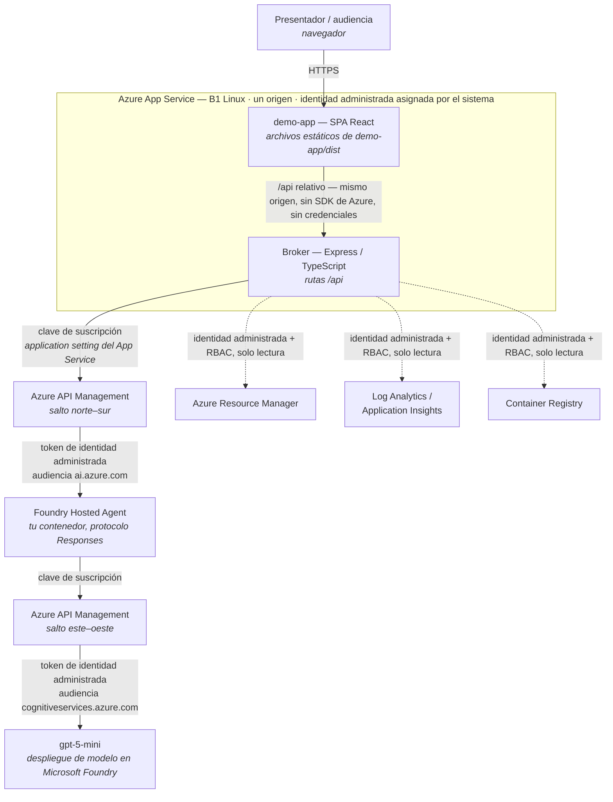
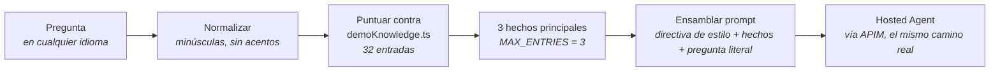

# Despliegue y consideraciones de costo

Este documento responde la pregunta que un arquitecto hace inmediatamente después de leer [`ARQUITECTURA_DEMO.md`](ARQUITECTURA_DEMO.md): *¿qué tengo que ejecutar, y cuánto me cuesta?*

Está escrito para ser verificable, no para convencer. Donde una cifra se puede medir, se mide y se muestra cómo. Donde una cifra depende de precios de lista de Azure, **no se cita ningún valor** — ver [Por qué aquí no aparecen cifras en dólares](#por-qué-aquí-no-aparecen-cifras-en-dólares) — y en su lugar se entrega un procedimiento para que obtengas los tuyos.

## Cómo leer este documento

Cada afirmación va etiquetada:

| Etiqueta | Significado |
|---|---|
| **[Hecho]** | Verificado contra el código de este repositorio o contra un despliegue real, o afirmado en documentación oficial de Azure. Reproducible. |
| **[Estimación]** | Derivado por cálculo a partir de un Hecho, con la aritmética a la vista. Depende de supuestos que se declaran en el punto. |
| **[Recomendación]** | Criterio profesional. Defendible, pero otro arquitecto podría decidir distinto con buenas razones. |

---

## 1. Arquitectura de despliegue

### 1.1 El hecho de costo más importante, primero

**[Hecho]** **La demo ahora agrega una línea de costo de hosting en Azure: un único App Service (B1, Linux) que aloja sus dos mitades.** La automatización del laboratorio (`labs/ai-foundry-hosted-agents-custom-framework-automation/scripts/deploy.ps1`) lo crea, compila dentro de él la consola y el broker, e imprime su URL pública. Ese plan factura mientras exista, se abra la demo o no.

**[Hecho]** Un solo App Service, no dos: Express sirve la consola compilada (`demo-app/dist`) **y** las rutas `/api` desde el **mismo origen**. Por tanto el navegador no recibe la clave de suscripción de APIM ni ninguna credencial de Azure — solo llama a rutas relativas `/api/...` del mismo sitio que lo sirvió. El broker llega a Azure con la **identidad administrada asignada por el sistema** del App Service más sus asignaciones de rol RBAC, y lee la clave de suscripción de APIM desde una application setting del App Service. Nada secreto queda compilado dentro del bundle del navegador.

**[Hecho]** Ejecutarlo desde un portátil sigue soportado y sin cambios — ver [§6.1](#61-ejecución-local--sigue-soportada). No cuesta nada, y sigue siendo el modo correcto para un presentador conduciendo desde su propia máquina.

Todo lo demás que la demo muestra ya lo había desplegado el laboratorio oficial. Más allá de su propio App Service, la demo es un *lector* de ese despliegue, no una extensión suya. La pregunta de costo tiene entonces dos partes: cuánto cuesta el App Service, y cuánto cuesta el laboratorio más el consumo marginal que la demo le agrega encima.

Ese consumo marginal se cuantifica en [§3](#3-modelo-de-costo) y [§4](#4-escenarios-de-consumo).

### 1.2 El camino de una solicitud

Al ejecutarlo en local la forma es idéntica, con `localhost:5173` (Vite) y `localhost:4000` (broker) en lugar de la caja del App Service, y `DefaultAzureCredential` resolviendo la sesión de `az login` del presentador en vez de una identidad administrada. El código del broker es el mismo en ambos casos.

### 1.3 Qué hace cada componente, y quién lo paga

**[Hecho]** — cada fila es verificable en este repositorio o en el `main.bicep` del laboratorio.

| Componente | Rol en la demo | Lo despliega | Dónde corre | Modelo de cobro |
|---|---|---|---|---|
| **App Service** (`B1`, Linux, Node 22 LTS) | Aloja las dos mitades de la demo en un solo origen. Porta la identidad administrada asignada por el sistema y la clave de suscripción de APIM como application setting. | La automatización de este repo | Azure | **Fijo, por hora** — factura mientras el plan exista, se use la demo o no |
| **demo-app** (SPA React) | Las cuatro secciones y la interfaz del copiloto. No guarda ninguna credencial ni tiene SDK de Azure — estructuralmente no puede llamar a Azure. El broker la sirve como archivos estáticos. | Este repo | Dentro del App Service (o la máquina del presentador) | **Ninguno propio** — va dentro del App Service de arriba |
| **Broker** (Express) | Guarda las credenciales de Azure. Se autentica con `DefaultAzureCredential` — la identidad administrada del App Service cuando está desplegado, la sesión de `az login` del presentador en local — llama a Azure por cuenta del frontend, e inyecta el contexto del copiloto. | Este repo | Dentro del App Service (o la máquina del presentador) | **Ninguno propio** — va dentro del App Service de arriba |
| **API Management** (`Basicv2`, capacidad 1) | El punto de control, dos veces por solicitud: frente al agente, y frente al modelo que el agente llama. Valida la clave de suscripción, la intercambia por un token de identidad administrada, aplica encabezados y escribe los logs completos de LLM. | Laboratorio oficial | Azure | **Fijo, por hora** — corre 24/7 se use la demo o no |
| **Foundry Hosted Agent** (`pydantic-agent`, `strands-agent` — 1 CPU / 2 GiB cada uno) | Tu contenedor, ejecutado por Foundry detrás del protocolo Responses. Produce cada respuesta que la demo muestra. | Laboratorio oficial | Azure | Cómputo mientras está registrado/en ejecución — **ver la salvedad en §3.3** |
| **gpt-5-mini** (`GlobalStandard`, capacidad 10) | El modelo que cada agente llama. | Laboratorio oficial | Azure | **Por token**, por consumo. Sin cargo en reposo. |
| **Log Analytics** (`PerGB2018`, retención 30 días) | Destino de los logs del gateway y de los logs completos de prompt/respuesta. Alimenta la sección Observabilidad. | Laboratorio oficial | Azure | **Por GB ingerido** + retención |
| **Application Insights** (basado en workspace) | Trazas distribuidas (7–10 spans por solicitud) del runtime de Foundry, el contenedor y APIM. | Laboratorio oficial | Azure | **Por GB ingerido**, en el mismo workspace |
| **Container Registry** (`Basic`) | Almacena las imágenes de los agentes. La demo solo *lee* manifiestos (digest, fecha de push). | Laboratorio oficial | Azure | **Fijo, por día** + almacenamiento/egreso sobre la cuota |

**[Hecho]** De estos nueve componentes, **tres los aporta este proyecto** (el App Service, demo-app y el broker), y **exactamente uno factura**: el plan de App Service. Los otros seis son del laboratorio oficial.

**[Hecho]** Todo lo que está en el grupo de recursos — el App Service y su plan incluidos, porque `deploy.ps1` los crea ahí — lo elimina `scripts/teardown.ps1`, que borra el grupo de recursos completo. No hay ningún paso aparte que recordar, y nada sobrevive.

---

## 2. El copiloto desde el punto de vista de infraestructura

### 2.1 Qué NO usa

**[Hecho]** El copiloto **no usa nada** de lo siguiente. No existe ninguna ruta de código hacia ellos en todo el repositorio:

| No se usa | Cómo verificarlo |
|---|---|
| RAG (generación aumentada por recuperación sobre un índice) | No existe capa de recuperación — ver §2.2 para lo que ocupa su lugar |
| Azure AI Search | Sin dependencia de SDK, sin endpoint, sin índice |
| Base de datos vectorial (ninguna) | Nunca se calcula ni se almacena un embedding |
| Embeddings | No hay modelo de embeddings desplegado ni invocado |
| Cosmos DB | No lo despliega el laboratorio, no se referencia |
| Blob Storage | No lo despliega el laboratorio, no se referencia — ver [§8.3](#83-por-qué-blob-storage-no-ayudaría-aquí) para saber por qué es deliberado |
| Indexación / troceado de documentos | La base de conocimiento es prosa escrita a mano, no derivada de documentos |

**[Hecho]** El `main.bicep` del laboratorio no despliega ninguna cuenta de almacenamiento, ni servicio de búsqueda, ni base de datos. La demo no requirió agregar nada a esa infraestructura.

### 2.2 Qué hace realmente

**[Hecho]** Todo esto vive en un único archivo TypeScript compilado, `broker/src/demoKnowledge.ts`. Medido directamente sobre ese archivo:

| Medición | Valor |
|---|---|
| Entradas en la base de conocimiento | 32 |
| Tamaño total de todos los hechos | 20.457 caracteres (~20 KB) |
| Hecho promedio | 639 caracteres |
| Hecho más largo | 1.120 caracteres |
| Directiva de estilo (persona + fronteras de honestidad) | 2.031 caracteres |
| Máximo de hechos inyectados por pregunta | 3 (`MAX_ENTRIES`) |

La coincidencia usa tres señales, de más fuerte a más débil: coincidencia exacta de una frase clave, ≥60 % de las palabras de una keyword multi-palabra presentes, y un término distintivo del mapa de términos por tema. Si nada coincide, se envía solo la directiva de estilo y el agente responde con su conocimiento general — nunca se niega a contestar.

**[Hecho]** La pregunta del usuario siempre se reenvía **literalmente** y claramente delimitada. La base de conocimiento solo decide qué *contexto de referencia* la acompaña; nunca reescribe la pregunta ni devuelve una respuesta enlatada. Cada respuesta del copiloto es una llamada real y en vivo al modelo, por el camino completo APIM → Foundry → modelo.

### 2.3 Por qué este diseño, para este proyecto

**[Recomendación]** — este es el razonamiento, y vale la pena decirlo sin rodeos porque "¿por qué no usaron RAG?" es una pregunta legítima de cualquier arquitecto.

1. **El corpus son 20 KB.** Eso es menos que una de las capturas de pantalla de este repositorio. Un índice vectorial sobre 20 KB de texto no es una optimización; es un sistema distribuido haciendo el trabajo de un `for` sobre 32 elementos.
2. **Aquí el determinismo vale más que el recall.** En una demo con cliente, el modo de falla que importa es que el copiloto afirme con seguridad algo falso sobre el despliegue. Hechos escritos a mano con una frontera de honestidad explícita hacen que ese riesgo sea revisable en un pull request. Recuperación sobre documentos troceados automáticamente, no.
3. **Cada hecho debe ser cierto sobre *este* despliegue.** La base de conocimiento se compila junto al broker y está versionada, así que una afirmación no puede alejarse del entorno que describe sin que alguien modifique un archivo bajo control de versiones. Eso es una propiedad de gobernanza, no una limitación.
4. **Cero infraestructura adicional, cero latencia adicional.** La coincidencia ocurre en proceso y termina muy por debajo de un milisegundo, frente a una llamada al modelo medida en 11–13 segundos de extremo a extremo. Cualquier servicio de recuperación agregaría un salto de red, una credencial, un modo de falla y una línea de costo — para no ahorrar nada medible.
5. **Tiene que sobrevivir a un portátil.** La demo se presenta en reuniones con clientes, a veces sobre el Wi-Fi de un hotel. Menos piezas móviles es un requisito de seguridad de la demo, no una preferencia estética.

**[Recomendación]** Es una decisión deliberada y adecuada al propósito, **no** una afirmación de que RAG sea inferior en general. En [§8](#8-escalabilidad-futura) se indica exactamente cuándo se invierte esa relación.

---

## 3. Modelo de costo

### 3.1 Fijo frente a variable

**[Hecho]** Este es el punto estructural que determina todo lo demás:

| Comportamiento | Componentes |
|---|---|
| **Fijo** — se acumula 24/7 aunque nadie abra la demo | API Management (`Basicv2`), **plan de App Service (`B1`, Linux)**, Container Registry (`Basic`), retención de Log Analytics/Application Insights, cómputo del Foundry Hosted Agent *(ver §3.3)* |
| **Variable** — solo se acumula al usar la demo | Tokens de `gpt-5-mini`, **ingesta** de Log Analytics/Application Insights |
| **Gratis** — lo aporta este proyecto | demo-app y broker *(sin cargo propio — corren dentro del plan de App Service de arriba, o en un portátil)* |

**[Estimación]** En cualquier volumen realista de demostraciones, los componentes fijos dominan el costo total por un margen amplio. La parte variable es tan pequeña que apagar la demo por la noche no ahorra prácticamente nada — los medidores que importan son APIM y el plan de App Service, ambos corriendo 24/7. La palanca con impacto financiero real es **eliminar el grupo de recursos cuando el laboratorio no está en uso** (`scripts/teardown.ps1`), no optimizar el uso de la demo.

**[Estimación]** El plan de App Service es una **adición pequeña a una base ya fija**: un plan B1 Linux es sensiblemente más barato que la instancia `Basicv2` de API Management junto a la que vive. Cambia el total, pero no cambia cuál es la línea dominante.

### 3.2 A) Sin copiloto frente a B) Con copiloto

Un supuesto común es que la demo sin copiloto no consume tokens. **Eso no es exacto**, y el desglose honesto importa:

**[Hecho]** Acciones de la demo que llegan a `gpt-5-mini` y consumen tokens, *sin abrir nunca el copiloto*:

| Acción | Prompt enviado | Escala de tokens |
|---|---|---|
| Gateway → "Ejecutar las tres pruebas de credenciales" | `{"input":"ping"}` — **solo el primero de los tres intentos** llega al modelo; los otros dos se rechazan con 401 antes de salir de APIM | Unidades de tokens de entrada |
| Plataforma / Agentes → "Precalentar agente" | `"Reply with the single word: ready."` | ~10 tokens de entrada |
| Agentes → "Probar agente alojado" | `"Reply with the single word: ok."` | ~10 tokens de entrada |
| Agentes → pestaña Ejecutar | Lo que escriba el presentador | Variable, normalmente pequeño |

**[Hecho]** Acciones que **no** consumen ningún token de modelo — la mayor parte de la demo:

- Toda la vista del registro de Agentes, historial de versiones y procedencia (plano de datos de Foundry + lecturas de ACR)
- Toda la vista de enrutamiento de Gateway y el XML de política en vivo (lecturas de Azure Resource Manager)
- Toda la sección de Observabilidad (consultas a Log Analytics — lecturas, no escrituras)
- Toda la sección de Plataforma: entorno, catálogo de controles y las cuatro acciones de mantenimiento salvo las listadas arriba (lecturas de ARM y Log Analytics)
- Gateway → "Probar APIM" (se envía deliberadamente sin clave; espera 401 y nunca llega al modelo)

**[Estimación]** Tamaños de prompt medidos para el copiloto, calculados sobre el contenido real del archivo (`caracteres ÷ 4`, la aproximación estándar para inglés):

| Caso del copiloto | Prompt ensamblado | Tokens de entrada (est.) |
|---|---|---|
| Sin coincidencia (solo directiva de estilo) | 2.123 caracteres | ~530 |
| Típico (3 hechos promedio inyectados) | 4.161 caracteres | ~1.040 |
| Peor caso (3 hechos más largos) | 5.319 caracteres | ~1.330 |

La salida está acotada por la propia directiva de estilo — *"como máximo tres o cuatro frases cortas"* — lo que sitúa la respuesta en torno a **100–150 tokens de salida**. **[Estimación]**

**[Estimación]** **El costo marginal del copiloto es entonces ~1.040 tokens de entrada por pregunta frente a ~10 de una sonda — aproximadamente dos órdenes de magnitud más por interacción, pero ambos son despreciables en términos absolutos.** Lo que cambia el copiloto no es si se consumen tokens, sino que el consumo pasa a ser proporcional a cuánto pregunte la audiencia.

### 3.3 Una salvedad honesta sobre el cobro de Hosted Agents

**[Hecho]** Los Foundry Hosted Agents ejecutan un contenedor que aporta la empresa, con una asignación declarada de 1 CPU y 2 GiB por agente en este laboratorio.

**[Estimación, baja confianza]** Lo esperable es un cobro por cómputo mientras el agente está registrado y en ejecución, coherente con cómo cobran superficies comparables de hosting de contenedores en Azure. **Sin embargo, Hosted Agents es una superficie en preview y no tengo certeza sobre la mecánica exacta de cobro — si es por agente registrado, por réplica en ejecución, por sesión activa, o con reducción a cero en reposo.** Esto afecta materialmente al total de costo fijo, porque en este laboratorio hay dos agentes registrados.

**[Recomendación]** No tomes posición sobre esto frente a un cliente. Confírmalo para tu propia suscripción en **Análisis de costos** (Portal de Azure → Cost Management → Análisis de costos, agrupando por recurso) después de tener el laboratorio desplegado unos días. Esa es la única respuesta autorizada para tu acuerdo y tu región, y toma minutos.

### 3.4 El que todos olvidan: la ingesta de telemetría

**[Hecho]** API Management está configurado en este laboratorio con **registro completo de prompt y respuesta al 100 % de muestreo**. Cada llamada al modelo escribe el prompt completo *y* el texto completo de la respuesta en Log Analytics, más una fila de log del gateway, más 7–10 spans en Application Insights.

**[Estimación]** Por pregunta del copiloto, la telemetría total escrita ≈ **15–20 KB** (prompt ~4 KB + respuesta ~0,6 KB + fila de gateway ~1–2 KB + spans ~10 KB).

Es el componente que más rápido crece con el uso y el menos visible en una factura, porque cae en un workspace compartido y no bajo una línea evidentemente relacionada con IA. A volúmenes de demostración es inmaterial (ver §4). A volúmenes de producto es lo primero que hay que reconsiderar — Azure Monitor ofrece un [límite diario de ingesta](https://learn.microsoft.com/azure/azure-monitor/logs/daily-cap) precisamente por esto.

**[Recomendación]** El muestreo al 100 % con captura completa de mensajes es la decisión correcta *para este laboratorio*, porque el sentido de la sección Observabilidad es enseñar un registro de auditoría real a una audiencia de cumplimiento. **No** es automáticamente la decisión correcta en producción, y es una decisión de gobierno de datos que el cliente debe tomar conscientemente — algo que conviene nombrar en voz alta durante la demo en lugar de dejar que lo descubran después.

---

## 4. Escenarios de consumo

**Supuestos [Estimación]:** una pregunta al copiloto ≈ 1.040 tokens de entrada + 125 de salida (§3.2) y ≈ 18 KB de telemetría (§3.4). Mes de 30 días. Las acciones sin copiloto se excluyen porque, según §3.2, son dos órdenes de magnitud menores.

| Volumen | Tokens entrada/mes | Tokens salida/mes | Telemetría/mes | Qué representa realmente |
|---|---|---|---|---|
| **50 preguntas/día** | ~1,6 M | ~190 K | ~27 MB | ~2 demos/día. Régimen realista para un presentador activo. |
| **200 preguntas/día** | ~6,2 M | ~750 K | ~108 MB | ~8 demos/día. Un equipo pequeño compartiendo un despliegue. |
| **1.000 preguntas/día** | ~31 M | ~3,8 M | ~540 MB | ~40 demos/día. **Ver la nota más abajo.** |

### Qué escala y qué no

| Componente | Comportamiento al crecer el volumen | Comentario |
|---|---|---|
| **Tokens de `gpt-5-mini`** | **Lineal** | El único componente que escala limpiamente con las preguntas. En un modelo de clase mini, incluso la fila de 1.000/día es un volumen mensual de tokens modesto. |
| **Ingesta de Log Analytics / App Insights** | **Lineal** | Crece más rápido en *bytes* que los tokens, porque se guardan los mensajes completos más los spans. Aun así queda muy por debajo de la cuota gratuita habitual de un workspace en todas las filas. |
| **API Management (`Basicv2`)** | **Plano** | Cargo fijo por hora. Idéntico con 0 y con 1.000 preguntas/día. Basicv2 capacidad 1 no se verá limitado por ninguno de estos volúmenes. |
| **Container Registry (`Basic`)** | **Plano** | La demo solo lee manifiestos. No se sube ninguna imagen durante una demostración. |
| **Cómputo de Hosted Agent** | **Plano, probablemente** | Sujeto a la salvedad de §3.3. No escala con el número de preguntas bajo ningún modelo de cobro que yo esperaría. |
| **App Service (`B1`)** | **Plano** | Cargo fijo por hora del plan. Idéntico con 0 y con 1.000 preguntas/día. Una instancia B1 es mucha más capacidad de la que necesita un puñado de presentadores concurrentes, porque la parte lenta es una llamada al modelo de 11–13 segundos, no el broker. |
| **demo-app / broker** | **Plano en cero** | Sin cargo propio — ambos corren dentro del plan de App Service de arriba. |

**[Estimación]** **La mayor línea de costo, muy probablemente, es API Management corriendo 24/7, en todos los volúmenes de esta tabla** — y no se mueve en absoluto con el uso de la demo. El plan de App Service es la segunda línea fija y se comporta igual.

**[Recomendación]** Una nota sobre la fila de 1.000/día: para una herramienta de demostración de preventa, ~40 demos diarias no es un perfil realista. Si de verdad llegas ahí, la demo dejó de ser una demo y se convirtió en un producto interno — momento en el cual vale la pena revisar las preguntas de arquitectura de [§8](#8-escalabilidad-futura), y las de hosting de [§5](#5-estrategias-de-despliegue) dejan de ser opcionales.

---

## 5. Estrategias de despliegue

**[Hecho]** Esta comparación es **el porqué se eligió App Service**, y se conserva como el razonamiento detrás de la decisión, no como una pregunta abierta. La automatización implementa la primera fila. El registro completo de la decisión, incluidas las dos opciones descartadas y los cambios de código que exigió el hosting, está en [`labs/ai-foundry-hosted-agents-custom-framework-automation/docs/04-app-service-decision.md`](../../../../labs/ai-foundry-hosted-agents-custom-framework-automation/docs/04-app-service-decision.md).

**[Hecho]** Lo que aloje esto tiene que hospedar dos cosas: un **bundle estático de React** (la salida de `npm run build` — archivos planos) y un **proceso Node/Express de larga vida** que guarda credenciales de Azure. El broker es la única parte con requisitos reales de hosting.

**[Hecho]** Hay una restricción que condicionó toda la decisión: en local el broker se autentica con `DefaultAzureCredential` contra la sesión de `az login` del presentador, y hospedarlo implica que esa misma llamada resuelva una **identidad administrada**, con los roles de lectura equivalentes otorgados a ella. `DefaultAzureCredential` hace eso sin cambio de código — lo que el hosting realmente exigió fue el RBAC, que `deploy.ps1` ahora asigna.

| Opción | Complejidad | Costo esperado | Mantenimiento | Escenario recomendado |
|---|---|---|---|---|
| **Azure App Service** (Linux, B1/S1) | **Baja.** Despliegue desde un repo Git o un zip. La identidad administrada es un interruptor. No requiere trabajar con contenedores. | Fijo mensual por plan. Frontend y broker pueden compartir un mismo plan. | **Bajo.** La plataforma parchea el SO y el runtime. | Un despliegue interno compartido para un equipo pequeño. La opción por defecto. |
| **Azure Container Apps** | **Media.** Requiere contenerizar el broker. El escalado a cero, las revisiones y el ingress incorporado son ventajas reales. | Por consumo; puede acercarse a cero en reposo. | **Bajo–medio.** No hay clúster que operar, pero la imagen es tuya. | Uso intermitente o a ráfagas, o si quieres escalado a cero entre demos. |
| **Azure Container Instances** | **Baja–media.** Un solo contenedor, sin orquestador. | Por segundo mientras corre. El más barato *si* lo detienes entre demos — pero nada lo detiene por ti. | **Medio.** Sin autoescalado, sin despliegues progresivos, sin una historia integrada de TLS/ingress. | Uso puntual o de corta vida. Mal encaje para una herramienta compartida siempre disponible. |
| **Azure Kubernetes Service** | **Alta.** Un clúster, pools de nodos, ingress, certificados, actualizaciones. | Costo de nodos, en la práctica fijo, más tiempo operativo. | **Alto.** Pasas a operar un clúster. | **No se justifica aquí.** Ver abajo. |
| **Static Web Apps + broker aparte** | **Media.** Excelente para la SPA; el broker sigue necesitando dónde vivir, así que es un *complemento*, no una respuesta completa. | La capa gratuita cubre un frontend de demostración. | **Bajo** en la mitad del frontend. | Combinarlo con App Service o Container Apps para el broker. |

**[Recomendación]** **AKS es desproporcionado para esta carga de trabajo, y decirlo claramente es más útil que listarlo como opción.** La demo es un bundle estático y un proceso Node sin estado, sin requisito de escalado horizontal, sin malla de servicios, sin multi-tenencia y sin red entre servicios. Adoptar Kubernetes aquí significa asumir actualizaciones de clúster, parcheo de nodos y gestión de ingress para ejecutar algo que App Service ejecuta desde un zip. Elige AKS solo si tu organización *ya* corre todo sobre un clúster existente y agregar un despliegue más es genuinamente menos esfuerzo marginal que introducir un servicio de hosting nuevo — ese es un argumento organizativo, no técnico, y es una razón legítima.

---

## 6. Despliegue recomendado

**[Hecho]** El modo desplegado por defecto es **Azure App Service (B1, Linux)**, creado por `deploy.ps1`. La ejecución local sigue plenamente soportada. Ambos modos se describen abajo.

### 6.1 Ejecución local — sigue soportada

**[Hecho]** Nada del camino en portátil cambió, y para un presentador conduciendo desde su propia máquina sigue siendo el modo correcto:

- No cuesta nada.
- Coincide con cómo se usa a menudo la herramienta: un presentador, en una reunión, conduciendo.
- Que el broker use la sesión de `az login` del propio presentador hace que la demo muestre *sus* permisos reales — incluida la lectura de RBAC que legítimamente falla por falta de permisos, algo que en sí mismo es honesto de enseñar a una audiencia de seguridad.
- No hay un despliegue compartido que mantener parcheado, asegurado y explicado en una revisión de seguridad.

Se arranca con `npm run dev` en `broker/` y en `demo-app/`, exactamente como antes.

### 6.2 El modo desplegado por defecto: Azure App Service

**[Hecho]** `deploy.ps1` aprovisiona un **Azure App Service (B1, Linux, Node 22 LTS)** al final del despliegue del laboratorio e imprime su URL pública. Las razones por las que es la forma correcta para esta carga:

- El broker es un proceso Node de larga vida y sin estado. Ese es exactamente el escenario central de App Service — no hace falta contenerizar.
- **La identidad administrada es un interruptor de configuración**, lo que resuelve limpiamente el único problema real de hosting (§5) sin reestructurar código: `DefaultAzureCredential` la resuelve sin cambios.
- Frontend y broker comparten un solo plan **y un solo origen**, dejándolo en un único recurso facturable, sin configuración de CORS y sin ninguna URL del broker compilada dentro del bundle del navegador.
- Nada en esta carga necesita lo que aporta una plataforma más pesada. No hay requisito de escalado horizontal: esto sirve a un puñado de presentadores concurrentes, y la parte lenta es una llamada al modelo de 11–13 segundos, no el broker.

**[Hecho]** Qué recibe el navegador, y qué no:

| El navegador recibe | El navegador nunca recibe |
|---|---|
| El bundle estático y llamadas relativas `/api/...` al mismo origen | La clave de suscripción de APIM — es una application setting del App Service, leída solo del lado del servidor |
| Lo que cada ruta `/api` decida devolver | Ninguna credencial ni token de Azure. El bundle no contiene SDK de Azure ni ningún endpoint que no sea su propio origen |

**[Hecho]** Consecuencia de costo, dicha sin rodeos: **el App Service factura mientras exista.** `scripts/teardown.ps1` borra el grupo de recursos y se lleva con él el sitio y su plan.

### 6.3 Cuándo Container Apps es la mejor respuesta

**[Recomendación]** Prefiere **Azure Container Apps** si se cumple alguna de estas condiciones:

- **El uso es genuinamente intermitente** y el escalado a cero importa — por ejemplo, un entorno de habilitación de partners usado unos pocos días al mes. App Service cobra el plan atienda tráfico o no.
- **Tu organización ya estandariza en contenedores** para herramientas internas, con lo que la imagen es el camino de menor resistencia y no trabajo extra.
- Quieres **despliegue por revisiones y división de tráfico** sin operar un clúster.

El intercambio es honesto: ganas elasticidad y pierdes la simplicidad de "despliega un zip y olvídate". Para una herramienta interna de uso intermitente eso suele valer la pena; para una instancia compartida de uso diario, normalmente gana la simplicidad de App Service.

---

## 7. Mejora futura opcional: un copiloto configurable

**[Recomendación]** — analizado según lo solicitado. **No implementado, y por ahora no recomendado.**

La idea: una variable de entorno `ENABLE_COPILOT=true|false` que apague el copiloto, de modo que la demo pueda ejecutarse sin ningún consumo de modelo.

### Ventajas

- **Un modo con cero tokens garantizados.** Útil cuando la política de un cliente prohíbe enviar cualquier texto libre a un modelo durante una evaluación, o en un entorno con un tope de gasto estricto.
- **Menor superficie para una revisión de seguridad.** "La instancia desplegada no puede enviar texto arbitrario del usuario a un modelo" es una frase mucho más fácil de pasar por un comité de revisión que explicar la postura frente a inyección de prompts.
- **Una historia más limpia sin conexión.** Hoy el respaldo ante una conexión rota es el modo Simulación; un modo sin copiloto es un instrumento más preciso para "la red está bien, pero puede que no llamemos al modelo".

### Desventajas

- **Elimina la prueba en vivo más persuasiva.** El copiloto es la demostración más clara de que todo el camino gobernado funciona de extremo a extremo — una pregunta real atravesando APIM → Foundry → modelo y volviendo marcada con el contenedor y la versión que respondió. Desactivarlo convierte la demo en algo más parecido a un visor de datos.
- **Crea una segunda configuración soportada.** Cada estado de la interfaz que asume que el copiloto existe necesita un estado "apagado" definido, y ambos caminos hay que probarlos. Dos configuraciones son más del doble de superficie que una, porque además hay que pensar la interacción entre ellas.
- **Es una bandera de configuración para algo que hoy es un comportamiento.** Un presentador simplemente puede no abrir el copiloto. Una bandera solo aporta valor cuando la garantía debe *imponerse* en lugar de *elegirse* — algo que es un requisito real en algunas organizaciones, pero no el caso común.

### Impacto

| Dimensión | Evaluación |
|---|---|
| **Costo** | **[Estimación]** Ahorro prácticamente nulo. Según §3.1 y §4, los tokens del copiloto son un error de redondeo frente a APIM corriendo 24/7. Esta bandera se justificaría por *política o gobernanza*, nunca por costo. |
| **Mantenimiento** | **[Estimación]** Pequeño pero permanente: un segundo camino de código, un segundo estado de interfaz y una cosa más que verificar antes de cada entrega. |

**[Recomendación]** Impleméntalo **solo** cuando un cliente real o una política interna exija una garantía impuesta de no llamar al modelo. Agregarlo de forma especulativa compra un ahorro despreciable a cambio de una obligación de mantenimiento permanente. Si se implementa, acótalo bien: la bandera debería desactivar **toda la superficie** del copiloto en lugar de degradarla silenciosamente, para que su estado nunca sea ambiguo para un presentador en mitad de una reunión.

---

## 8. Escalabilidad futura

### 8.1 Qué cambiaría si esto creciera mucho

**[Estimación]** La arquitectura aguanta más de lo que su uso actual sugiere, porque las partes caras ya son de costo fijo y el modelo de enrutamiento ya escala. En orden aproximado de qué se rompe primero:

| Detonante de crecimiento | Qué cambia realmente |
|---|---|
| Varios presentadores simultáneos | **Ya resuelto** — el App Service de §6.2 es compartido y está siempre disponible, y el broker no tiene estado. Escalar más allá es un cambio de tamaño de plan, no un rediseño. |
| La correlación debe sobrevivir a reinicios | **[Hecho]** El almacén de preguntas está hoy en memoria — un reinicio del broker hace que las preguntas pasadas devuelvan un 404 honesto. Una correlación duradera necesitaría un almacén real; es el primer requisito genuino de persistencia que el proyecto encontraría. |
| Volumen alto y sostenido de preguntas | Revisar el muestreo de APIM y añadir un límite diario en Azure Monitor (§3.4). Considerar políticas de límite de tasa en APIM — ya disponibles en el punto de control, solo que no activadas. |
| Muchos más agentes | **[Hecho]** Ningún cambio. El enrutamiento es por nombre de agente en la ruta URL, así que una sola API de APIM ya sirve a cualquier número de agentes sin reconfiguración. |
| El copiloto debe responder más allá de este despliegue | Este es el que sí cambia el diseño de verdad — ver §8.2. |

### 8.2 Cuándo RAG, AI Search y embeddings pasarían a ser lo correcto

**[Recomendación]** El diseño actual es correcto **para un corpus de 20 KB, escrito a mano y específico de este despliegue**. Eso es una afirmación sobre este corpus, no sobre la recuperación en general. La relación se invierte cuando se cumple **cualquiera** de estas condiciones:

| Adopta recuperación cuando… | Por qué se rompe el enfoque actual |
|---|---|
| El corpus supera aproximadamente **100–200 KB**, o unos cientos de entradas | La coincidencia por palabras clave se degrada y los hechos dejan de caber cómodamente en un prompt. Curar cientos de entradas a mano también deja de ser realista. |
| El contenido proviene de **documentos que no escribes tú** — documentación del cliente, manuales de producto, tickets | Ya no puedes garantizar que cada hecho sea cierto sobre el despliegue, que es justo la propiedad que el diseño actual existe para proteger. El troceado y la recuperación pasan a ser las herramientas adecuadas. |
| El contenido cambia **más rápido que un ciclo de entrega** | Compilar los hechos dentro del broker implica un redespliegue por cambio. Aceptable mensualmente; equivocado a diario. |
| Los usuarios hacen preguntas **parafraseadas o conceptuales** que el mapa de palabras clave no puede anticipar | Esto es exactamente lo que resuelven los embeddings. Es el argumento técnico más fuerte para el cambio. |
| Necesitas **citas hacia documentos fuente** | El modelo actual inyecta prosa sin identidad de documento que citar. |

**[Recomendación]** Llegado ese punto, el destino natural es **Azure AI Search** con vectorización integrada, ya que resuelve troceado, embeddings y recuperación híbrida (palabras clave + vectores) en un solo servicio gestionado en lugar de ensamblar tres. Hasta entonces, incorporarlo significaría operar un índice sobre menos texto del que contiene este mismo documento.

### 8.3 Por qué Blob Storage no ayudaría aquí

**[Recomendación]** — respondido directamente, porque se planteó como candidato.

Mover la base de conocimiento a Blob Storage sería una **regresión**, no una mejora:

1. **Resuelve un problema que este proyecto no tiene.** El corpus son 20 KB y cambia rara vez. Blob es almacenamiento de objetos para artefactos grandes o numerosos; unos pocos kilobytes de prosa no lo son.
2. **Agrega un modo de falla al camino crítico de la demo.** Cada pregunta dependería de una llamada de red, una credencial y un servicio que puede estar lento o caído — en una herramienta cuya principal restricción de diseño es sobrevivir a una reunión con cliente sobre Wi-Fi poco fiable. Hoy ese camino no puede fallar, porque el dato está en el proceso.
3. **Elimina la propiedad de gobernanza que justifica el diseño.** Todo el valor de la base de conocimiento es que *cada afirmación debe ser cierta sobre el entorno desplegado*. Hoy eso lo garantiza la revisión de código: cambiar un hecho implica un cambio rastreado en un archivo versionado. Muévelo a Blob y cualquiera con permiso de escritura puede cambiar lo que el copiloto le afirma a un cliente, sin revisión, sin historial y sin forma de saber qué versión estaba activa durante una demo concreta. **Para una base de conocimiento cuya premisa entera es la honestidad verificable, eso es justo lo contrario de una mejora.**
4. **No compra ningún rendimiento medible.** La coincidencia en proceso está por debajo del milisegundo frente a una llamada al modelo de 11–13 segundos.

**[Recomendación]** Si el objetivo de fondo es *"editar los hechos del copiloto sin redesplegar el broker"*, entonces el servicio correcto es **Azure App Configuration** — está pensado exactamente para configuración externalizada, con historial de cambios, etiquetas, instantáneas puntuales y feature flags, nada de lo cual ofrece Blob. Dicho eso, yo aún cuestionaría el objetivo en sí: para este proyecto el redespliegue no es una fricción que eliminar, es la puerta de revisión que mantiene honesto al copiloto. Externaliza los hechos solo si alguien sin perfil de ingeniería realmente necesita editarlos — y si llega ese día, acompaña App Configuration de un paso de revisión documentado, para no perder la garantía junto con la comodidad.

---

## Por qué aquí no aparecen cifras en dólares

**[Hecho]** Este documento no cita **ningún precio** de forma deliberada. Es una decisión de corrección, no una omisión:

- Los precios de lista de Azure cambian, y este documento pretende seguir siendo útil con el tiempo. Una cifra desactualizada en una referencia técnica es peor que ninguna cifra, porque se repetirá delante de un cliente.
- Los precios varían por **región**, y de forma relevante por **acuerdo** — Enterprise Agreement, CSP, MCA y pago por uso pueden diferir bastante para el mismo recurso.
- Varios componentes cobran por **consumo**, así que un número aislado no significaría nada sin declarar los supuestos de volumen que lleva dentro.

**[Recomendación]** Obtén tu propia cifra en unos diez minutos:

1. Abre la [Calculadora de precios de Azure](https://azure.microsoft.com/pricing/calculator/).
2. Agrega, en tu región objetivo: **API Management** (`Basicv2`, capacidad 1), **App Service** (`B1`, Linux), **Container Registry** (`Basic`), **Azure Monitor / Log Analytics** (usa las cifras de GB/mes de §4) y tu **despliegue de modelo** (usa los volúmenes de tokens de §4).
3. Aplica el precio de tu acuerdo corporativo.
4. Para **Foundry Hosted Agents**, no estimes — despliega el laboratorio y lee los cargos reales en **Cost Management → Análisis de costos**, agrupando por recurso, después de unos días (§3.3).
5. Compara todo eso con una factura real al cabo de un mes. **[Recomendación]** Trata cualquier salida de la calculadora como una estimación hasta que una factura real la confirme.

---

## Fuentes

Documentación oficial de Azure usada para los modelos de cobro y las características de servicio descritas arriba. Todos los enlaces verificados como accesibles al momento de escribir.

- [Calculadora de precios de Azure](https://azure.microsoft.com/pricing/calculator/)
- [Precios de API Management](https://azure.microsoft.com/pricing/details/api-management/) · [Descripción de los niveles v2](https://learn.microsoft.com/azure/api-management/v2-service-tiers-overview)
- [Precios de Azure Monitor](https://azure.microsoft.com/pricing/details/monitor/) · [Cálculo de costos de Log Analytics](https://learn.microsoft.com/azure/azure-monitor/logs/cost-logs) · [Límite diario de ingesta](https://learn.microsoft.com/azure/azure-monitor/logs/daily-cap)
- [Precios de Container Registry](https://azure.microsoft.com/pricing/details/container-registry/)
- [Precios de App Service](https://azure.microsoft.com/pricing/details/app-service/linux/) · [Precios de Static Web Apps](https://azure.microsoft.com/pricing/details/app-service/static/)
- [Precios de Container Apps](https://azure.microsoft.com/pricing/details/container-apps/) · [Modelo de facturación de Container Apps](https://learn.microsoft.com/azure/container-apps/billing)
- [Precios de Container Instances](https://azure.microsoft.com/pricing/details/container-instances/) · [Precios de Azure Kubernetes Service](https://azure.microsoft.com/pricing/details/kubernetes-service/)
- [Documentación de Azure AI Foundry](https://learn.microsoft.com/azure/ai-foundry/) · [Introducción a Foundry Agents](https://learn.microsoft.com/azure/ai-foundry/agents/overview)
- [Azure Well-Architected Framework — Optimización de costos](https://learn.microsoft.com/azure/well-architected/cost-optimization/)

Las mediciones internas del repositorio (§2.2, §3.2) se tomaron directamente de `broker/src/demoKnowledge.ts`, `broker/src/routes/accessControl.ts` y `broker/src/routes/maintenance.ts`. Los datos de SKU provienen del `main.bicep` del laboratorio oficial, tal como se documenta en [`ARQUITECTURA_DEMO.md`](ARQUITECTURA_DEMO.md) §2.

## Ver también

- [`ARQUITECTURA_DEMO.md`](ARQUITECTURA_DEMO.md) — la arquitectura técnica completa que este documento costea.
- [`CONTEXTO_COPILOTO.md`](CONTEXTO_COPILOTO.md) — el comportamiento y las fronteras de honestidad del copiloto, desde el ángulo de producto y no de infraestructura.
- [`PROPOSITO_DEMO.md`](PROPOSITO_DEMO.md) — por qué existe el proyecto y qué deliberadamente no es.
